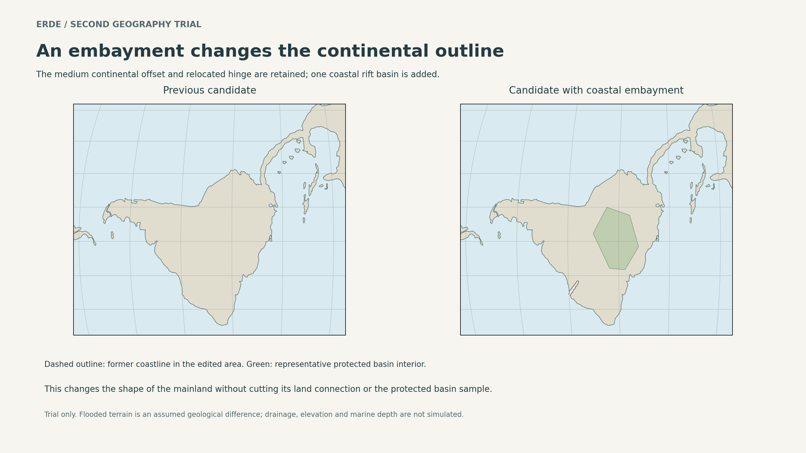

# Erde coastal reshaping: completed second trial

**Outcome:** the gulf is a plausible feature to investigate, but this experiment does not justify adopting it solely to make the continent less recognizable. Its visual effect is modest at continental scale, while even the middle option substantially changes a regional landscape. Retain the medium continental offset as the working base; keep this gulf optional.

This completes the requested construction-and-consequence trial at the geometric and qualitative level. It is not a completed terrain, plate-tectonic, drainage or climate simulation. The public atlas is unchanged.

## What was tried

The [previous trial](../geography-trial/README.md) established a medium continental offset with a relocated land hinge and relatively isolated offshore remnants. This follow-up holds those features fixed and tests one embayment on a different flank of the moved continent. It does not replace either early continental migration with island hopping.



[Three gulf sizes, shown at equal scale](02-gulf-options.png) · [comparison SVG](01-coast-comparison.svg) · [options SVG](02-gulf-options.svg)

| Trial | Previously exposed land converted to marine area | Gulf axis crossing former land |
| --- | ---: | ---: |
| Small | 20,406 km² | 326 km |
| Moderate | 58,109 km² | 567 km |
| Deep | 126,837 km² | 870 km |

Areas are spherical polygon measurements. Axis lengths use the local equal-area projection and are approximate. They measure the drawn design, not flooding calculated from elevations. The moderate figure is the selected comparison specimen, not adopted canon. It removes approximately 0.039% of the prior candidate's global mapped land area; that small global proportion does not make the regional consequences small.

## Checks completed

All three generated candidates pass these geometric checks:

- Valid land polygons.
- Four existing representative population locators still belong to the same connected land component.
- No intersection between the new gulf and the relocated hinge.
- No loss of land from the representative protected basin-interior sample.
- A connected gulf shape whose mouth begins in existing water and whose head intrudes into existing land.

The moderate cut lies approximately 1,370 km from the protected basin sample and 2,186 km from the schematic highland axis in the local projection. These are approximate separations from limited reference features, not distances from complete watershed or mountain-system boundaries. They do not establish that all headwaters, habitats or migration paths survive unchanged.

Both figure sets were visually inspected. The comparison preserves a common projection and extent within each sheet. The regional sheet uses Equal Earth centered at 90°W; the close views use a local Lambert azimuthal equal-area projection. Plotting geometry was clipped to the local viewing region to avoid projecting unrelated antipodal land through the local projection; the stored candidate geometry remains global.

## Consequences

| Subject | Finding and implication |
| --- | --- |
| Main migrations | The external entry and internal land hinge remain geometrically intact. The principal founding dates can remain design constraints. Their dated ecological passability has not been newly demonstrated. |
| Local terrestrial movement | The gulf interrupts paths along the edited coast. Travelers and terrestrial animals must detour around its head or cross water. Keeping the continental hinge intact does not preserve every local route. |
| Basin and highland habitats | The protected interior sample is not cut, and the main schematic ridge is distant. Changed drainage divides or moisture transport could still affect a wider area than the flooded polygon. |
| Coastal ecosystems | Former terrestrial habitat becomes marine or estuarine habitat. Deltas, tidal wetlands, sheltered shores and brackish-water communities become possible, depending on freshwater input, depth, tides and climate. Productivity is not guaranteed. |
| Wildlife | The gulf can divide coastal populations and create new dispersal filters, with divergence, range shifts and local extinctions over geological time. The exact original wildlife distribution cannot be retained automatically. |
| Hydrology | New outlets and altered local relief can capture or redirect rivers. A substantial sediment supply might fill the basin unless subsidence or other accommodation keeps pace. A permanent open gulf requires a sediment-and-subsidence explanation. |
| Maritime travel | Shores could provide later harbors and exchange routes, but the gulf itself adds water crossings and navigation demands. Shelter, navigability and freshwater cannot be read from a coastline alone. |
| Ocean circulation | This is a single-ended embayment, not a new inter-ocean seaway. Local circulation, tides, stratification and coastal temperatures would change; the direction and magnitude are unknown. |
| Appearance | The edited coast is distinguishable in the regional close-up. At continental scale the gulf remains a relatively small notch; it does not strongly obscure the inherited overall silhouette. |
| Historical institutions | If retained, the gulf could justify local maritime communities, head-of-gulf crossings and contrasting shores. These are future worldbuilding opportunities, not newly established peoples, states or traditions. |

## Geological explanation required

A defensible candidate history is an inherited extensional basin whose later reactivation and subsidence allow marine incursion. Such a mechanism must produce low ground before it is flooded. It is not scientifically sufficient to raise the sea across an unchanged highland landscape merely because the desired outline looks useful.

As a provisional sequence, older inherited crustal weaknesses could be reactivated during the tens-of-millions-of-years reorganization already being explored, with the basin becoming marine before the established human migration histories. Proposed dates remain open. No recent catastrophe or sudden destruction of existing civilizations is introduced.

The model would need to specify basin depth, sill elevation, subsidence history, sediment delivery, river outlets and sea-level response. It might produce an open gulf, a restricted inlet, a large estuary or an eventually filled sedimentary lowland. The drawn gulf alone does not decide among them.

## Recommendation after evaluation

Do not adopt the moderate or deep gulf merely for its cartographic effect. The moderate design would convert about 58,000 km² of land while delivering only a modest reduction in recognizability. The deep option more than doubles that habitat cost without transforming the continental silhouette.

If a substantial maritime province is independently desirable, the moderate gulf is a useful candidate to develop with an actual basin and drainage design. Otherwise, defer it and retain the medium-offset/relocated-hinge trial as the current working geography. Future silhouette work should compare broader inherited margin configurations, rather than assuming every additional inlet is an improvement.

## Reproduction and scope

```sh
python -m pip install -r scripts/editorial/requirements-atlas.txt
python scripts/editorial/try_erde_coast.py
```

Inputs are the first trial's committed medium-offset geometry and parameters. Outputs are [measurements](measurements.json), [candidate land](candidate-land.geojson), [gulf outline](gulf.geojson), and the two PNG/SVG figure pairs. The script's assertions run for each of the three alternatives.

The adopted atlas generator does not read this directory. No public article, map or app behavior changes as a result of this experiment.

## Scientific sources

- [Geological Society of America: major failed rifts](https://www.geosociety.org/gsa-today/june-2022/three-major-failed-rifts-in-central-north-america-similarities-and-differences): failed rift histories can include subsidence and thick sedimentary filling. This supports the mechanism, not the specific candidate outline.
- [McNeill et al., 2019: climate-driven environmental change in an active rift basin](https://www.nature.com/articles/s41598-019-40022-w): illustrates the interaction of tectonic subsidence, sedimentation, climate and sea level.
- [Cui et al., 2023: marine incursions into rift basins](https://www.nature.com/articles/s43247-022-00668-3): provides a geological analogue for transitions from continental basin conditions to marine influence. Its locations and chronology are not copied into Erde.
