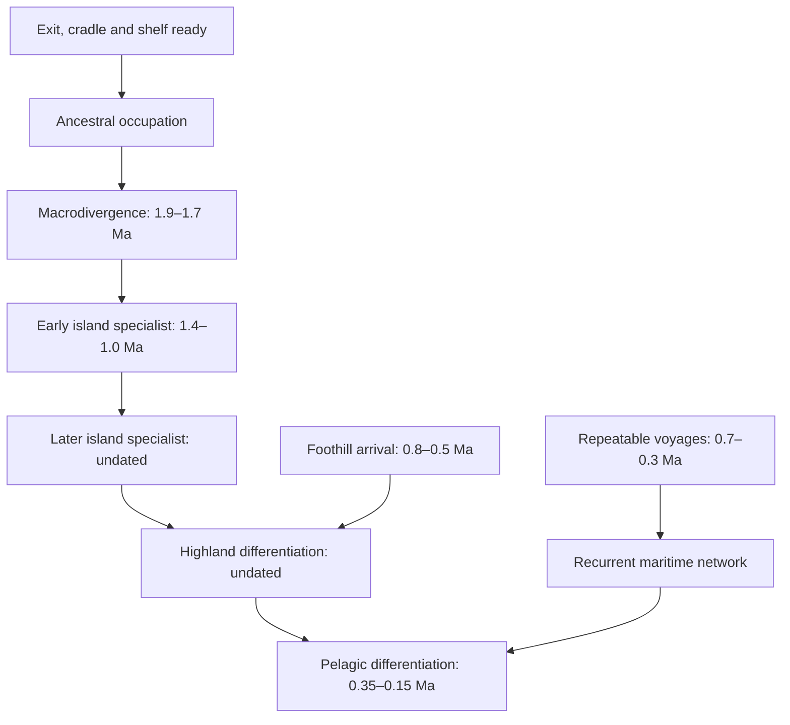
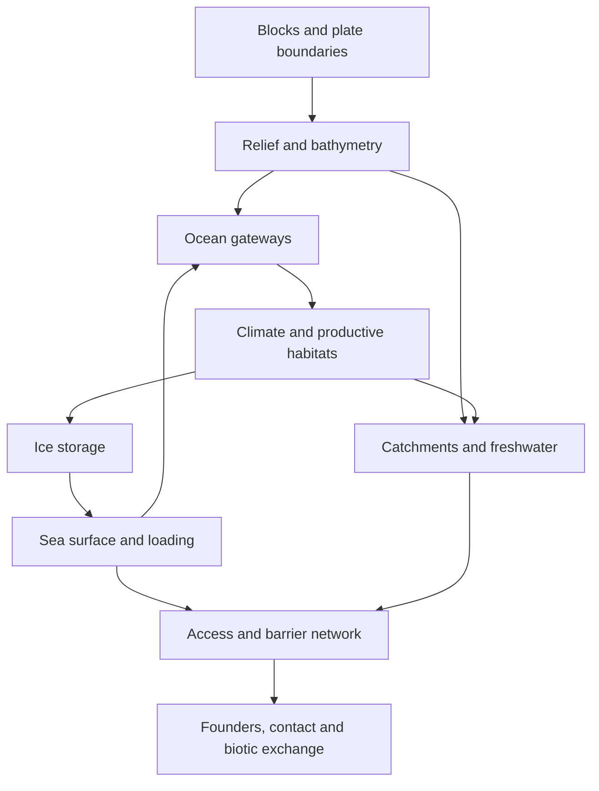

# Erde: dated constraints for continental reconstruction

**The historical requirements form a consistent dated graph. They do not yet establish a physically validated continental history.** The best way forward is to assemble an Erde-specific history of crustal blocks and gateways around the visibly different continental targets. Relative rotations, new peninsulas and relocated connections are available design choices.

This completes the bounded analysis and implements its constraint model. It preserves the [latest conditional outlines](../geological-reconstruction/README.md) without another premature redraw. The [machine-readable graph](graph.json), [validation results](validation.json), and [checker](../../scripts/editorial/check_erde_constraints.py) make the distinction between a consistent requirement and a demonstrated physical solution explicit. C1–C6 are authorial identifiers, not proposed native names.

## Decision and scope

The latest user direction makes **historical relationships binding and Earth-specific geography revisable**. An old coastline, junction, finite rotation or breakup detail cannot overrule a required migration merely because it came from Earth. Conversely, a pleasing new coastline cannot overrule a required isolation interval. Broad inherited ancestry remains a useful starting hypothesis; exact Earth trajectories and the previous prohibition on an extra C2 rotation are not acceptance rules for the new reconstruction.

The earlier trial removed C2's extra rotation because it conflicted with a stationary pasted hinge. That diagnoses an inconsistent combination, not a geological prohibition on rotating C2. A rotation becomes a legitimate candidate when the hinge, adjoining blocks, mountain belt and drainage evolve with it.

The proposed work is fictional reconstruction, not an attempt to discover empirical evidence about an actual Erde. We can author missing physical parameters and test their consequences. We must identify those assumptions, bound their sensitivity and avoid calling a result independent validation when its preferred outcome was built into its inputs.

### What binds, and what can change

| Binding relationship | Freedom retained | Consequence that must be assessed |
| --- | --- | --- |
| All six continental bodies must look meaningfully different | Proportions, lobes, bays, orientations, remote margins and constituent blocks | Crustal provenance, submerged shelves, oceans and global circulation |
| Ancestral populations occupy a mainland–shelf cradle before divergence around 1.9–1.7 Ma | Route location, a new peninsula, marginal block assembly or rotation | Substrate age, productive approaches, shelf cycles and marine exchange |
| Productive peripheral ancestral refuges on C4; intermittent western/eastern core contact | Exit side and route length, peripheral block geometry | Latitude, ice, freshwater, food and long-term filtering |
| Island specialists remain selectively isolated | Island locations and arc geometry; mainland may project toward another destination | No indirect lowstand shortcut joins protected island branches |
| Shelf-human founding uses rare short-water crossings in 1.0–0.6 Ma | Fragmented platforms or a projecting peninsula with detached islands | Founder viability, early technology and limited later influx |
| Early and later paired-continent arrivals use terrestrial/coastal approaches | External approach location; relative rotation of C1/C2; novel hinge | Separate opening windows, restricted intervening contacts, suitable hinterlands |
| Five ecological complexes and selected durable-contact order persist | Mountain curves, catchment outlines and coast sectors | Drainage, resources, coastal bypass, maritime relay and headwater descent |
| C6 and remote regions have credible older biotic history | Their bodies and plate histories can be substantially reconstructed | Wildlife and freshwater provenance, ocean barriers and climate effects |

Native continent names remain undecided. Public documents remain Erde-first. This authorial analysis does not introduce story material or use magic as a missing tectonic mechanism.

## Three connected graphs

The implementation contains 32 dated or explicitly undated events, 31 precedence relations, 14 physical dependencies, 12 gateway relationships and all 12 historical acceptance rows. Three architecture choices remain open.

1. **Temporal graph:** event windows and ordering. A readiness milestone must precede use; a selected lineage sequence must remain ordered. Ages use Ma before present, so larger numbers are older.
2. **Physical dependency graph:** blocks → terrain → access and habitats, with coupled ocean, climate, ice and sea-level feedback. These feedback cycles are real dependencies, not temporal contradictions.
3. **Route-choice graph:** mutually exclusive architecture alternatives. A peninsula and a fragmented-platform design are alternatives to compare, not simultaneous requirements. Neither is selected or certified merely by appearing in the graph.

### The dated backbone



Arrows show required precedence; the exact strict/non-strict relation is in JSON. Highland arrival is dated, but differentiation is not silently assigned the same date. Likewise, island emergence, first occupation and specialist divergence are distinct events.

The parallel human-form branch has its own constraints:

| Event or process | Adopted time | What the graph requires |
| --- | --- | --- |
| H-E ancestral branching | Undated | Before H-A ancestral branching and later western/eastern sister differentiation |
| H-E founding waves | 1.0–0.6 Ma | Destination and viable short-water approach ready; branching already occurred |
| H-A principal early founding | 0.65–0.45 Ma | Appropriate external land/coastal opening, then access to both interiors |
| Intervening recontacts | Between early and later principal founding | Rare bidirectional opportunities and persistent differentiation; exact counts and rates open |
| Later principal founding | 35–20 ka | A separate terrestrial/coastal opening first supports durable rim settlement |
| Subsequent durable contact | Undated ordered events | Rim → watersheds → hinge → spine → basin; no invented date for each arrow |
| Expansion beyond the rim | Roughly 8–12 millennia | Retained process statement; exact start/end milestones need clarification before a numerical duration edge is imposed |
| Northern successor outcome | Established by about 5 ka | Several connected mixed successor populations; four other complexes remain self-sustaining |

The H-E and H-A settlement intervals overlap. Their selected **ancestral branching order does not require every H-E settlement wave to precede every H-A settlement wave**. The checker deliberately preserves this distinction.

A broad interval is an opportunity window, not continuous exposure. One possible event within it cannot establish the repeated waves, migration duration or restricted contacts a population history requires. Those process tests remain separate from the temporal solver.

### The main physical coupling



A permanent ancestral neck may solve access while changing coastal productivity or allowing earlier terrestrial fauna exchange. A convenient shelf peninsula may reduce crossing demands while destroying island isolation. A continental rotation may improve a silhouette while shifting a refuge poleward or moving a rain shadow across a required basin. These are reasons to evaluate connected systems together.

## Bounded analysis of the alternatives

| Architecture | Assessment | Decision |
| --- | --- | --- |
| Preserve Earth-relative paths and patch modern coasts | Lowest initial effort, but repeatedly forces desired outlines back toward reference geometry. Buffers supply neither crust nor dated terrain. | Keep as comparator and checkpoint, not the governing design method. |
| Assemble regional crustal blocks inside one shared global boundary history | Accommodates novel shapes and gateways while making causes, chronology and budget testable. Requires explicit coupled sectors. | **Recommended.** Start with the global topology, then solve linked regional systems. |
| Rebuild the entire deep-time planet without inherited priors | Maximum freedom, but introduces many unrelated variables and extensive biological/climate uncertainty. | Reserve for a demonstrated conflict that the regional approach cannot resolve; do not begin here. |

The recommended architecture changes the unit of work from an isolated coastline edit to a **dated regional system**. It does not treat a composite continent as one rigid plate. A block has a parent-relative rotation history; adjacent rifts, sutures and deforming regions must explain changes between blocks. This follows the distinction between rigid rotations and topological deformation in the [GPlates primer](https://www.gplates.org/docs/pygplates/pygplates_primer). Crustal thinning and subsidence require more than a rotation file; the [GPlates worked example](https://www.gplates.org/docs/pygplates/sample-code/pygplates_reconstruct_crustal_thickness_and_tectonic_subsidence) uses both rotation and topology inputs.

### Work on all bodies, with coupled gateway sectors

| System | First physical candidate | Materially different fallback | Downstream checks |
| --- | --- | --- | --- |
| Global C1–C6 framework | Preserve distinct target bodies; assign old nuclei, marginal continental blocks, arcs and submerged crust in one topology | Reassign or rotate the conflicting block and change its boundary history | Full polygon integrity, provenance, budgets, ocean topology and outline comparison for every body |
| C4 ↔ western C3 | Dated western accreted neck, using the existing conditional route as a starting hypothesis | Rotate/reassemble peripheral blocks into a shorter margin route | Productive polar refuges, seaway exchange, early fauna dispersal, later core filtering |
| Eastern C3 ↔ C5 and highlands | Segmented shelf platforms with persistent transverse deep channels | Mainland peninsula toward the human destination; specialist islands stay on detached blocks | Early island radiation, H-E founding, highland arrival, recurrent contact and later marine network together |
| Eastern C3 ↔ C1 ↔ C2 | Reconstruct external approach and curved internal hinge around the current broad bodies | Rotate paired blocks with a relocated accreted hinge and external peninsula | Both principal founding windows, restricted recontacts, mountains, basins and durable-contact sequence |
| C6 and remote margins of every body | Explicit rifted/accreted margin histories and submerged basement; review during global assembly | Revise the responsible lobe, gulf or block orientation | Older clade histories, freshwater isolation, circulation, climate and equal visual attention |

The fallback options are not yet fitted physical histories. They define distinct searches with known consequences. Do not combine whichever parts of separate scenarios pass individually: a candidate must use one compatible block history and shared forcing throughout.

## Coherent execution plan and gates

The old scaffold (ancient nuclei; Mesozoic breakup; Cenozoic relief; Quaternary gateway changes) is an initial partition, not a set of mandatory Earth event dates. Geological stages may move when the block model requires it. Continental-scale changes should be completed before they conflict with the population record; young local sea-level or uplift changes cannot stand in for an unexplained late relocation of a whole continent.

| Stage | Concrete output | Gate before the next dependent edit |
| --- | --- | --- |
| 0. Constraint specification — **completed** | This graph, source precedence, chronological checker, negative controls and unresolved assumptions | All H01–H12 represented; dates/order consistent; unknown physics cannot report acceptance |
| 1. Shared crustal assembly | Block polygons with IDs, provenance, crust type, parent rotations, boundary types and event ages; every target sector assigned | No unexplained overlap, gap, oceanward continental addition or incompatible circuit; all six bodies included |
| 2. Coupled gateway histories | Dated cross-sections and full approach networks for the regional systems above; alternative-choice record | Substrate exists before use; rotations and hinge/mountain construction compatible; opening and isolation obligations considered together |
| 3. Environmental bounds | Coarse elevation/bathymetry and derived drainage; shared ice/sea scenarios; seasonal habitat, currents and freshwater bounds | A common physically argued scenario can support all required resources and gateways; uncertainty and failure ranges exposed |
| 4. Migration and biotic review | Time-indexed access/barrier networks and clade-specific audits; founder and contact dossiers | Appropriate technology, adequate resources, restricted exchanges, no unexplained shortcuts or reversed durable-contact sequence |
| 5. Sector revision and final comparison | Only necessary outline/relief revisions, followed by all affected downstream checks | Every body remains visibly distinct; changes improve diagnosed problems; no conditional result promoted to full history |
| 6. Atlas integration | Geography, migration layers and public explanations updated together | Historical acceptance review completed for the chosen scenario; unresolved material constraints prevent promotion |

Stage 1 must precede further outline edits. It is the highest-value next implementation: the previous six conserved nucleus parcels and modern margin envelopes do not account for the full bodies. It should create a complete **coarse** model first, not refine one peninsula indefinitely while other continents remain unassigned.

For each block, store present polygon, provenance, rotation parent, finite rotations at event ages, deformation zones, crustal thickness/area assumptions, exposure history and associated ecological obligations. For each gateway, store source and destination habitat nodes, intervening land/island cells, sill/depth history, local vertical uncertainty, freshwater, seasonal productivity, allowed travel behavior and required closure/filtering intervals.

The first environmental pass can use explicit bounding scenarios rather than require a full global circulation simulation. Compare a lower-ice/warmer case, a higher-ice/colder case and a seasonally unfavorable case with the **same** crust and gateway histories. These are authored sensitivity cases, not an imported Earth glacial timetable. If outcomes depend on unbounded rainfall, ice storage or voyage performance, record that dependence; a more detailed model is warranted only where it could change a decision.

Dates should be sampled at formation events, before/inside/after founding windows, during intervening restrictions and at each modeled state transition. Endpoint checks miss temporary bridges and young substrates. Piecewise histories permit targeted refinement around threshold crossings; continuous physical or demographic viability cannot be inferred merely from a sparse time grid.

### Acceptance and choice

Use hard requirements first, then compare surviving candidates on target-body fidelity, credible physical causes, fewer unsupported assumptions and lower downstream disruption. No arbitrary weighted score may trade away an island barrier or a founding window. Relative-area overlap and silhouette comparison are useful diagnostics, not physical acceptance thresholds. The old 75% IoU target remains a historical design heuristic, not a new hard rule.

An acceptable scenario must explain both **why a route can open** and **why it does not erase a required separation**. Wildlife guilds need distinct treatment: a human boat route is not freshwater continuity or unrestricted large-animal exchange. Long-lived magical provinces and reciprocal disease ecologies also need review when geology and contact networks move; they are not escape clauses for missing physical causes.

## Bounded retries and progress controls

Use no more than three full architectures in a reconstruction pass: one baseline plus two materially different alternatives. Within the selected architecture, allow at most two causal revisions for a particular blocker. Repeated parameter nudges without a new diagnosis count against that budget; they do not reset it.

Before a revision, record the failing predicate, affected dates and sector, causal input, proposed change and downstream requirements to rerun. Preserve the failed candidate. For example:

| Failure | Cause to distinguish | Useful next attempt |
| --- | --- | --- |
| H-E crossing remains too demanding | Geometry, currents, freshwater or founder frequency? | If geometry dominates, test a peninsula architecture rather than enlarge shallow buffers repeatedly |
| Island barrier disappears | A direct sill or an indirect land shortcut? | Reposition the relevant block/channel and retest the entire regional network |
| Rotated C2 disconnects its hinge | Inconsistent adjoining block motion | Reconstruct the hinge and boundary history jointly; do not paste the old neck back |
| Ancestral route is exposed but unproductive | Latitude, ice, aridity or resource discontinuity? | Shorten/reposition the peripheral route; do not call land exposure habitability |
| Model lacks decisive climate or demographic bounds | Missing assumption or evidence, not numerical failure | Document the unresolved dependency and stop this branch until a bounded scenario can be specified |

Each computational batch needs an expected output, a time budget and a saved checkpoint. A batch with no output or demonstrable progress for 60 seconds triggers inspection; terminate or checkpoint an unproductive process rather than repeating the same call. Long useful computations may continue with observable progress and regular updates. A deterministic failed call is not retried unchanged.

After the budget is exhausted, preserve the last reproducible conditional map, retain whichever sectors genuinely passed their scoped checks, and report the unresolved constraint. This does not convert a partially valid global history into a valid one. The current conditional map remains that checkpoint; no further coastline edit is justified by this graph alone.

## Validation performed

Run from the repository root:

```bash
python scripts/editorial/check_erde_constraints.py --self-test --output docs/continental-constraint-graph/validation.json
```

The checker uses exact decimal difference constraints, including strict precedence without inventing a minimum number of years. It checks referential integrity, all-six coverage, H01–H12 coverage, interval validity, chronological feasibility and dependency blocking. Its temporal method follows the [Simple Temporal Networks framework](https://drops.dagstuhl.de/entities/document/10.4230/LIPIcs.TIME.2021.1); architecture alternatives remain explicit choices outside the conjunctive temporal solver.

**Result:** graph structure passes; chronology is feasible; ten negative/scope controls pass; historical acceptance remains false. Controls include late substrate, reversed branching, equal times where strict precedence is required, missing requirements and dangling gateway references. They also verify that physical feedback does not become a false temporal cycle, undated ancient events retain open age bounds, overlapping settlement windows remain possible, and unselected alternatives or unknown physics do not certify history.

The output includes a graph content hash, derived feasible age bounds, dependency impacts and the blockers for each historical row. Derived bounds are implications of the adopted order, not new dates promoted to canon. All twelve rows still require physical or population review. The solver neither constructs continental crust nor proves migration success.

### Uncertainty retained deliberately

Exact ancient clade dates, full marginal crust provenance, local uplift/subsidence, Erde's ice/sea timetable, seasonal resources, voyage/founder performance and several process durations remain unresolved. The 8–12 millennia expansion statement is retained without fabricated endpoints. The disease outcome and five ecological complexes are obligations, but no new pathogen history or deterministic rainfall field is invented.

These uncertainties do not justify indefinite reasoning. The next productive artifact is the complete coarse block inventory and shared topology in Stage 1. It can use declared authorial hypotheses and testable bounds. It should proceed to a coastline revision only when its downstream consequences have been evaluated sufficiently to identify a coherent candidate.
