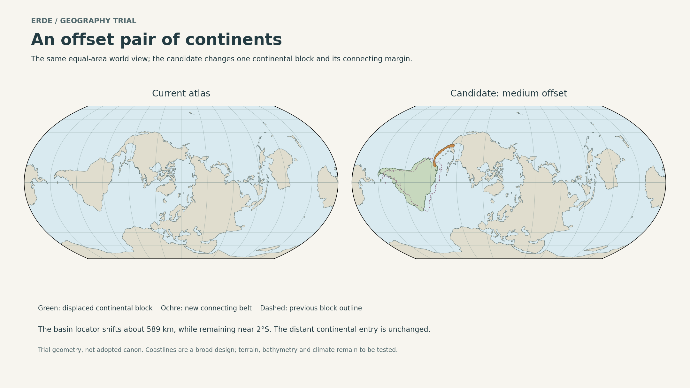

# Erde: offset continents and volcanic hinge trial

**Working result:** the medium offset is the best candidate to develop further. It changes the continental junction substantially while keeping the equatorial basin near its existing latitude. The tested land outline connects the continents and retains representative interior land footprints. Climate, terrain and historical ecological passability remain unvalidated.

This is an authorial trial, not replacement canon. The live world guide continues to use the previously adopted geography. Earth coordinates in the generator are authorial source locators; the figures use native Erde coordinates. No new place or people names are adopted.

## Maps



- [World comparison, vector SVG](01-world-comparison.svg)
- [Detailed hinge and island map](02-hinge-detail.png) · [vector SVG](02-hinge-detail.svg)
- [Three offset candidates](03-offset-options.png) · [vector SVG](03-offset-options.svg)
- [Protected land samples and population regions](04-habitat-constraints.png) · [vector SVG](04-habitat-constraints.svg)

The main comparison uses Equal Earth. The regional sheets use a Lambert azimuthal equal-area view centered on the hinge. All use the same spherical globe and native latitude/longitude frame. Shape distortion differs by projection; compare candidate offsets within a sheet, where the projection is identical.

## What was constructed and measured

A southern continental block is displaced by a rigid spherical rotation around native 100°W, 60°N. Three alternatives use −4°, −6° and −8° rotations. These are finite differences from the existing geographic scaffold, not a reconstruction of Earth's past or a complete global plate model.

| Candidate | Basin-locator displacement | Approximate maximum change in coastal-vertex latitude | Geometric land connection |
| --- | ---: | ---: | --- |
| Modest | 393 km | 1.5° | Joined |
| Medium | 589 km | 2.2° | Joined |
| Stronger | 786 km | 3.0° | Joined |

The medium candidate keeps the basin locator at approximately **2.06°S**, compared with **1.99°S** previously. Its continental block retains approximately **17.9 million km²** of mapped land area, unchanged by the rigid rotation to numerical precision. Keeping area and latitude does not keep rainfall or ecology automatically.

The new accreted belt has an approximately **3,170 km** schematic axis and constructed widths of approximately **140–290 km**. These are coastline-design dimensions, not measurements of traversable habitat. The belt occupies about **726,000 km² gross**, including attachment overlaps. Approximately **527,000 km²** of old margin is removed from the exposed-land outline, with about **60,000 km²** retained as five assumed upland remnants. Global mapped land area changes by only about **+0.07%**, but this is a major regional reorganization. A small global percentage does not imply a small climatic or biological effect.

The coastlines of the new belt and surviving islands are schematic. Their shapes are generated reproducibly, but no elevation or bathymetry dataset demonstrates those particular shorelines. The construction partitions source land approximately at the old hinge; this partition is not asserted to be an actual tectonic boundary.

## Consequences evaluated after construction

| Requirement or consequence | Evaluation | What follows |
| --- | --- | --- |
| Early continental founding, 650,000–450,000 years ago | The remote external entry is unchanged by this trial. A connected internal continental land outline passes the geometric check. | Retain the founding route and contact order. The new internal hinge must already be traversable by then; the external entry's sea-level and habitat assumptions remain as before. |
| Later principal founding, 35,000–20,000 years ago | Same geometric situation; no obligatory new sea crossing is introduced into the principal migration. | Coastal-rim communities can still receive sustained contact first. Subsequent travel distances and local timing need revision. |
| Great Watersheds | Northern block and a representative interior land footprint remain intact. | Its broad role remains available. Water supply, complete drainage divides and navigable outlets were not tested. |
| Equatorial Basin | The continental block and a representative interior land footprint move together; the sampled basin stays close to its old latitude. | No gulf is cut through the protected interior sample. Humid forests, seasonal environments and river networks remain plausible requirements, not verified outputs. |
| Highland Spine | The continental core moves rigidly, preserving its internal geometric relationships. | Carry the mountain system and elevation networks with the block. Coastal currents and wind exposure may still change, and the whole mountain range has not been terrain-tested. |
| Volcanic Hinge | A longer, broad, curved land belt replaces the familiar narrow junction. | More scope for distinct highlands, coastal plains, passes and refuge districts. The history should allow several regional societies rather than treating it as one compact isthmus. |
| Offshore islands | Consecutive large remnants have approximate shortest outline gaps of 197–313 km in the local projection. | They are not an easy short-hop ladder. Early continental movement remains overland; settlement of the islands requires separate evaluation of craft, currents, landings and freshwater. |
| Terrestrial wildlife | A land connection can support exchange without mandatory rafting. The islands filter movement differently. | Connected mainland populations and distinctive island descendants can coexist. Loss of the old margin would also produce habitat loss, displacement and extinctions, not just attractive new islands. |
| Ocean gateways | The drawn land belt blocks a direct surface seaway through this continental junction. | This avoids one especially disruptive change, but basin geometry, shelf depths, coastal currents and circulation elsewhere remain unresolved. No direction or magnitude of rainfall change is established. |
| Hobbit cradle, ancestral polar refuges and other continents | Their land polygons and source locations are outside the edited region. | They are geometrically retained. Possible remote climate effects cannot be ruled out without circulation work. |
| Visual differentiation | The bent junction and island-fringed basin look substantially different at regional scale. | Global improvement is moderate. The moved continent largely retains its familiar silhouette, and untouched continents remain recognizable. A further margin-shape pass would help more than simply maximizing displacement. |

The protected footprints are representative **interior land samples**, not complete reconstructed watersheds. They establish that the coast edits did not flood those samples. They cannot demonstrate unchanged rainfall, catchments, food production or population capacity.

## A geological history that could support it

This is a proposed sequence to test. Its mechanisms have real analogues, but the dates, crustal geometry and resulting landscapes are fictional design assumptions.

| Interval before present | Proposed development | Necessary check |
| --- | --- | --- |
| Roughly 30–15 million years | Relative plate trajectories diverge from the old scaffold. A substantial pre-existing arc and inherited crustal blocks occupy the future hinge region. | Use a full plate circuit to account for relative motion, oceanic spreading and subduction. Do not manufacture the entire belt from recent volcanism. |
| Roughly 15–7 million years | Oblique convergence and terrane accretion build a broader curved margin; extension and subsidence affect parts of the older coastal belt. | Maintain a physically consistent trench/arc/back-arc arrangement and crustal budget. Active volcanism belongs to suitable parts of the system, not every remnant island. |
| Roughly 7–3 million years | Accreted land and uplift consolidate the relocated connection; the old margin becomes increasingly fragmented. | Establish a complete barrier to the regional seaway without assuming that present coastlines or topography already exist everywhere. |
| By approximately 2.5 million years | The candidate requires an enduring continental connection with habitable lowland or pass routes available during favorable intervals. | Preserve adequate food and freshwater corridors before the established early founding. This is a requirement, not a numerically derived closure date. |
| 1 million years to present | The broad arrangement persists while climate, sea level, rivers and local deformation alter access. | Test the existing founding windows, intervening isolation/contact, later coastal exchange, the 5,000-year endpoint and present geography separately. |

A 589 km difference accumulated over 30 million years corresponds to about 2 cm/year at the sampled basin location. That is a plausible displacement scale, not the actual speed of a fully modeled plate. The frame is comparative: the other continents being held fixed in the trial does not mean they stood still for 30 million years. Regional deformation and neighboring oceanic plates still need reconstruction. The opposite coasts and plate margins of the moved continent must also accommodate its changed path.

Until elevations and bathymetry exist, drawing several nearly identical maps labeled with the migration dates would merely illustrate these assumptions. No time-sliced paleogeographic simulation has been performed, and the trial should not be presented as one.

## Refinements made during evaluation

1. Replaced a smooth constant-width belt and nearly circular remnants with a variable-width, irregular schematic margin. This improves the visual prototype without claiming extra geological evidence.
2. Checked the existing population locators against land. The legacy coastal-rim and Highland Spine points were offshore in the source scaffold. For this trial, representative locators move inland within those same broad regions before applying the continental offset. The live atlas has not silently inherited this correction.
3. Distinguished the new land connection from the offshore-island route after measuring the long island gaps. The preserved principal migrations do not depend on the islands.
4. Restricted land-retention checks to explicitly representative interior footprints. Independently reprojected coastline intersections had created tiny boundary slivers; they were unsuitable for an exact interior-preservation test. This is a geometric representation issue, not evidence of lost watershed habitat.
5. Kept climate claims conditional despite the successful area, latitude, topology and locator checks.

## Recommendation after the trial

**Continue with the medium candidate as a working design, rather than adopt it as finished geography.** It preserves the important geometric opportunities and gives the hinge a distinct regional character. The strongest consequences are a larger and more internally varied Volcanic Hinge, altered coastal contact distances, and island populations with stronger isolation than an easy stepping-stone route would imply.

The next consequential choice is whether these islands should remain relatively isolated, or whether a denser shelf archipelago is desired. A denser chain requires more retained high ground and a bathymetric design; adding dots would not establish safe passage. In either case, keep the early continental migrations on land.

Before canon adoption, the main technical priorities are a consistent regional plate reconstruction, elevation and bathymetry around the hinge, moisture pathways into the basin, and dated corridor/access scenarios. Detailed ecosystems and migration success remain conditional until those checks are done.

## Reproduce and inspect

From the repository root:

```sh
python -m pip install -r scripts/editorial/requirements-atlas.txt
python scripts/editorial/try_erde_hinge.py
```

The generator checks valid land geometry, north-to-south land-component continuity, all trial population locators on land, preserved representative interior footprints, rigid-block area preservation and bounded latitude changes for all three candidates. A successful run regenerates the four figure pairs, [measurements](measurements.json), [candidate land](candidate-land.geojson) and [candidate overlays](candidate-overlays.geojson).

The published atlas generator does not read this trial geometry. No web-app code, public article or adopted map is changed by the experiment.

## Scientific grounding

- [German Geological Society: plate motion as rotations on a sphere](https://www.dggv.de/en/portfolio/4-3-plate-motions-rotations/): supports the rigid spherical displacement method; it does not validate the trial's chosen Euler pole.
- [USGS: Gulf of California rift evolution](https://www.usgs.gov/publications/magmatic-evolution-gulf-california-rift): supports the use of long-lived tectonic reorganization and continental-margin extension as mechanisms.
- [USGS: arc accretion and collision](https://pubs.usgs.gov/publication/70210694): documents arc accretion/underthrusting as a geological mechanism. It does not establish the dimensions or rates of the proposed hinge.
- [Sentman et al., 2018: Central American Seaway and circulation](https://agupubs.onlinelibrary.wiley.com/doi/full/10.1029/2018PA003364): illustrates that circulation responses to gateway changes depend on the model and background climate. An assumed Earth-like climate response should not be assigned to Erde.
- [Kaifu et al., 2020: Palaeolithic water crossings](https://www.nature.com/articles/s41598-020-76831-7): supports considering visibility, currents and deliberate voyaging instead of treating island separation alone as evidence of access. The study does not establish the capabilities of Erde's much earlier fictional populations.

## Follow-up

The [coastal reshaping trial](../coast-trial/README.md) tests an additional gulf while retaining this medium-offset base. Its evaluation recommends deferring that gulf unless its regional maritime setting is independently wanted.
