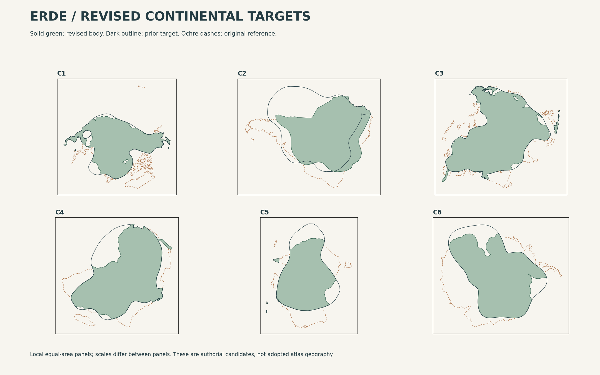
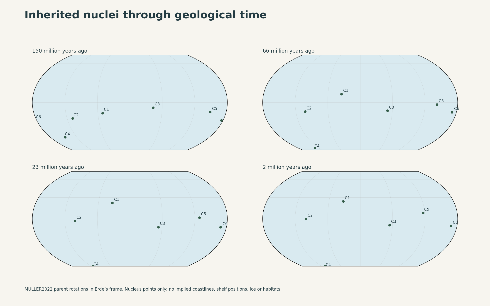
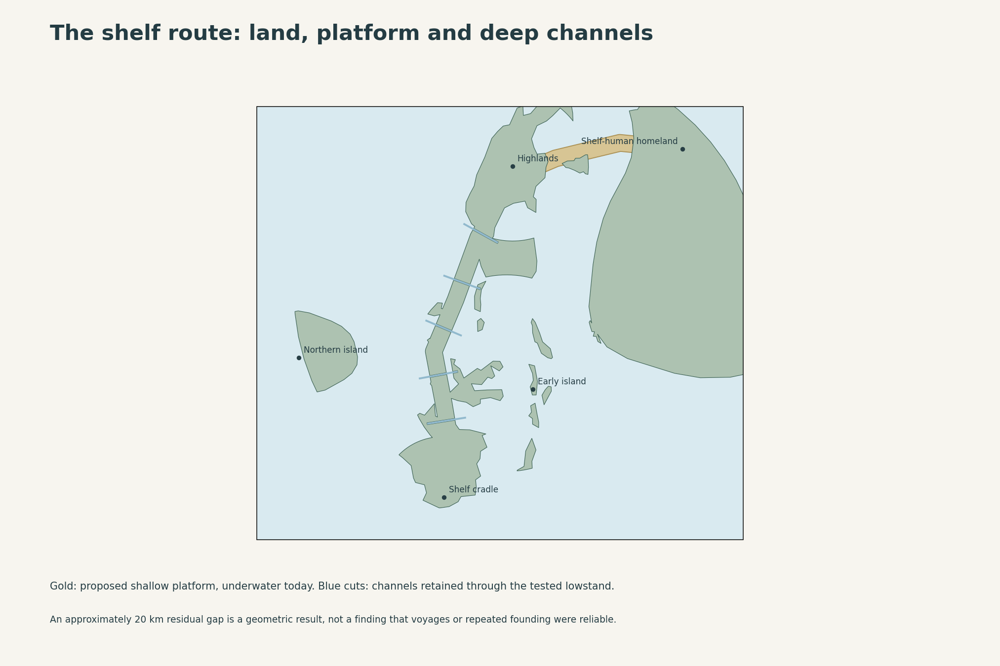
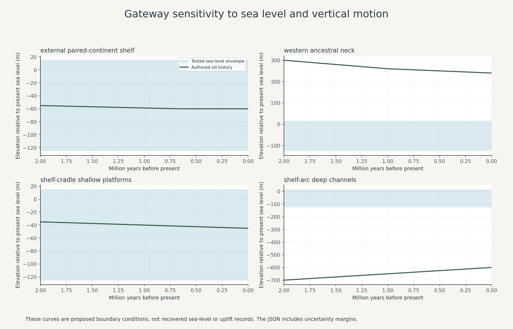

# Erde: fitting the continental targets to geological history

**Result: revised outlines and a more explicit, partially tested geological scenario. The candidate passes the reported geometry and parameter-consistency checks, but it does not yet pass every historical acceptance requirement.** The public atlas has not been replaced.

The subsequent [dated constraint graph and execution plan](../continental-constraint-graph/README.md) now governs the next reconstruction pass. It retains the historical obligations while allowing Erde-specific relative rotations, peninsulas and replacement junctions. The rotation removal and inherited paths below describe this tested candidate, not permanent restrictions on future designs. The graph passes chronological consistency checks; it does not retrospectively validate this candidate's unresolved physical history.

This study implements changes rather than repeating the earlier list of missing evidence. It compares three margin alternatives, removes the unsupported extra rotation of the southern paired continent, supplies a western ancestral-route substitution, redraws the highland/headwater scaffold, and tests a mapped shelf route. A failed long-water crossing was replaced and tested again. The retained limitations are substantive; changing a label from “unknown” to “pass” would not resolve them.

## Updated outlines



The broad shapes of all six groups remain different from the original atlas. Changes concentrate on the least-supported oceanward expansions, the paired continent's unnecessary positional offset, and the ancestral coastal route. C1–C6 are authorial diagram identifiers, not continent names.

| Group | Revision and causal interpretation | Historical consequence |
| --- | --- | --- |
| C1: northern paired continent | Retain the broad curved body and major embayments; trim remote additions using the narrowest tested margin envelope that preserves the design | External approaches and the interior remain connected; their old land-and-coastal founding requirement remains binding |
| C2: southern paired continent | Remove the additional six-degree rotation while retaining the short, broad body; trim the unsupported far flank; provide a new inland highland axis | Avoids requiring a moved rigid continent to remain attached to a pasted stationary hinge; the headwater route reaches the basin without crossing new sea |
| C3: large composite mainland | Retain most of the target; keep its constituent-block ancestry rather than assigning the entire continent to one rigid plate; integrate the western neck | Provides a source-to-western-core alternative; western/eastern ecological filtering is still required |
| C4: polar continent | Retain the embayed body; give its ancestral periphery a continuous western route; treat drowned old highland sectors as submerged crust | The source population need not traverse the former obligatory exit near 60°S; old highlands do not have to survive as today's dry land |
| C5: shelf-adjacent continent | Keep the oblique body but trim the most remote lobe; add a separate submerged platform toward the highland island | At suitable lowstands, the final leg to the shelf-human homeland becomes terrestrial without joining the whole radiation to the mainland |
| C6: equatorial continent | Keep the lobed, asymmetric body; trim remote additions and retain submerged inherited basement where the new coast retreats | Its present low-latitude setting does not become a claim of continuous equatorial history or identical ancient fauna |

The 250, 450 and 700 km margin envelopes are **design search limits around the reference land**, not measured continental shelves, crustal boundaries or limits supplied by a geological paper. They reduce the unconstrained oceanward additions but do not prove their provenance. The selected 250 km alternative preserves at least 75% intersection-over-union with each comparison target. That threshold is a design heuristic, not a scientific acceptance criterion. For C2 the comparison target is placed before the extra rotation; the figure also shows the prior rotated target, so the positional change remains visible.

A craton is a body of crust, not a promise of permanently exposed land. During review, circular land patches added merely to keep old sample points dry were removed. They would have fabricated islands to satisfy the wrong test. The nucleus parcels remain in the crustal history whether their present surface is exposed or submerged.

The revised world has approximately **138.4 million km² of land**, versus 147.3 million km² in the reference. About **21.9 million km²** becomes land at formerly marine locations, down from 37.6 million km² in the prior target; approximately **30.7 million km²** of reference land becomes water. These are surface-mask differences, not a crustal mass budget. The roughly 6% reduction in total dry land has ecological and hydrological consequences that remain to be modeled. Group totals overlap in some connection sectors and should not be summed as an independent world total.

## A dated causal history

The reconstruction uses one inherited working frame, **MULLER2022**, throughout. The previous MERDITH2021 results remain a sensitivity comparison; the model does not switch frames between eras to rescue preferred outcomes.

| Interval | Proposed physical development | What is actually tested |
| --- | --- | --- |
| Before 150 Ma | Inherit the nuclei and broad breakup/collision families. Extra marginal basement must already belong to a credible continental or arc domain | Six small inherited nucleus parcels are reconstructed at 150 Ma; the full marginal inventory is not resolved |
| 150–66 Ma | Different rift geometry, asymmetric extension and subsidence produce broad shelves, drowned sectors and different continental proportions | Parent motions and nucleus area conservation; margin provenance remains a hypothesis |
| 66–23 Ma | Active-margin accretion, foreland development and continuing subsidence shape C1/C2, the composite C3 margin and isolated C5/C6 margins | Dated nucleus positions and compatible timescale, not a complete deforming plate mesh |
| 23–8 Ma | Develop highland relief and drainage. Accrete the proposed western ancestral neck during roughly 15–8 Ma | Proposed chronology explicitly predates population dispersal |
| 8–3 Ma | Western neck exposed by 6 Ma; highland relief established by 5 Ma; shelf-arc substrate present by 5 Ma; hinge consolidated before 3.5 Ma; headwater/foothill routes established by 3 Ma | Formation-before-use inequalities and specified elevation histories |
| 2 Ma–present | Regional vertical motion, ice-driven sea-level variation, erosion and sedimentation change route availability while deep straits remain marine | Elevation-envelope tests at 10,000-year spacing, additional migration dates and piecewise-linear breakpoints; high/low-water topology screens |

These are proposed Erde dates, not imported Earth event dates. In particular, the Earth chronology of an isthmus or an island does not date Erde's corresponding feature.

The six 200 km-radius nucleus parcels preserve area within roughly one part per million through eight sampled epochs, and do not overlap one another at those snapshots. Their reconstructed latitudes agree with the independently cached point-service results within 0.001°. This checks rotation direction, coordinates and material conservation for those parcels. It **does not** validate the other millions of square kilometres of crust. Their finite rotations, the raw service response and the parcel polygons are included.



## The western ancestral substitution

The previous mandatory eastern exit was near 60°S in the sampled early-Pleistocene scaffold. The replacement runs from the existing peripheral refuge along a lowland western coast, across an accreted neck, and into the western continental core. Its complete present path is on land, about 5,300 km long, with sampled vertices no farther poleward than about 47°S. This lowers the latitude burden; it does not eliminate winter, drought, ice-margin or food constraints.

The neck is proposed as an old accretion/uplift feature, exposed by 6 Ma, rather than a land bridge created immediately before a desired migration. Its low point is 240–300 m in the two-million-year test history. With 60 m vertical uncertainty, 15 m local sea-level uncertainty and a +15 m highstand, it remains above water. Those elevations are authored design parameters.

The substitution changes marine geography. Closing a western seaway can alter exchange, salinity, moisture supply and coastal productivity. Retaining other outlets is a design obligation, not a demonstrated circulation result. It also allows terrestrial wildlife exchange earlier than the named human dispersal. It cannot be treated as a human-only passage. The old eastern route may still exist; it is no longer the sole required exit in this candidate.

Later west/east sister-lineage differentiation is preserved as a requirement for ecological and demographic filtering, not made into absolute isolation. A permanent neck permits passage; it does not require continuous high-volume migration.

## Repairing the shelf-human route



The mapped first attempt failed: the smallest achievable largest water gap to the shelf-human homeland was about **256 km at the modeled lowstand**. That is incompatible with presenting the route as rare short-water crossings.

The retry adds an explicit **submerged southern platform** between the highland-island neighborhood and C5. The earlier arc retains deep transverse channels. In the selected lowstand geometry, the minimum-largest-gap calculation finds a route with a remaining gap of approximately **20 km**, while no continuous all-land route joins source and destination. The early island and the relocated northern-island site stay separate from both endpoints under the tested high- and low-water configurations.

At the present coastline the largest required gap is still roughly 346 km. This is intentional: the early shelf-human route depends on a sufficiently low sea surface, and is not presented as equally accessible today.

The northern island's old locator fell in water under the target outline. The replacement site lies in the interior of the existing proposed island at authorial reference 123°E, 14°N. This is an explicit locator substitution, with old island substrate required before occupation. Moving the dot does not establish the island's geological or biological history; that obligation remains open.

The lowstand test assumes up to 45 km of exposed shallow platform around regional land, plus the mapped southern platform. Deep-channel polygons remain excluded. This supplies a reproducible geometric scenario, **not a reconstructed bathymetric raster**. The metric minimizes the largest inter-component gap. It does not minimize total travel, test travel within each island, choose safe beaches or account for currents. Its regional equal-area distances should be read as approximate kilometres.

A 20 km channel is not universally safe. Early-Pleistocene island occupation on Earth supports the possibility of early hominins crossing marine barriers, but not a specific vessel, route, frequency or founding probability on Erde. Large island area provides room for resources; it does not demonstrate freshwater, productivity or sufficient founders.

## Mountains and headwaters

The new C2 mountain axis is about 4,300 km long and stays on the revised land. Its proposed elevation profile spans approximately 2,200–4,300 m. The headwater line descends from that axis toward the basin through a specified decreasing profile and also remains on land. This repairs the old overlay's offshore terminus and gives the selected Highland Spine-to-Equatorial Basin contact direction a concrete spatial scaffold.

The profile is not a terrain model or a calculated drainage network. It supplies neither watershed area nor rainfall, sediment loads, discharge or ecological continuity. A monotonically descending line cannot certify an entire basin. Likewise, a land connection through the hinge does not prove that all volcanic refuges survive at the same time. These distinctions are recorded in the acceptance ledger below.

## What passes, and what remains open

| Requirement | Result for this candidate |
| --- | --- |
| Visibly changed bodies across all six groups | Retained in the comparison; visual satisfaction remains the author's judgment |
| Valid modern polygons and tested land approaches | Pass for the reported geometry |
| Old C2 offset versus pinned hinge | Extra offset removed; remaining hinge history is proposed, not fully reconstructed |
| Nucleus motion and material conservation | Pass for six limited parcels and eight epochs |
| Western ancestral route | Present continuity and elevation-envelope pass; palaeohabitat and circulation remain open |
| Shallow shelves versus deep water barriers | Pass for the stated elevation envelope and mapped high/low configurations |
| Shelf-human short-water geometry | Failed initial attempt; selected retry passes the stated gap screen |
| Early and later island-site isolation | Pass for the two mapped sites at the tested configurations; not a complete biogeographic audit |
| New highland/headwater scaffold | Whole lines are on land; elevation/age conditions specified; full drainage and habitat remain open |
| Early and later continental founding windows | Shelf can emerge within the tested envelope, but actual lowstand timing, duration and founder viability remain unvalidated |
| Rare intervening contacts and independent differentiation | Not established by sea-level bounds or land connectivity |
| Complete ancient crust inventory and closed plate circuit | Not yet passed; the new province map classifies assumptions rather than proves them |
| All wildlife, freshwater lineages and ocean/climate consequences | Not yet passed |

The eight gateway profiles all satisfy their specified substrate-before-use and water/land inequalities within the tested uncertainty envelope. That is a **conditional consistency result**: the sea-level envelope and vertical histories were chosen as scenario inputs. They are not independent evidence that the climate generated the desired openings at 650–450 ka and 35–20 ka.



The common sea-level envelope is −125 to +15 m, with ±15 m of local effects and additional gateway-specific vertical uncertainty. The inherited polar continent offers substantial possible grounded-ice storage, but the required change in ice volume, its timing, and productive refuges must work together. A large ice sheet need not vary enough to expose a chosen shelf. No Earth glacial calendar is silently imported.

## Why further parameter retries stop here

The actual failures in geometry were investigated and repaired. Broader margin limits retain more of the original targets but assign more unexplained oceanward land; they do not close the crustal-history gap. Adding the southern platform fixes a long-water leg, but narrowing its channel further cannot establish repeated colonization or rainfall. More iterations of these same calculations would therefore not resolve the remaining acceptance requirements.

The next productive model is a **whole-margin reconstruction**, beginning with C2 and the C4 western neck, that assigns the added basement to dated blocks and compatible conjugate boundaries. It must then carry palaeotopography and bathymetry through the required population dates. A second scenario should keep the original eastern exit as an optional route, so failure of the western marine/terrestrial tradeoff need not force restoration of all original continental shapes. The shelf platform similarly remains replaceable with shorter independently resourced island stages if its basement or subsidence history fails.

This candidate is preserved as an authorial working revision. It is not promoted to public canon under a weaker acceptance standard.

## Evidence and reproducibility

- [Earlier validation and inherited-source links](../global-geography-trial/GEOLOGICAL-VALIDATION.md).
- [Scenario parameters and six continental chronologies](scenario.json).
- [Machine-readable validation](validation.json), [variant comparison](variant-results.json), [crossing retry](crossing-retry.json), and [gateway results](gateway-results.json).
- [Revised outline GeoJSON](revised-geography.geojson), [proposed crustal provinces](crustal-provinces.geojson), [dated nucleus parcels](dated-nucleus-blocks.geojson), [relief/headwater lines](relief-and-headwaters.geojson), and [southern platform](southern-shelf-platform.geojson).

Run from the repository root with the pinned optional atlas dependencies installed:

```sh
python scripts/editorial/reconstruct_erde.py
```

Generation uses saved inputs and no network. `ERDE_NO_RENDER=1` skips figures. The inherited component generator is run in an isolated temporary directory with a 45-second timeout. Computation errors raise failures rather than count as passes. The raw Euler response records its source URL, retrieval timestamp and SHA-256; the script checks that hash and compares rotations against the earlier point-service cache.

### Scientific sources and their limits

1. [GPlates finite rotations](https://gwsdoc.gplates.org/rotation/euler-pole-and-angle/) and [Müller et al. (2022)](https://se.copernicus.org/articles/13/1127/2022/) support the working rotation frame and reconstruction method. They do not provide Erde's altered margins.
2. [USGS: continental-rift and passive-margin development](https://www.usgs.gov/publications/tectonic-development-passive-continental-margins-southern-and-central-red-sea-a) supports treating extension, thickness and subsidence together. A search radius around a coast is not a crust-thickness measurement.
3. [USGS: extended crust beneath the West Antarctic Rift System](https://www.usgs.gov/publications/crustal-and-lithospheric-structure-west-antarctic-rift-system-geophysical) provides an analogue for submerged, extended continental crust. It does not validate the volume or placement of this candidate's submerged basement.
4. [O'Dea et al. (2016), Formation of the Isthmus of Panama](https://www.usgs.gov/publications/formation-isthmus-panama) shows why terrestrial connection, marine closure and biotic exchange require joint evaluation. Its Earth dates are not adopted for Erde.
5. [Hakim et al. (2025), Hominins on Sulawesi during the Early Pleistocene](https://www.nature.com/articles/s41586-025-09348-6) documents artefacts at least 1.04 Ma old, possibly up to 1.48 Ma, on an oceanic island. This supports possible early marine dispersal, not a guarantee of deliberate or repeatable crossings.
6. [Bird et al. (2019), Early human settlement of Sahul was not an accident](https://www.nature.com/articles/s41598-019-42946-9) motivates separating route accessibility from successful founding. Its much later Earth population and geography do not validate H-E's earlier history.
