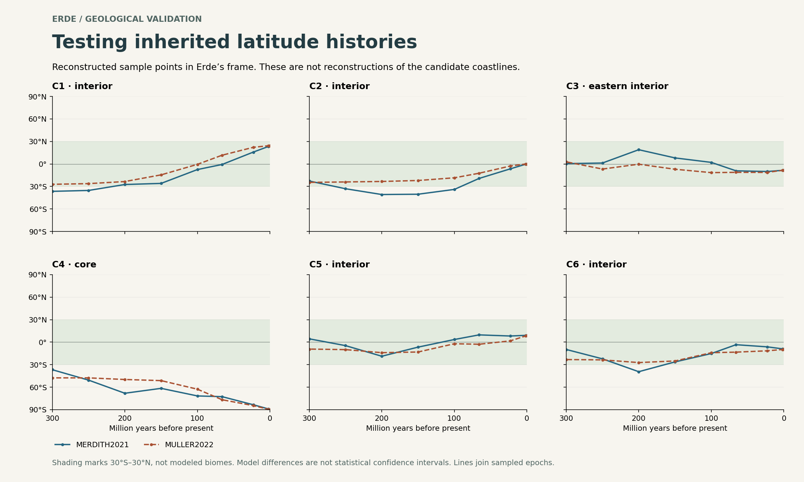

# Erde continental redesign: geological validation

**Verdict: the broad geological direction is defensible, but the exact worldwide candidate does not yet pass historical validation.** Some inherited latitude claims now have numerical support; others require correction. The candidate still lacks the crustal-block, elevation and gateway histories needed to demonstrate its migration requirements. This is a completed validation review with a conditional/negative result, not a completed reconstruction of the candidate.

Reviewed candidate: repository commit `d8b68e98894fd9216ab65ed021009798161fd1f8`. The exported geometry's SHA-256 is recorded in [geological-validation-metrics.json](geological-validation-metrics.json). No coastlines, founding dates or public canon were changed during this review.

## 1. Recovered geological baseline

The earlier map study relied mainly on repository summaries. This review retrieved the underlying Drive sources from the same project folder and checked their actual claims:

| Source | Authority and findings |
| --- | --- |
| [20: Deep-Time Alternate-Axis Simulation Framework](https://docs.google.com/document/d/1W0brKz6RBonehijhqNcoToaSiwvYaS80S9UQ6GiENxM/edit) | Independent planet with a permanent geographic frame, not a recent tipping event. Retain recognizable craton ancestry, broad supercontinent chronology, ocean opening/closure order and major collision families. Margins, terranes, shelves, relief and surface processes can diverge. The framework explicitly calls its regional outcomes hypotheses without a specified numerical reconstruction. Its old “pole selection open” status is superseded by the later selection of Proposal 4. |
| [24: Proposal 4 Geological History](https://docs.google.com/document/d/1wvKc6K2dcRd-jJ9L0ZJlyvONznNYAHDtFdcZcfwfyYw/edit) | Contains an actual qualitative history from formation to present, including late-Cenozoic polar glaciation, earlier greenhouse landscapes, rifting and equatorial ecological provinces. It is not missing from the project. Its epoch-specific positions and climates are conditional scenario claims, not a previously validated model. |
| [38: Project Scientific Review](https://docs.google.com/document/d/1KOAiA8JMpKVBnDSLZjOAnRGJiExcskbuQfJ3UsOG6LY/edit) | Relevant corrections distinguish geographic rotation from obliquity, retain low-latitude external founding routes, require peripheral ancestral refuges and defer exact climate predictions. This review used its Erde corrections, not unrelated narrative material. |
| [Current Erde decision ledger](../../content/erde-reference.md) | Later population decisions and supersessions control founding dates, lineage order, limited contacts and refuge requirements. |

The right test is therefore compatibility with an inherited tectonic sequence and a distinct surface history. Neither preservation of Earth coastlines nor unlimited invention of an unrelated tectonic past meets that contract. The user's later permission to change every continent expands the available design space; it does not itself demonstrate a replacement history.

## 2. Work actually performed

- Audited the candidate generator, exported geometry, atlas relief scaffold, historical checklist, current population decisions and the three recovered Drive sources.
- Recomputed land-mask differences, southern high-latitude land area, C2 offset rates, reuse of existing relief samples, and ice-volume/vertical-motion sensitivities.
- Requested **240 sample positions**: ten present-reference locations at twelve epochs in each of two explicit published GPlates models. There are 228 usable reconstructed positions and 12 unavailable results; unavailable results remain null rather than being invented or forced past their valid ages.
- Tested the present-day identity of all ten input locations in both models. Retained the raw API responses, request URLs, retrieval timestamps and hashes; replayed the analysis from those saved responses.
- Compared inherited-scaffold paleolatitudes with specific descriptions in document 24, then assessed each redesigned continental group and the twelve historical requirements.

No candidate plate polygons, oceanic spreading system, deformed crustal mesh, palaeoelevation raster, dated sea-level curve or climate model was supplied or created. Those absences limit what can be certified. A full mantle-to-biosphere simulation is not necessary for useful worldbuilding validation, but the specific connections being claimed still need explicit, compatible physical histories.

## 3. What the plate-model test establishes

We used `MERDITH2021` and `MULLER2022`, with anchor plate 0, through the [documented GPlates location-reconstruction service](https://gwsdoc.gplates.org/reconstruction/reconstruct-points/). Each sampled source location is assigned to a plate and reconstructed before applying Erde's latitude transform. This tests an inherited reference scaffold; it does not assign the redesigned margins to those plates.

The models share substantial ancestry and are not two independent votes. They use different reference-frame treatments. That difference matters especially here: an uncertain ancient Earth-reference longitude becomes part of the calculation of Erde's ancient latitude. A modern pole fixes today's transform; it does not remove this deep-time uncertainty. See the [model descriptions](https://gwsdoc.gplates.org/models/) and [Müller et al. (2022)](https://se.copernicus.org/articles/13/1127/2022/).



Each entry below gives the two model results as a range, **not a statistical uncertainty interval**. These are individual crustal sample positions, not the extent or mean latitude of a whole continent.

| Sample and epoch | Transformed latitude | Assessment of the earlier history |
| --- | --- | --- |
| C4 core, 23 Ma | 83.4–84.5°S | Supports a near-polar core by the Neogene in both tested scaffolds. It does not date ice-sheet initiation. |
| C4 core, 66 Ma | 72.6–76.7°S | Supports high southern latitude by the start of the Paleogene. |
| C4 core, 100 Ma | 62.7–71.7°S | Supports a high-latitude Cretaceous core, with substantial frame dependence. |
| C4 core, 200 Ma | 49.7–68.1°S | Does not justify treating the present polar core as continuously at the pole. Other Pangaean blocks may still surround the pole. |
| C2 interior, 150 Ma | 22.1–40.4°S | An unqualified Jurassic “equatorial South America” description is too strong for this sampled interior. |
| C2 interior, 100 Ma | 18.5–34.0°S | Cretaceous equatorial occupancy cannot be generalized across the entire body. |
| C6 interior, 200 Ma | 27.2–39.3°S | The present equatorial continent's sampled interior was substantially farther south. Its fauna should not be assigned a continuously equatorial history. |
| C6 interior, 23 Ma | 6.2–11.5°S | Supports low-latitude late-Cenozoic habitat opportunity. Moisture and vegetation remain separate questions. |
| Ancestral refuge sample, 2 Ma | 41.7–42.5°S | Compatible with a midlatitude peripheral refuge; no proof of continuous habitability. |
| Ancestral exit sample, 2 Ma | 60.1–60.9°S | A significant cold/ice exposure problem must be evaluated along the full outbound route. The lower-latitude refuge alone does not resolve it. |

The 450 Ma probes illustrate an even larger reference-frame sensitivity: the C4-core sample is about 9.6°N in MERDITH2021 and 40.3°S in MULLER2022. This does not settle the later Ordovician ice maximum, nor exclude high-latitude land elsewhere. It does reject treating an invariant ancient African polar center as established by the present map.

**Correction adopted for authorial interpretation:** retain the late-Cenozoic polar-continent scenario as the strongest supported geographic part of document 24. Treat older polar occupancy and supposedly persistent equatorial provinces as dated, model-dependent hypotheses. Do not select different reference frames in different eras simply to preserve preferred prose. Archean and early Proterozoic placements remain outside this numerical test.

Polar forests during greenhouse intervals remain scientifically credible in principle. Earth's record includes a Cretaceous rainforest at approximately 82°S; latitude alone does not require an ice sheet. That analogue supports the mechanism, not Erde's particular greenhouse concentrations or forest distribution. [Klages et al. (2020)](https://www.nature.com/articles/s41586-020-2148-5)

## 4. Land and crust accounting

| Static comparison | Approximate area |
| --- | ---: |
| Land in candidate where reference has water | 37.6 million km² |
| Water in candidate where reference has land | 31.3 million km² |
| Sum of changed locations | 68.8 million km² |
| Net land increase | 6.3 million km², about 4.25% |

The sum of changed locations is about 46.8% of the reference land area. This **does not mean 46.8% of the original land disappears**: the figure includes both added and removed locations. Approximately 21.2% of the reference land mask becomes water. Neither measure is a continental-crust budget. Submerged continental crust can remain in place, and a shifted block changes two map locations without creating or destroying equivalent crust.

This distinction prevents two opposite mistakes: the small net increase does not make the changes geologically minor, while large coastline differences do not automatically make them impossible. Zealandia provides a real example of extensive submerged continental crust after stretching and thinning. It is a mechanism analogue, not permission to flood any arbitrary highland or attach any arbitrary oceanic tract. [Mortimer et al. (2017)](https://www.geosociety.org/gsa-today/march-april-2017/zealandia-earths-hidden-continent)

**Current failure:** the candidate has no crustal inventory assigning these changed locations to inherited blocks, displaced blocks, submerged continental margins or accreted terranes. Its drafting shrink factors and circular retained sectors cannot serve as physical histories. The copied sectors must eventually be embedded in compatible margins, with deformation where required.

Areas use the bundled generalized geometry. Longitude/latitude clipping followed by geodesic area measurement produces an approximately 4,274 km² partition residual, small relative to the continental totals. Gross differences are therefore reported to 0.1 million km², not as precise surveyed areas.

## 5. Continent-by-continent disposition

| Group | Geological sequence that remains defensible | What prevents validation of this candidate |
| --- | --- | --- |
| **C1** | Retain an inherited interior nucleus and circum-oceanic convergent margin; change outer rift geometry and terrane docking over the Mesozoic/Cenozoic; preserve the two approach hinterlands as evolving landscapes | No block allocation for enlarged lobes and missing marginal land. The present connected-interior check passes, but the external shelf's emergence and habitats at both founding windows are unspecified. Existing cordilleran sample vertices remain on land, which is only a reuse screen. |
| **C2** | Preserve the paired continent's nucleus and breakup order; form different conjugate margins, then an oblique convergent highland belt and basin; complete major relative repositioning before the relevant population history | The 6° offset and locally retained hinge have no shared deformation/accretion history. The far end of the old highland overlay is now offshore. A new basin marker and mountain marker do not reconstruct drainage or relief. This group needs explicit revision before acceptance. |
| **C3** | Preserve the inherited collision families and constituent blocks; alter microplate docking, rift embayments and peninsular margins; maintain continental access to the external approach and shelf cradle | The large outline does not specify which old blocks moved or submerged, the age of new embayments, or the mountain/river network controlling intermittent western/eastern contact. An unintended easier coastal bypass has not been excluded. |
| **C4** | Retain the late-Cenozoic near-polar core; allow earlier greenhouse landscapes; develop a central ice sheet and distinct outlet, rift, erosional and depositional systems as climate permits | A smooth envelope is not a glacial coastline. One formerly terrestrial northern highland locator is offshore; the outbound ancestral route lies near 60°S. Required refuges, ice-free passages, bedrock elevations and isostatic history remain untested. Cold-based interiors and actively eroding outlets must not be treated identically. |
| **C5** | Preserve the inherited rift separation and shelf/highland neighborhood; alter the remote margin through breakup geometry, extension and subsidence | A present coastline supplies neither the shelf bathymetry nor island emergence chronology needed for founding at 1.0–0.6 Ma. Keeping source-like islands does not prove short, viable water crossings. |
| **C6** | Preserve the major inherited separation sequence and a coherent continental nucleus; permit altered margins and later low-latitude habitat expansion | No allocation of new versus submerged crust, island provenance, or ancient fauna connections. The sampled interior's Mesozoic latitude history requires changing any claim of continuous equatorial refugial habitat. |

These are geologically reasonable directions to test, not six independently approved histories. Their oceanic plate boundaries and relative motions must work together. None of the six has an established exact history for its redesigned outline.

## 6. Timescale, ice and gateway checks

### C2 displacement

The finite offset moves the basin locator about 589 km and the old southern hinge locator about 489 km. Spread over 20–40 million years, these imply approximately 1.2–2.9 cm/year, an ordinary plate-motion scale. Applying the same displacement within 650,000 years would require roughly 75–91 cm/year and is not a credible ordinary tectonic repair for this scenario. The calculation is a scale check, not a reconstruction or a dated movement already adopted. Plate motions accumulate over millions of years; see [USGS, Understanding plate motions](https://pubs.usgs.gov/gip/dynamic/understanding.html).

**Result:** the offset passes a long-timescale plausibility check. It does not pass compatibility with a pinned hinge, adjacent plates or historical topography. The necessary hinge and its access must predate traversal; sea-level changes cannot reveal an island arc that did not yet exist.

### Polar land and sea level

The candidate retains about 21.4 million km² of land south of 60°S, compared with 23.1 million km² in the reference. South of 70°S it retains about 12.3 million km². This supports ample geometric space for a major ice sheet, not a prediction of actual ice cover.

Using the candidate's ocean area as a fixed approximation and freshwater/ice densities of 1000/917 kg/m³:

| Hypothetical sea-level fall | Additional grounded-ice volume equivalent | Mean thickness change if spread over all candidate land south of 60°S |
| --- | ---: | ---: |
| 50 m | 19.4 million km³ | 0.91 km |
| 100 m | 38.9 million km³ | 1.82 km |
| 150 m | 58.3 million km³ | 2.73 km |

These are sensitivity scenarios, not adopted sea-level amplitudes. They quantify the **change** in grounded-ice storage needed, not total ice thickness. A persistent central ice dome may supply substantial total storage while varying too little to expose a particular shelf. Restricted accumulation area raises the required thickness change. Ice dynamics, atmospheric forcing, local sea-level effects and the simultaneous survival of refuges remain unresolved. An exact Earth glacial schedule cannot be imported.

### Long-lived sill elevations

Even an assumed net vertical rate of 0.1 mm/year accumulates to 65 m over 650,000 years and 190 m over 1.9 million years. That is enough to change whether many hypothetical shelves emerge. Rates are illustrative, not estimated for Erde; real histories may change direction or be episodic. The calculation shows why preserved modern shorelines do not preserve ancient crossing thresholds. Real rift records demonstrate interactions among basin evolution, sills and sea-level cycles. [McNeill et al. (2019)](https://www.nature.com/articles/s41598-019-40022-w)

The two continental founding windows therefore need separate terrain and habitat tests. Between them, recurrent limited access must remain possible without becoming an unrestricted route. A water gap must also persist where island differentiation requires one.

For the shelf-human founding, the inherited reference archipelago presents a particular unresolved problem: low sea level does not eliminate all consequential water gaps. Actual voyage/demographic studies distinguish arrival from successful founding and show why accidental drifting cannot simply be assumed to solve every crossing. Erde's earlier populations require their own route and capability assessment. [Bird et al. (2019)](https://www.nature.com/articles/s41598-019-42946-9)

## 7. Historical requirement results

| Ledger requirement | Review result |
| --- | --- |
| H01: older crustal and wildlife histories | **Incomplete.** Recoverable inherited framework exists; candidate-specific crust and clade allocation do not. |
| H02: pre-1.9 Ma access and shelf divergence | **Unverified.** Modern access samples pass; palaeoshelves, karst development, habitable outbound route and repeated isolation are unspecified. |
| H03: early island specialization | **Unverified.** Required channel persistence and island emergence ages are absent. |
| H04: shelf-human founding | **Unverified, high priority.** Source-like geography does not establish sufficiently feasible residual water crossings. |
| H05: highland founding and later contact | **Unverified.** Appropriate elevation and foothill habitat must precede settlement. |
| H06: early paired-continent founding | **Unverified.** Current approaches connect to their interiors, but exposure, passage duration and resources at 650–450 ka are unknown. |
| H07: intervening restricted recontacts | **Unverified.** No time-varying route or demographic filter has been evaluated. |
| H08: ancestral refuges and sister cores | **Partly supported geography; unverified habitat.** Peripheral latitude is reasonable; the high-latitude outbound route and ice history require attention. |
| H09: maritime network and pelagic differentiation | **Unverified.** No dated island, resource or navigability model. |
| H10: later paired-continent founding | **Unverified.** A successful early crossing would not demonstrate the separate 35–20 ka opening. |
| H11: five complexes and later contact order | **Requires remapping and historical review.** The C2 relief/catchment scaffold cannot be carried over unchanged. |
| H12: remaining regions and ecosystems | **Unverified.** Particularly avoid assigning C6 a perpetually equatorial past. |

No historical substitution is accepted in this review. No absence of evidence is counted as a successful migration or a demonstrated impossibility.

## 8. Corrections and shortest path to acceptance

The documentation now uses the recovered source history and the numerical results above. It no longer treats the older source as absent, a small net land-area change as a small geographic intervention, or a modern latitude as a stable deep-time habitat.

The next physical revision should preserve the user's goal of visibly different bodies across all six groups:

1. **Choose one explicit reconstruction frame for the working model and identify inherited nuclei and major boundaries.** Use the alternative frame as a sensitivity check, not an era-by-era substitute. Fit the current outlines to crustal blocks; change the outlines where that fit fails.
2. **Resolve C2 and C4 first because they affect established histories most directly.** For C2, couple the offset, hinge and highland/basin evolution. For C4, reconstruct the refuge-to-exit terrain and ice margin, including the newly submerged highland sector. Favor changes remote from these systems without restoring whole Earth silhouettes.
3. **Give the external gateway and shelf/island system explicit bathymetry and vertical histories.** Make islands old enough, test lowstand sill exposure and persistent deep gaps, and specify viable alternatives for any broken route before retaining the change.
4. **Evaluate dated ecological access and required isolation together.** Use the earliest shelf divergence, all founding windows, intervening contacts and later contact order from the ledger. Check pertinent wildlife as well as peoples.
5. **Review polar ice storage and major ocean gateways jointly.** The same ice/sea-level scenario must support the required crossings while preserving habitable ancestral margins and other island barriers.

This is a bounded reconstruction task, not a request to simulate every geological process since planetary formation. Its minimum deliverables are an internally consistent block/boundary history, dated gateway sections, appropriate topography and habitat assumptions, and a passing ledger with stated uncertainty. Until those exist, the candidate remains a visual design target rather than validated historical geography.

## 9. Reproducibility and evidence limits

```sh
python scripts/editorial/validate_erde_history.py
python scripts/editorial/check_erde_paleolatitudes.py
```

These commands use the optional atlas dependencies and saved local inputs. The second replays the cached public GPlates responses and regenerates the figure without network access. `--fetch` explicitly refreshes those responses and can change results if the provider updates a named model; cached response hashes preserve this review's evidence.

Files: [scale and geometry results](geological-validation-metrics.json), [static land differences](land-mask-differences.geojson), [paleolatitude results](paleolatitude-checks.json), [raw response cache](paleolocation-responses/). The cache preserves invalid/null results. Twelve epochs and individual points cannot establish continuous continental occupancy, a coastline, a pass or a biome. Full climate outcomes, population survival and the exact candidate's plate history remain outside the demonstrated results.
