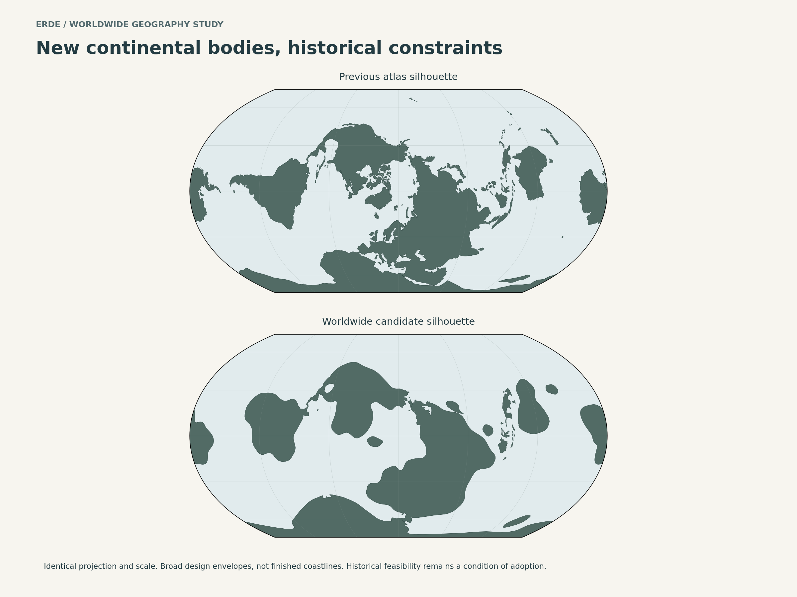
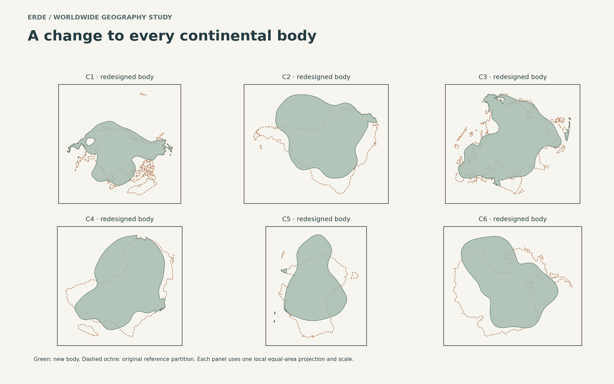
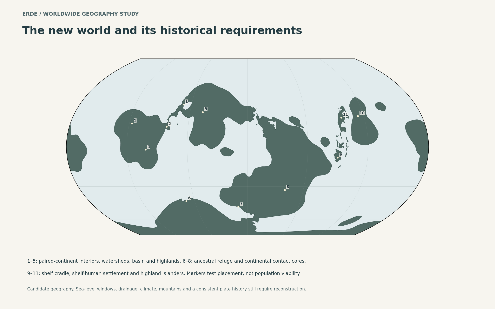

# Erde: worldwide continental redesign study

Status: **authorial silhouette candidate, not adopted geography or a validated historical reconstruction**. This study follows the rejected subtle changes in the [offset trial](../geography-trial/README.md) and [gulf trial](../coast-trial/README.md). It applies the user's correction to all six continental groups. The public atlas remains the reference map while this alternative is evaluated.

The additional acceptance rule is binding: **a modern junction cannot compensate for a broken historical connection. A replacement must work during the original migration interval and retain the necessary intervening isolation.** Unknown historical feasibility is not a pass. See the [history and acceptance ledger](HISTORICAL-CONSTRAINTS.md).

## Visual comparison



The large bodies now have different proportions, lobes, coastal orientations and embayments. The broad global arrangement still resembles the reference; the design deliberately retains its major continental neighborhoods. This is a stronger silhouette experiment, not a claim that recognition has been eliminated. The smooth new edges are broad design envelopes. They must acquire coherent coastal geology before becoming finished atlas coastlines; adding random detail would not establish that geology.



C1–C6 are diagram identifiers, not proposed native names. Earth references below are an authorial crosswalk only. Each local panel uses one equal-area projection for both outlines; the six panels do not share a common scale. Their orientation also differs from the global map. The local panels close sub-pixel projection seams with a 1 m display-only buffer; this does not alter the exported geography or validate any narrow channel. Reference partitions approximate continental groups and do not sum exactly to a complete world inventory.

| Group | Authorial crosswalk | Broad shape change | Geological explanation to develop, not yet a reconstruction |
| --- | --- | --- | --- |
| C1 | North American-derived | Broader curved body, different outer headlands and embayments; familiar northern fragmentation and eastern projections reduced | Different ancient rift margins and accreted coastal blocks; preserve the approach hinterland and a connected interior. New continental shelf area needs inherited continental crust or accreted material, not unexplained sediment fill across deep ocean. |
| C2 | South American-derived | Shorter, wider, asymmetric body instead of a long taper; expanded flank, indented opposite margin | Different early breakup and marginal-block history; an oblique active margin supports a relocated highland chain. Retain a large basin and reconstruct its catchment and outlet. |
| C3 | Eurasian-derived | Fewer familiar narrow peninsulas; broader, differently oriented coastal lobes and recesses | Different collision angles, terrane assembly and rift basins; keep both continental population cores and routes into the shelf cradle and external approach. |
| C4 | African-derived south-polar continent | Changed taper and embayed outer body | Ancient peripheral extension, inherited crustal blocks and later basin flooding, while maritime ancestral refuges and their outbound land route survive. Reshaped polar land can change ice storage and global sea level. |
| C5 | Australian-derived island continent | Oblique, lobed body with different ends and coastal recesses | Different rift inheritance and marginal subsidence, retaining the highland/shelf neighborhood. A continental shelf must be designed separately from the visible coastline. |
| C6 | Antarctic-derived equatorial continent | Asymmetric lobed body with a different peninsula pattern | An alternative ancient rift-margin configuration and differential basin subsidence. Review isolation, forest habitat and ocean gateways even though its population history is less specified. |

These are a menu of ordinary mechanisms matched to design problems. They do not yet demonstrate a single compatible plate circuit. The magnitude of several changes exceeds the original proposal's “small differences.” This version requires a substantially different older crustal history; it cannot honestly be explained solely by a modest recent plate offset.

## Measurements and actual checks

The script computes spherical areas using the atlas radius and compares both worlds in the same Equal Earth projection.

| Measurement | Result | Interpretation |
| --- | ---: | --- |
| Reference land area | 147.26 million km² | Area of the bundled generalized source geometry, not a new measurement of Earth |
| Candidate land area | 153.52 million km² | Includes candidate islands and restored local control sectors |
| Land-area change | +4.25% | Reduced from an unintended +18.44% first draft; climate equivalence still cannot be assumed |
| Candidate planetary land fraction | 30.10% | Broadly similar land/ocean balance, with different regional distribution |
| Continental footprint intersection/union | 0.48–0.72 | Spatial difference, not a score for visual originality or geological plausibility |
| Region locators on land | 11 of 11 | Representative samples only |
| Paired-continent interior continuity | Pass | All five interior samples share a current connected land polygon |
| Approach and hinterland continuity | 4 of 4 | Includes both external approaches on their respective continents, the ancestral exit and mainland access to the shelf region |
| Polygon validity | Pass | Computational geometry only |
| Historical migration and isolation validity | **Unresolved** | No dated topography/bathymetry or complete ecological reconstruction exists yet |

The external intercontinental crossing is intentionally **not** tested as a present land bridge. Its emergence is a dated requirement. Similarly, a present sea gap around the shelf islands does not demonstrate its former depth or crossing difficulty.

## What was repaired during review

1. **The first redraw increased land area by about 18%.** Root cause: broadly drawn replacement bodies enlarged several groups at once. The new C3, C4 and C5 envelopes were resized in local equal-area coordinates before the historical control sectors were restored. This is a drafting operation, not a proposed physical shrinkage of rock. The revised total is about 4% above the reference.
2. **The paired junction survived locally but lost an approach outside the protected sector.** Root cause: protecting the junction alone ignored the route feeding it. The retained sector now includes its northern hinterland, and the southern attachment is covered. The connected-interior check now passes.
3. **The eastern external approach was cut off by the broader C3 redesign.** Its hinterland is now retained too. It connects to the western and eastern continental cores in the current outline.
4. **Two illustrative region markers were offshore.** The ancestral-refuge and shelf-cradle locators were corrected to inland regional samples. This is a marker repair, not evidence that habitats were preserved. Mountain and basin locators also remain design placeholders; moving a marker does not move a real catchment or prove a replacement mountain range.
5. **The earlier speculative replacement hinge lacked a demonstrated history.** It is excluded from this candidate. The existing hinge region is the conservative control pending a dated reconstruction. No late-emerging island arc is substituted for an older land migration.
6. **Present-day checks could be mistaken for historical acceptance.** The history ledger now includes the earliest mainland–shelf divergence, founding windows, later contact and required isolation, plus older wildlife and geological obligations. All unresolved historical gates remain visibly open.

## How the local controls work

Nine overlapping geographic sectors retain the reference land mask around sensitive approaches, the ancestral refuge and exit, and the shelf/island radiation. Their centers and radii are recorded in [design-controls.json](design-controls.json). They are drafting controls, not circular geological units, political boundaries or complete routes.

The final mask differs from the reference within those sectors by approximately 3.9 km² over 7.11 million km² of retained land, a very small polygon-operation residual. This is not exact coastline preservation. At this generalized map scale that discrepancy cannot resolve a narrow channel. Any historically decisive strait or passage needs its own higher-resolution geometry and depth profile.

Crucially, this procedure preserves **only a modern land mask**. It does not preserve submerged shelves, sill heights, uplift/subsidence histories, river access, weather or founder viability. Even unchanged coastlines can become ecologically different when distant land or ocean gateways change.



## Consequences requiring a decision before adoption

- The broadening and shortening of C2 alter latitude coverage, ocean exposure and likely catchment geometry. A new active-margin highland chain must have the appropriate age and elevation before regional differentiation. Retaining five region markers is insufficient.
- C3's new coastal geometry changes maritime access and inland distances. Western/eastern contact must remain intermittent and ecologically filtered, including any unexpected coastal bypasses.
- The new C4 polar outline can change ice-sheet extent and ice discharge. This affects the sea-level windows needed on other continents and must be evaluated globally.
- C5's revised coast must leave a feasible earlier approach to shelf-human habitats and preserve partial highland isolation. Large nearby islands cannot be linked indiscriminately to make migration easier.
- C6 and the changed outlying islands need a wildlife provenance audit. No human migration record does not mean an absence of historical constraints.
- The C2 finite offset is a drawing hypothesis. Its relationship to the retained hinge requires a block-motion and deformation history. A rigid rotation plus a pasted modern junction is not itself that history.

## Reproduction and files

From the repository root, with the optional pinned atlas dependencies installed:

```sh
python scripts/editorial/try_erde_global.py
```

The script uses the bundled reference geography and generates the three PNG/SVG comparisons, `candidate-geography.geojson`, `design-controls.json` and `measurements.json`. `ERDE_GEOMETRY_ONLY=1` runs the geometry checks without rendering. The GeoJSON coordinates use the existing **native Erde longitude/latitude frame**, not Earth coordinates; the reference-frame control vertices are explicitly labeled separately. No network download is needed for generation.

[HISTORICAL-CONSTRAINTS.md](HISTORICAL-CONSTRAINTS.md) defines the next reconstruction and its acceptance gates. [The original proposal](../ERDE-GEOGRAPHIC-DIVERGENCE-PROPOSAL.md) remains the earlier design record. No public names, population histories or deployed atlas geometry are changed by this study.
