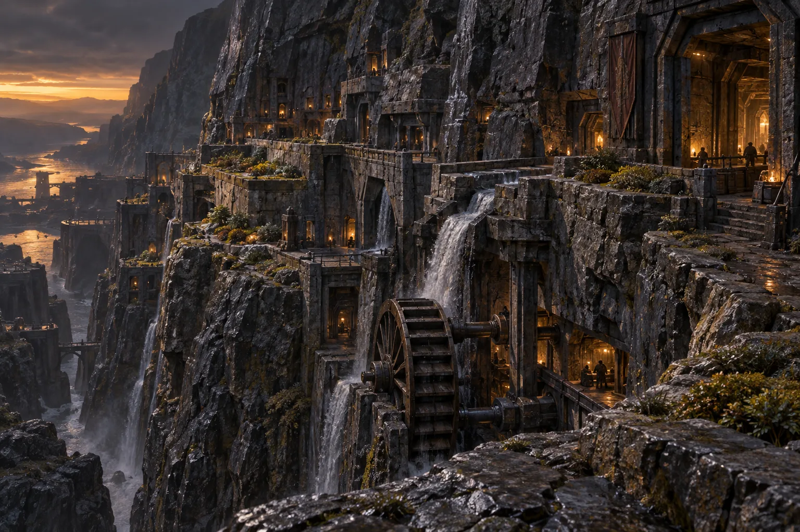
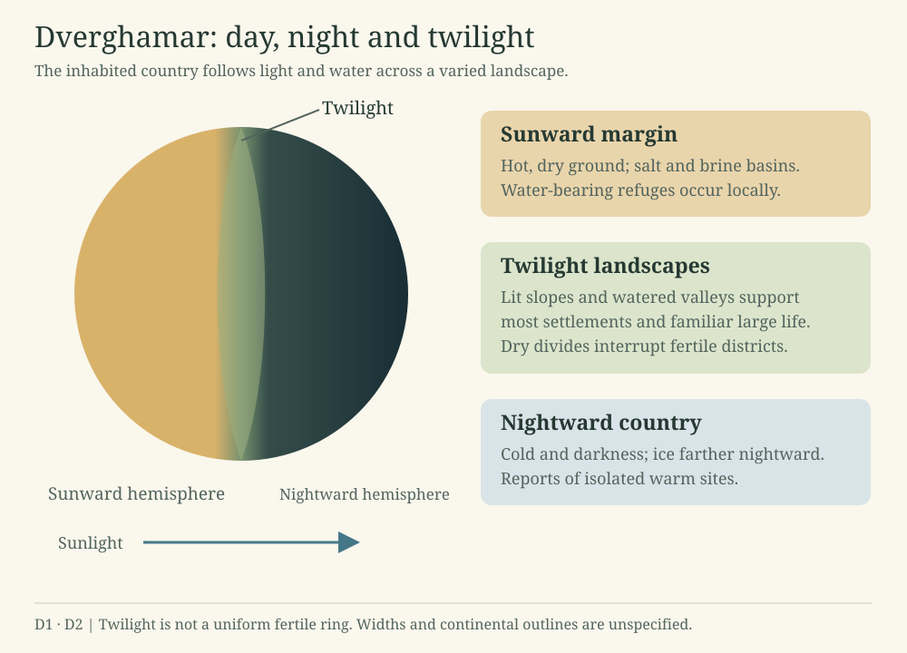
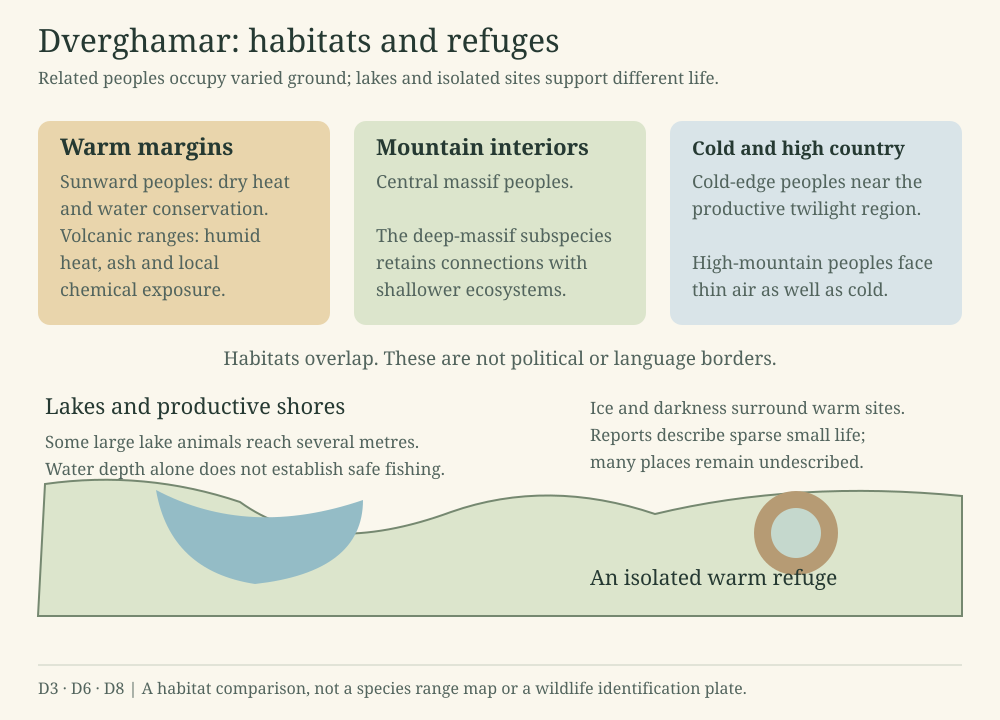
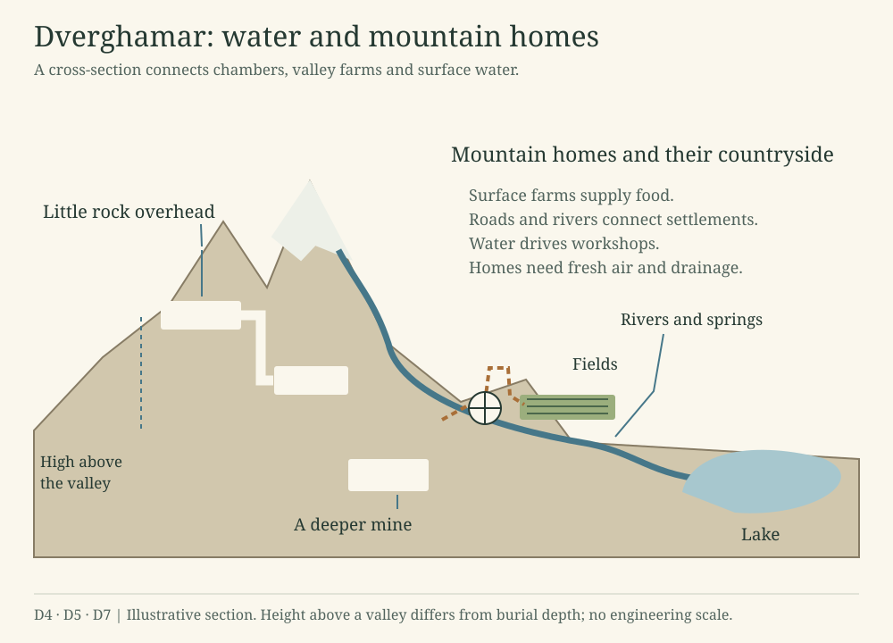

# Dverghamar

A world of permanent day, night and twilight. Its inhabited valleys support farms and mountain homes, with Hamarkorar, Thals and Jotun living across overlapping landscapes.

Dverghamar: excavated homes and water-driven workshops beneath a rock escarpment. Small planted benches catch the permanent low light. The buildings and landforms depict an unnamed district.

## Light, landscape and settlement

### Permanent day, night and twilight

The dwarven world is called Dverghamar, or Dvergahamrar in archaic and highly formal speech. One hemisphere faces the sun, the other lies in darkness, and a broad twilight region runs between them. Mountains, dry basins and salt country divide the fertile districts.

The sunward lands become dangerously hot and dry. The nightward lands grow cold and dark. Most settlements and familiar large organisms are found in the better watered twilight landscapes. Strong gravity makes lifting and movement more demanding for human visitors.

### Rivers, lakes and homes

Illuminated slopes, river valleys, lakes and sheltered mountain districts support living communities. Dry divides and salt basins separate them. Farther nightward, ice and isolated warm sites dominate accounts of the landscape.

The Hamarkorar prefer homes inside rock. Surface farms feed the settlements, while roads and river works connect them. Water wheels drive shafts and gears in their workshops. Keeping food, fresh air and water available requires continual maintenance.

### Peoples

The native Hamarkorar have four arms and two legs. Their ancestry belongs to Dverghamar’s own life, long before the Thals arrived from Erde. Jotun communities occupy mountain margins and valleys; their precise ancestry remains undescribed.

### Rock and relief

Volcanic country, old massif cores, layered rocks, soluble beds, fractures and natural caves offer different landscapes and building conditions. Rivers and erosion expose and reshape them. Natural caves, excavated homes and mines each pose different building problems.

### The twilight provinces

Lit slopes and watered valleys contrast with dry rain shadows, salt flats, colder uplands and dark fringes. Mountains and passes connect some districts and isolate others. A mild-feeling place need not have reliable rain or productive farmland.

### Water and food

Rivers, lakes, springs, glaciers and groundwater figure in travel and settlement. Brine basins and salt pans occur toward the hot margin. The depth or size of a lake does not tell a traveler whether its water or fishing grounds are safe.

Cultivators use illuminated fields and near-surface chambers for suitable crops. Fungal growing rooms require continual tending and supplies. Farmers, growers and household workers distinguish useful native foods from unfamiliar organisms.

### Homes inside rock

Hamarkorar communities prefer underground homes where conditions permit. A chamber high on a mountain can have little rock above it; a low mine can be deeply buried. Water, stale air, heat and difficult escape routes are familiar practical concerns.

Surface farms, roads, river machinery and transport links support mountain communities. Water-powered industry is prominent; mechanical transmission, hydraulic equipment, compressed air, fuel engines and limited electricity occur in the wider industrial setting.

### Neighbors and journeys

The Hamarkorar are native peoples, the Thals are later Erde-derived inhabitants, and the Jotun have varied mountain societies. Their routes and settlements overlap across several habitats and rock formations.

## Maps of habitats and mountain life

### Scope of this guide

These maps connect the day and night geography with habitats, water and mountain settlements. They show broad relationships; distances, continental outlines and engineering dimensions remain undescribed.

### D1 · Day, night and twilight

The sunward hemisphere, dark hemisphere and twilight region, where fertile districts are separated by less hospitable ground.

Permanent light and darkness. The twilight region contains fertile districts, dry divides and difficult terrain. The diagram does not specify the region’s width.

### D2 · Landscape contrasts

Hot dry ground near the sunward margin, watered districts in the twilight region and cold country farther nightward.

[See the diagram](#figure-dverghamar-light).

### D3 · Habitats and passages

Wet provinces and dry rain shadows, with salt basins, valleys and mountain passes between them. Continental names remain undecided.

Habitats and refuges. Dwarven ranges overlap, and a species range establishes neither a political border nor a language boundary. Many lake animals and isolated refuges remain undescribed.

### D4 · Water in the landscape

Rivers, springs, lakes and glaciers that shape travel and settlement.

Water and mountain homes. Height above a valley differs from burial depth. Farms, roads and river machinery sustain the settlement; the section gives no engineering dimensions.

### D5 · Mountain homes

A mountain chamber can be high above the valley while having little rock overhead. Elevation and burial depth describe different conditions.

[See the diagram](#figure-dverghamar-settlement).

### D6 · Dwarven habitats

Related dwarven peoples occupy overlapping habitats. These ranges do not define political borders.

[See the diagram](#figure-dverghamar-habitats).

### D7 · Settlement and countryside

The farms, roads and river works that connect mountain homes with the surrounding country.

[See the diagram](#figure-dverghamar-settlement).

### D8 · Lakes and isolated refuges

Lake shores, large aquatic animals and reports of sparse life around isolated warm sites.

[See the diagram](#figure-dverghamar-habitats).

## The Hamarkorar

### People of the great rock masses

**Hamarkor** means a person of the crags or great rock masses. **Hamarkorar** is the plural and the general name for the native dwarven peoples of Dverghamar. It includes farmers, musicians, travelers and people living in many kinds of terrain.

Rakkor/Rakkorar and Menkor/Menkorar are names reserved for narrower identities. The first is regional; the second may be local, cultural or a species name. Their communities remain unspecified. Hamkor is a proposed conversational shortening of Hamarkor.

### Four arms and two legs

The Hamarkorar have four arms and two legs, descended from a native six-limbed ancestry. The upper arms are especially suited to precise work and the lower pair to bracing and carrying, while both retain dexterity. Holding, steadying and working on an object can happen together. Exact adult dimensions, finger counts and external coverings remain undescribed.

### Related peoples in different habitats

The native genus contains five species and a deep-massif subspecies.

| Population | Principal environmental pressures |
| --- | --- |
| Central massif species | Varied mountain interiors, slopes and connected surface catchments |
| Deep-massif subspecies | Greater reliance on enclosed habitats, while retaining connections to shallower ecosystems |
| Sunward species | Dry heat, water conservation and warm-margin travel |
| Volcanic-range species | Humid heat, ash and locally distinctive chemical exposure |
| Cold-edge species | Cold-margin conditions near the productive twilight belt |
| High-mountain species | Altitude, thin air and cold |

Their ranges can overlap. Languages, communities and political affiliations do not follow species boundaries automatically. The deep-massif population remains a subspecies of the central massif species, with fertile exchange where populations meet.

### Adaptation and senses

Sunward peoples are relatively sparsely insulated and somewhat longer-limbed, while volcanic-range peoples are comparatively slender. Cold-edge peoples have short extremities and strong insulation. High-mountain peoples face both cold and thin air. Heat, ash, fumes and altitude can still harm people adapted to those environments.

Vision is retained across the genus. Hearing, vibration, smell, touch and artificial lighting also matter in enclosed or poorly lit places. Deeper communities remain connected with shallower habitats and wider food supplies.

### Care and households

Nurseries bring several kinds of caregivers together. Korvar distinguishes reproductive parentage, protective care, food provision and shared residence. One person can hold several roles, and households take many forms.

### Household life and material knowledge

Dwelling within rock encourages close attention to cracks, grain, moisture, heat and the behavior of a material under load. This knowledge appears in language, construction and nursery care. Hexagonal arrangements suit some supports, compartments and markings, while other shapes serve tunnels, water channels and rooms better.

### Native descent

The Hamarkorar belong to Dverghamar’s own history of life. Their origin is independent of the much later Thal migration. Naturalists infer their descent from comparisons of bodies and habitats; the dates and mechanisms remain uncertain.

### A six-limbed ancestry

The native ancestry leading to the Hamarkorar has three pairs of limbs. In the living peoples, the hind pair supports upright movement and the other two pairs serve as arms. Shared bodily structures allow broad comparison with related native animals. They do not imply that every animal on Dverghamar has six limbs.

Aquatic and terrestrial forms belong to the broad ancestral account. The intermediate forms and fossil record remain undescribed.

### Diversification and habitat

Related dwarven peoples inhabit central massifs, sunward country, volcanic ranges, cold margins and high mountains. A deep-massif population remains closely related to the central massif people. Naturalists attribute their differences partly to isolation and renewed contact, though they cannot yet reconstruct a detailed family tree.

Observable differences include compactness, relative limb proportions, insulation and ways of coping with heat, cold or difficult terrain. Adaptation does not make an individual immune to environmental danger, and culture does not follow species divisions automatically.

### Care, learning and later history

Parental care, social learning, tool use, cultivation and industry belong to different spans of this history. Modern languages can spread through trade, teaching and migration across biological boundaries. Their relationships should not be mistaken for a species genealogy.

The Thals arrived much later, among already established native communities.

## Habitats and wildlife

### Lit and watered country

Moist slopes, shorelines and shallow waters support the most familiar plant-like life and its consumers. Growers use suitable storage crops and cultivated fungi. Exact pigments, textures, names and many visible forms remain undescribed.

### Native animals

Grazers, scavengers, predators and aquatic animals occupy different habitats. Three pairs of limbs characterize the ancestry leading to the Hamarkorar, not all fauna. Naturalists compare visible structures to investigate relationships, which remain uncertain.

### Lakes and shorelines

Large lake animals can reach several metres. Their feeding habits, shapes and life histories await fuller description. Productive shores and surface waters differ from deeper, less hospitable water; travelers cannot infer safe fishing from the size of a basin alone.

### Hot margins and dark country

Hot dry ground, brine basins and cooler water-bearing refuges contrast with nightward ice and isolated warm sites. Much life in extreme districts is inconspicuous. Travelers report sparse small creatures in isolated oases, though few of these places have been thoroughly surveyed.

### Caves and settlements

Streams, entrances and neighboring productive habitats connect cave life with the wider landscape. Settlements add tended crops, stored food and waste, attracting cultivated organisms, household associates and pests. Many of these organisms and domestic animals remain undescribed.

### Open public descriptions

Appearance, behavior and local uses remain to be described for much of Dverghamar’s wildlife. The available accounts are too limited for a comprehensive field guide.

## The Thals

### From Erde to Dverghamar

The Thals descend from an ancient human lineage of Erde. About **40,000 years ago**, a catastrophe drove a great migration through the Otherworld. People fled alongside animals and plants bound up with the life of their homeland. The survivors emerged across Dverghamar’s twilight mountains, changed by the passage and better able to live in their new surroundings.

Accounts of the flight recall terror, skilled practitioners and a desperate will to survive. They do not settle what caused the catastrophe, why the road reached Dverghamar or how the travelers changed. Particular animals, plants and surviving local populations still need fuller descriptions.

The native Hamarkorar are not descended from the refugees. Their ancestry and diversification belong to Dverghamar’s independent history of life.

### Mountain refuge life

Thal communities favor cool, illuminated mountain and cave districts with sheltered terrain, access to water and cultivated food. Their history on Dverghamar spans tens of thousands of years. Present communities have inherited that long history of settlement and exchange, as well as memories of the flight.

The heavier pull of the world still shapes work and travel. Sheltered growing ground, manageable routes and knowledge of local conditions matter. The changes of the migration did not remove the need for food, water, rest and care.

Near-surface growing chambers and sheltered fields allow crops to receive light. Fungal cultivation and food storage supplement the work of growers. Judging native foods requires practical knowledge. Resemblance to an Erde organism is not enough.

### Neighbors and continuity

Thals and Hamarkorar trade, share settlements and learn one another’s speech. Thal households have built permanent homes and organized care, transport and work around the demands of their adopted world. There is no single Thal culture. Their regional histories, bodily variation and local institutions remain to be described in detail.

## The Jotun

### Mountain people

Jotun is the self-name of Dverghamar’s mountain giants. They are imposing people with cold-adapted bodies and distinctive protective features. Their typical height, ancestry and detailed appearance remain unsettled; the earlier two-and-a-half to three-metre range is a provisional design.

### Homes and journeys

Communities inhabit productive mountain margins and valleys and make demanding journeys into higher terrain. They trade with richer districts and know the hazards of mountain travel. Communities differ in how they govern themselves.

### Authority and difference

Knowledgeable hosts, scholars, negotiators and communities valuing intellectual authority coexist with recorded coercive and violent clans. Some clans have long conflicts with dwarven neighbors. Clans differ greatly in their conduct toward neighbors and strangers.

### Atrocity and exaggeration

Accounts of especially cruel clans include captives displayed as trophies and status gained through conspicuous violence. Retellings sometimes exaggerate these atrocities. They describe particular clans, whose cruelty gives them no extraordinary bodily immunity. Tales of thirty-foot giants also exceed ordinary descriptions of Jotun.

### Open details

Local institutions, life histories and detailed regional variations await further description. Aquatic and heat-associated branches remain proposals.

All original project IP remains the author’s. Public documentation grants no license or right to reuse this work.
