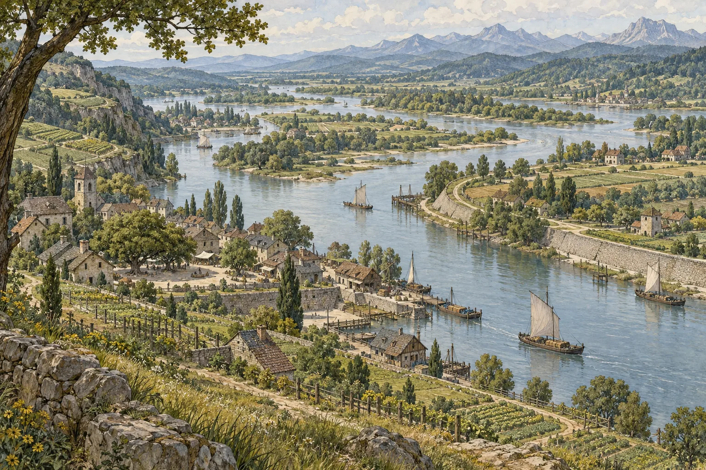
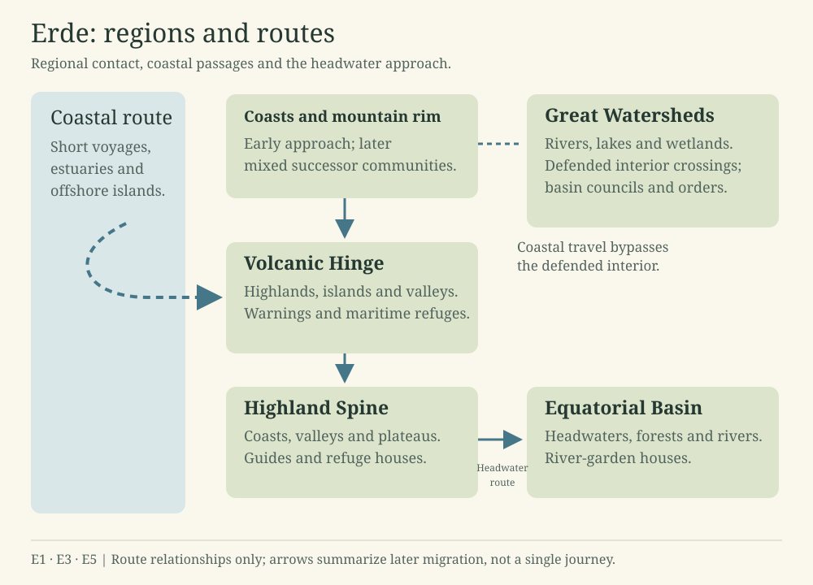
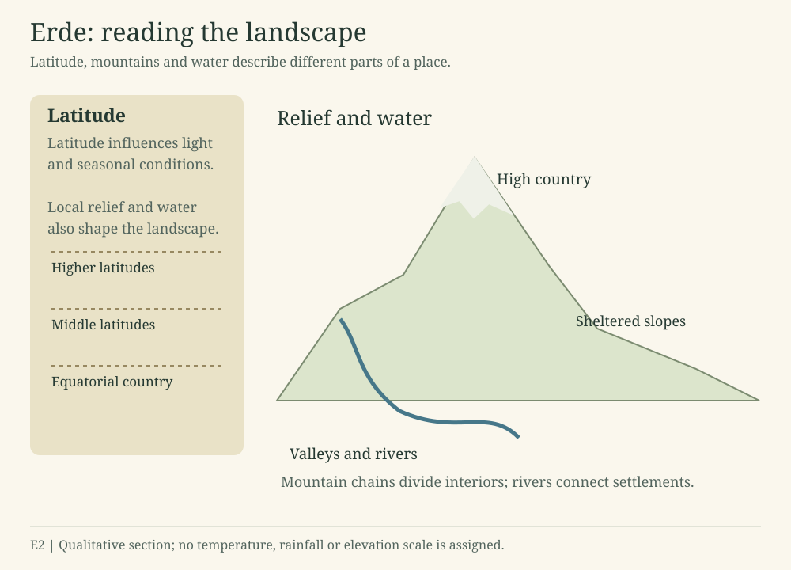
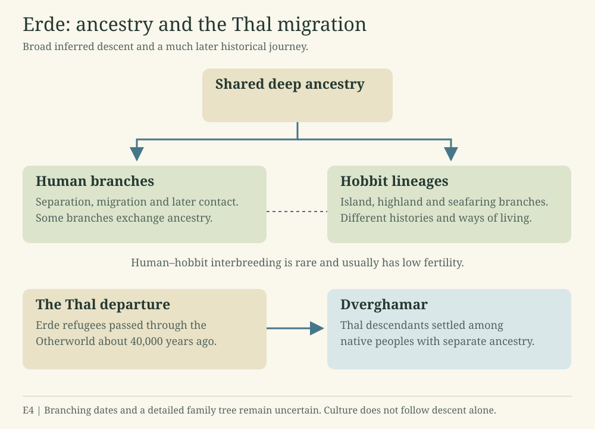

# Erde

River basins, mountain refuges and island passages connect Erde’s peoples. Their histories follow those routes, from early settlement to the institutions that govern water, travel and healing.

River country on Erde. This illustration brings together the cultivated banks, settlements and water routes described in the regional histories.

## Landscape and peoples

### The lands of Erde

Mountain chains divide Erde’s interiors. Rivers connect settlements across wide basins, and travelers follow coasts and island passages between communities.

The [atlas](erde.md#atlas) describes the lands and seas, mountain passages and ancient migrations. The diagrams show the regional relationships; detailed coastlines and distances remain undescribed.

Erde orbits one sun in the [three-star system](https://andeleidun.github.io/test-fantasy-world/index.html#skies). Its sun and Merenval's form the closer stellar pair. The exact properties of Erde’s sun and the length of its calendar periods remain undecided.

### Peoples and deep history

Human and hobbit lineages share deep ancestry and follow different branches. Long isolation, movement between habitats and occasional contact shape their histories. Hobbit lineages include several island branches, highland populations and seafaring peoples. Their shared ancestry does not give them one culture or a single way of living.

Humans, Halflings or hobbit lineages, and Goblins inhabit Erde. Goblin peoples vary greatly in body, habitat and custom.

Early human migration reaches a connected pair of continents long before later arrivals. Over many generations, descendants form distinct regional populations with established communities, routes, institutions and ways of living.

### Landscapes and learned magic

Different communities develop magical traditions around recurring needs. River peoples learn to sense and influence water; volcanic communities maintain warning and refuge networks; highland communities preserve knowledge of breath, cold and ascent. Teachers and local institutions preserve this knowledge across generations.

A well-prepared team at a familiar river crossing can achieve things that an isolated traveler cannot. Exceptional masters are remembered precisely because their abilities exceed ordinary practice.

### The Thal departure

About five thousand years ago, a catastrophe on **Erde** drove survivors of an ancient human lineage through the Otherworld to Dverghamar. Their descendants are the **Thals**. Other populations of that lineage remaining on Erde subsequently became extinct or were absorbed.

The departure belongs to Erde’s history. Dverghamar’s native dwarven lineages had already evolved independently over far longer spans of time.

## Maps and regional routes

### Scope of this guide

The maps below show the regional relationships described in the histories. They are schematics: detailed coastlines, distances and many local places remain undescribed.

### E1 · Lands and seas

Erde’s continents, seas and broad coastlines. Detailed shorelines remain to be described.

Erde’s regional routes. The arrows summarize later migration through coasts, maritime passages and headwaters. They do not give distances or surveyed positions.

### E2 · Latitude and landscape

How latitude, relief and local conditions affect the landscape.

Latitude and landscape. Mountain chains divide interiors while rivers connect settlements. This diagram assigns no temperature, rainfall or elevation values.

### E3 · Relief and passages

Mountains, valleys, coastal approaches and island passages used by travelers.

[See the diagram](#figure-erde-regions).

### E4 · Ancestry and dispersal

Inferred shared descent and movement between habitats. The early chronology remains uncertain.

Ancestry and migration describe different spans of history. The Thal departure occurred about five thousand years ago, long after Dverghamar’s native lineages had arisen.

### E5 · Regional contact

Contact among Great Watersheds, Volcanic Hinge, Highland Spine, Equatorial Basin and coastal successor communities.

[See the diagram](#figure-erde-regions).

## Ancestry and early settlement

### Deep ancestry

Erde’s human and hobbit peoples share deep ancestry. Their branches separated, spread and sometimes met again. Separation between island populations and neighboring mainland populations is important to the later branching history. Several island, highland and pelagic hobbit lineages develop their own ways of living.

Ancient human branches likewise diverge, encounter one another and sometimes exchange ancestry. Interbreeding between the broad human and hobbit branches is rare and usually has low fertility. Biological compatibility, language, culture and political belonging remain different questions.

### Early continental settlement

An early human population reaches a connected pair of continents in deep antiquity. Its descendants diversify long before later human arrivals. Mountain corridors, watershed systems, coastlines and refuges support different regional histories.

Five broad regional groups appear in this history. Each contains distinct local peoples and institutions.

| Complex | Landscape and later continuity |
| --- | --- |
| Coastal and mountain-rim communities | Populations along coasts, mountain corridors and the old continental approach, later continued through several mixed successors |
| Great Watersheds | Interior rivers, lakes, wetlands and coastal drainage systems, with enduring basin networks |
| Volcanic Hinge | Volcanic highlands, islands, valleys and maritime refuge routes |
| Highland Spine | Connected coasts, slopes, valleys, plateaus and high refuges |
| Equatorial Basin | River gardens, headwaters, forests and distributed settlement networks |

### Contact and successor communities

Further human populations establish lasting settlements much later. Contact spreads unevenly over many generations. Some regions support newcomers, some restrict settlement, and others experience violence, displacement or long-term mixture.

Disease acts together with food shortages, social disruption and existing local stresses. Transmission is reciprocal, with different populations affected at different times.

The coastal and mountain-rim complex eventually continues through multiple mixed successor populations. Substantial ancestral and cultural continuity can survive without one unchanged population identity. The other regional complexes remain self-sustaining through different combinations of ecological connection, institutions, refuges and defense.

### Learned traditions and individual lives

Communities develop magical traditions through repeated observation, teaching and work together. Bodily differences affect how individuals experience a practice, but ability varies within every people. Institutions pass on discoveries and mistakes alike, and often disagree about who may use their knowledge.

The [Erde atlas](erde.md#atlas) places these histories in their geographic framework. It covers broad geography, contact and inferred ancestry, with the early chronology still uncertain.

## Regional histories and institutions

### Chronology and ancestry

Human and hobbit peoples share deep ancestry, with later island, highland and seafaring branches. Naturalists compare their anatomy and habitats to infer descent, though precise divergence dates and early population histories remain uncertain.

Early continental inhabitants precede later human migration. Contact unfolds through travel, alliance, adoption, intermarriage, settlement and sometimes displacement. Disease, hunger, disrupted caregiving and local conditions affect different communities at different times.

Around five thousand years before the present, Great Watersheds, Volcanic Hinge, Highland Spine and Equatorial Basin communities remain self-sustaining. Coastal and mountain-rim communities continue through multiple mixed successors. Ancestry alone does not define membership.

The later Thal catastrophe sent refugees from Erde to Dverghamar, where native dwarven peoples already lived.

### Great Watersheds

Great Watersheds survives as a self-sustaining complex because its population is large, geographically distributed, and repeatedly connected through many river, lake, wetland, woodland, and grassland systems. Severe regional losses do not eliminate the wider network.

Different drainage basins and ecological zones experience drought, flood, epidemic, and migration pressure at different times. Surviving communities can support, repopulate, or reconnect affected districts without requiring the entire complex to retreat into one refuge.

Great Watersheds broadly responds to sapiens-like expansion with hostile containment. Communities fortify major waterways, crossings, passes, portages, and settlement approaches; regulate or deny passage; and restrict newcomers to limited contact zones.

Resistance is organized around guarded boundaries and coercive controls on movement. Trade, diplomacy, hostage exchange, intermarriage, refuge, defection, and local cooperation still occur, but they remain exceptions within a generally adversarial frontier.

Reports, refugees, and material evidence from the northern successor regions make uncontrolled migration and disease transmission credible threats. Defense of established watersheds, food systems, sacred places, and political autonomy reinforces the decision to control entry.

Demographic scale and ecological redundancy keep Great Watersheds viable, while hostile containment reduces the speed and depth of sapiens-like settlement and ancestry exchange.

Great Watersheds formalizes a widely shared magical tradition around watershed and seasonal-cycle management before sapiens-like arrival.

Generations of observing rivers, floods, storms, wetlands, drought, groundwater, animal movements, and seasonal plant cycles turn locally effective practices into specialists, teaching lineages, shared signs, ritual calendars, and intercommunity standards.

Hydrological knowledge supports travel, settlement placement, fishing and gathering, agriculture where present, food storage, flood preparation, drought response, and coordination across distant communities. Communities trust practitioners whose work has repeatedly helped them.

Great Watersheds remains an independently reproducing population network with internal diversity, limited but real sapiens-like ancestry, and cultural institutions that were not replaced by northern expansion.

Later Great Watersheds and sapiens-like traditions may remember the containment era as righteous defense, cruel exclusion, heroic resistance, invasion, divine judgment, or epidemic necessity. These later interpretations can distort the events they describe.

### River defenses and coastal voyages

Great Watersheds is organized through river-basin confederacies. Autonomous communities delegate border defense, epidemic coordination, interbasin water law, and diplomacy to councils while retaining substantial local authority; no single centralized state governs the whole complex.

Before sustained sapiens-like contact, Great Watersheds practitioners reliably sense and predict water, weather, soil moisture, flood cycles, and seasonal change. Direct influence is possible but remains local, limited, costly, or dependent on cooperation.

Defense against migration pushes practitioners to develop direct manipulation of rivers through experiment, teaching and military use.

Mature defensive practice can make defended rivers extraordinarily dangerous to cross by altering currents, turbulence, depth, timing, debris movement, banks, channels, or localized flood behavior. Fortifications and ordinary river knowledge compound the magical danger.

As river magic becomes strategically decisive, basin councils coordinate training standards, interbasin deployment, secrecy, maintenance, and protections for upstream and downstream communities. Local communities and practitioner bodies retain authority within the rules established by their confederacies.

Sapiens-like travelers eventually establish a sea route around the strongest watershed defenses.

The route follows the ocean-facing coast through short voyages, estuaries and offshore islands. Several millennia of seasonal travel, failed expeditions, vessel improvement and temporary settlement build the knowledge needed for lasting migration. Travelers must learn where to land and provision their vessels, then pass that knowledge on. Lasting contact with Volcanic Hinge is therefore delayed, while Great Watersheds keeps control of its interior.

### Councils and hydrological orders

Basin councils hold the public and legal authority to approve major hydrological acts, especially those that cross community or basin boundaries. Local practitioners may use codified defensive measures immediately when a recognized crossing or settlement is under threat.

Independent hydrological orders control training, discipline, technique, and much of the ecological judgment behind deployment. An order may refuse a council command that its practitioners believe would imperil the watershed, downstream communities, or the long-term viability of the confederacy.

Neither authority is wholly subordinate to the other. Councils claim confederate legitimacy, responsibility for collective defense, and accountability to affected communities; the orders claim specialized knowledge, binding vows, and obligations to water systems that political majorities may misunderstand or disregard.

Different basins and historical periods resolve this tension differently. Disputes may lead to emergency action, refusal, delayed authorization, unauthorized intervention, schism, removal from office or public trial. Confederacies have different constitutions.

Ordinary mature practice relies on prepared teams at known crossings. Through coordinated work, stored preparations, altered banks and channels, and conventional defenses, they can produce dangerous currents, turbulence, debris movement, depth changes, unstable footing, and short flood pulses.

Crossing-scale denial is temporary, tiring, dependent on local knowledge, and capable of injuring defenders or damaging fisheries, settlements, soils, and downstream communities. Attackers can still find crossings, especially away from prepared defenses.

Only a few individuals in the entire remembered history up to roughly five thousand years ago can exert flexible control over an unfamiliar river reach with little preparation. Ordinary schools and councils cannot reliably reproduce their achievements.

Once or twice, several confederacies and practitioner orders combine their strength to redirect a major channel or disrupt the seasonal flow of an extensive basin. These acts prevent an immediate catastrophe at the price of severe and lasting ecological, political, and humanitarian consequences.

Later accounts enlarge, moralize, or mythologize the exceptional masters and the basin-scale acts. Cultural accounts can disagree over authorization, culpability, scale and whether the waters themselves consented.

### Volcanic Hinge

First durable contact is regionally divided. Volcanic Hinge has no single response to sapiens-like settlers: some communities welcome them, some restrict them to controlled zones, some seek to exploit their labor, knowledge, alliances, or trade position, and some meet settlement attempts with organized violence.

The outcome at a harbor, island, valley, or coastal passage depends on local population pressure, political rivalries, previous epidemic experience, resource competition, and the value each side sees in exchange.

Welcoming regions may develop guest quarters, intermarriage, shared markets, and mixed maritime crews; containing regions may impose residence, movement, marriage, or trading limits; exploitative regions may subordinate newcomers or use them within local conflicts; resistant regions may destroy settlements or force repeated relocation.

No response is permanently fixed. A community may welcome one arrival and resist the next, while newcomers may become allies, clients, rivals, kin, or an expansionist threat over several generations. Both the established peoples and the newcomers have divisions among them.

Volcanic Hinge remains self-sustaining through a refuge-and-recolonization network spanning volcanic highlands, islands, defensible valleys, and established maritime routes. Local destruction does not sever every population center or every path of recovery at once.

Redundant refugia allow surviving communities to evacuate, exchange food and specialists, preserve teaching traditions, and later repopulate damaged districts. The network helps communities survive eruptions, earthquakes, storms, epidemics and military defeats.

Some coastal and island populations become substantially mixed, while other Volcanic Hinge populations retain local demographic majorities and maintain ancestry exchange with one another through the refuge network.

Communities across Volcanic Hinge begin teaching one another how to survive eruptions and earthquakes. The practice begins with detecting unrest, identifying safer settlement ground, warning threatened populations, and coordinating evacuation.

Close observation of tremors, springs, gases, animal behavior, heat, groundwater, slope movement, and recurring eruption patterns is combined with real magical sensitivity. Observation and magic inform one another, although practitioners disagree about why their methods work.

Warning stations, remembered safe routes, stores, refuge agreements, signal systems, and trained practitioners help convert foresight into survival. The tradition becomes interregional because hazards cross political borders and successful evacuation depends on communities trusting and understanding shared warnings.

In cooperative regions, sapiens-like settlers may depend on Volcanic Hinge warnings and refuge institutions, strengthening local Volcanic Hinge authority. In hostile regions, control of safe ground and evacuation routes gives communities a strategic advantage. They still cannot control the disasters themselves.

Later traditions may portray successful warnings as conversations with mountains, failed evacuations as divine judgment, or famous practitioners as eruption-commanders. These stories may preserve genuine events while exaggerating causation, power, and moral certainty.

### Warning systems and maritime settlements

Volcanic Hinge’s warning system is maintained through a civic network of locally appointed watchers, observatories, sanctuaries, signal stations, refuge keepers, and route wardens. Local governments normally decide when settlements evacuate, while regional councils coordinate threats that cross political or island boundaries.

Autonomous volcanic orders retain the authority to issue a binding warning or evacuation when they judge delay to be intolerably dangerous, even if a local ruler, council, landholder, or commercial interest refuses to act. Practitioners exercise this power only in emergencies.

Override authority protects communities from denial, corruption, rivalry, and politically convenient delay, but false alarms and disputed readings can displace populations, abandon harvests, interrupt trade, and weaken public trust. Exact thresholds, credentials, appeals, and post-crisis review remain unresolved.

Civic observers preserve local measurements, oral histories, evacuation practice, and signal discipline; specialist orders compare evidence across regions, train advanced practitioners, investigate anomalies, and intervene when a threat exceeds local experience. The warning network depends on both groups.

Routine physical capability by roughly five thousand years ago remains local mitigation. Organized practitioners can stabilize vulnerable slopes, protect springs and stored water, strengthen refuge sites and evacuation routes, reduce limited ash or debris hazards, and preserve critical passages long enough for people to escape.

Magical mitigation works with engineering, land management, observation, and preparation. It is less reliable when practitioners lack local knowledge, preparation time, coordinated labor, or suitable materials, and its use can move danger toward another settlement rather than eliminate it.

Rare masters can redirect a limited lava, mud, debris, heat, or pressure flow, including in circumstances where ordinary teams would fail. Most practitioners cannot learn to reproduce these feats.

Even a master cannot routinely stop a major eruption, command tectonic plates, or remove pressure without consequences. Successful redirection changes who and what is endangered, making consent, sacrifice, downstream responsibility, and later political judgment central to each remembered intervention.

By roughly five thousand years ago, sapiens-like settlement and mixed ancestry are concentrated in ports, navigable coastal districts, and major islands connected to the coastal migration network. Maritime centers may contain long-established mixed populations with locally distinct identities.

Volcanic Hinge demographic majorities remain strongest across volcanic highlands, inland valleys, smaller refuge districts, and the routes joining evacuation and recolonization sites. These populations remain connected enough to reproduce as a self-sustaining complex even while coastal communities exchange substantial ancestry.

Mixed ports are not automatically sapiens-controlled. Depending on local history, they may remain under Volcanic Hinge law, develop shared institutions, become newcomer-dominated, or alternate among competing coalitions.

Port and island populations become important translators among Volcanic Hinge refuge institutions, sapiens-like maritime networks, and local political systems. Navigation, healing and protective practices can spread and change through these contacts. The later schools remain to be described.

### Highland Spine

First durable contact reaches Highland Spine through a Volcanic Hinge-mediated coastal relay. Volcanic Hinge navigators, mixed port communities, and sapiens-like settlers extend existing coastal links south together.

The relay carries people, vessels, route knowledge, interpreters, marriage ties, trade obligations, pathogens, and magical practices. Individual settlements may still identify principally with Volcanic Hinge, sapiens-like, mixed-port, or local affiliations, so the route does not create one uniform migrant people.

Contact remains incremental. Reconnaissance, seasonal exchange, fishing and gathering camps, refuge agreements, and failed settlements precede durable communities, while Highland Spine coastal groups mediate movement into valleys and higher elevations.

Highland Spine remains self-sustaining through a vertical ecological network connecting coasts, ocean-facing slopes, intermontane valleys, high plateaus, and highland refuges. Communities exchange people and resources across elevations rather than depending on one environmental zone.

Vertical complementarity distributes risk. Drought, frost, crop failure, earthquake, epidemic, invasion, or coastal disruption may devastate one tier without simultaneously eliminating every population center, food source, marriage network, storage system, or migration route.

Movement between elevations supports recolonization after local collapse and preserves internal ancestry exchange. Highland Spine can therefore remain a coherent macro-population while developing substantial regional biological, linguistic, cultural, political, and magical diversity.

Regional societies begin sharing and teaching magic for survival at high altitude. Its core problems are breath, circulation, cold stress, acclimatization, altitude illness, and safe movement between elevations.

Long-term Highland Spine physiological adaptations may change how some techniques are sensed, tolerated, or learned, while culturally transmitted magic alters survival and mobility pressures. Each practitioner still needs training and preparation.

Seasonal ascent, caravan travel, hunting, childbirth, rescue, warfare, pilgrimage, sickness, and the movement of lowland visitors create recurring pressure to distinguish useful practices from dangerous ones and to preserve them through trained specialists.

Early reliable practice may detect dangerous bodily strain, support gradual acclimatization, regulate breathing or peripheral circulation, conserve warmth, maintain awareness during descent, and help groups pace movement. Travelers still need shelter and rest, and may have to descend.

Newcomers and coastal mixed communities initially depend heavily on Highland Spine guides, hosts, and practitioners when moving upward. Some practices spread beyond the lineage, but physiology, preparation, trust, language, and training affect how safely outsiders can use them.

Volcanic Hinge warning traditions can contribute seismic knowledge along the southern relay, but Highland Spine high-altitude practice develops from a distinct cultural necessity. Later schools may combine the two traditions, which developed independently.

### Refuge houses and mountain travel

Pass-and-refuge houses are the principal institutions that maintain and transmit Highland Spine high-altitude practice. These publicly supported waystations occupy different elevations, shelter travelers, train practitioners, stage rescues, preserve route knowledge, maintain supplies, and exchange techniques between communities.

The houses form a public network governed locally. Local communities may fund and govern them differently, but shared standards of hospitality, warning, recordkeeping, and practitioner competence allow travelers to trust the network across political boundaries. Their precise religious and political relationships remain undescribed.

Because the houses are practical institutions, magical authority rests first on demonstrated care, safe judgment, route knowledge, rescue service, and teaching. Ancestry may affect physiology and technique, but it does not confer automatic authority or competence.

Routine individual support is the foundation of mature altitude magic. Practitioners can regulate breathing, circulation, warmth, alertness, and acclimatization, but the effects remain finite, require skill and bodily reserves, and never grant indefinite endurance.

Protected group travel is a prepared capability. Coordinated practitioners, stocked refuges, route markers, rehearsed procedures, and advance preparation can support caravans, refugees, or soldiers through dangerous elevations for limited periods. The protection weakens with group size, mobility, distance from prepared routes, extreme altitude, severe weather, and practitioner exhaustion.

A few exceptional practitioners across history can sustain many people during a disaster or cross normally lethal heights, but only at severe personal cost and with a meaningful risk of lasting injury or death. These feats cannot be reliably reproduced and do not establish a hereditary magical caste.

Limited environmental influence is local and site-dependent. Around prepared refuges, passes, and maintained routes, practitioners can soften wind, cold, or thin-air effects for a bounded area and duration. They cannot broadly command regional weather or permanently alter the atmosphere.

Armies adopt the supply arrangements first developed for civilian travel. They may benefit from refuge houses and protected crossings, but travelers, herders, traders, pilgrims, rescuers, and displaced communities depend on the same network. Attempts to monopolize houses or deny refuge can become serious political and moral conflicts.

By roughly five thousand years ago, sapiens-like settlement and mixed ancestry are concentrated along the ocean-facing coasts, lower valleys, maritime ports, and productive agricultural contact zones.

Highland Spine majorities remain strongest across the plateaus and remote highland valleys. Their continued exchange through the vertical ecological network prevents those populations from becoming isolated remnants even where lower elevations become heavily mixed.

Coasts and lower valleys become major cultural and technological exchange zones. People, languages, marriages, crops, craft traditions, and magical techniques move upward and downward, but every practice must be adapted to different elevations, ecologies, bodies, and institutions.

### Equatorial Basin

First durable contact reaches the Equatorial Basin by descending connected headwater tributaries from Highland Spine. Mixed lower-valley communities and Highland Spine guides carry river knowledge, translation networks, trade relationships, crops, pathogens, and magical practices into the upper tributaries.

Seasonal expeditions, exchange camps, intermarriage, refuge agreements, failed settlements, and locally invited communities precede durable newcomer populations. Existing Equatorial Basin peoples control much of the practical knowledge required to travel and survive beyond the headwaters.

Equatorial Basin communities are spread across main rivers, tributaries, wetlands, forest refuges, upland margins and seasonal savannas. The survival of the wider population does not depend on any one lowland center.

Long climatic cycles repeatedly divide and reconnect those communities. Forest contraction, savanna expansion, floods, droughts, channel changes, and shifting disease zones produce regional lineages and cultures while river corridors periodically restore movement, marriage, exchange, and recolonization.

Epidemic, warfare, ecological disruption, or outside settlement may devastate particular regions, but separated refugia and redundant corridors preserve surviving populations that can later reconnect or recolonize affected areas.

Disease ecology and medical adaptation provide a second major source of continuity. Generations of accumulated knowledge help communities recognize seasonal illness, dangerous water, parasites, venom, infected wounds, toxic plants, useful organisms, and the ecological conditions in which particular treatments work.

Equatorial Basin communities gain an advantage from local knowledge, practiced institutions, locally adapted behavior, and magic that works best within understood relationships. Unfamiliar diseases, failed treatments and ecological change still threaten them. Contact can bring diseases that compound hunger and social disruption on either side.

Newcomers face compounding difficulties when they move beyond supported routes. A plant useful in one preparation may be toxic in another; familiar symptoms may have unfamiliar causes; disturbed habitats may change disease exposure; and imported medical or magical practices may fail when separated from their original ecology.

The first widely shared magical tradition combines ecological medicine with forest communication and tracking while preserving them as distinct disciplines. Ecological medicine concerns the relationships among nourishment, remedy, poison, infection, venom, decay, and symbiosis. Forest communication and tracking concern the detection and interpretation of movement, absence, disturbance, growth, alarm, and recurring pathways within dense living systems.

The two disciplines reinforce one another. Tracking helps practitioners locate organisms, recognize environmental changes, and follow the spread of illness or contamination. Medical knowledge helps them interpret whether a detected pattern signals prey, danger, disease, seasonal change, or a useful ecological partnership.

Several communities develop deliberate practices independently. Different river, forest, wetland, and savanna societies discover repeatable techniques from different species and relationships, then exchange, transform, conceal, or lose them. No single culture creates the whole tradition, and later schools may incorrectly attribute shared knowledge to one legendary founder.

Reliable magic remains relational and context-sensitive. It can sharpen perception, identify familiar patterns, support carefully tested treatments, carry limited signals through prepared living networks, or reveal disturbances that ordinary senses would miss. Unfamiliar organisms can resist interpretation, and treatments can fail. Signals carry only limited information.

Practitioner competence depends on ecological familiarity, careful observation, memory, preparation, and community-held knowledge. Bodily differences may affect sensitivity or tolerance, and magic may change the dangers people survive. Neither guarantees an individual’s mastery.

Contact therefore produces dependency as well as conflict. Newcomers require local guides, healers, interpreters, and safe settlements, while Equatorial Basin communities may trade knowledge selectively, restrict access, misdirect hostile intruders, absorb useful foreign techniques, or reject practices that threaten local relationships.

### River-garden houses

River-garden houses are the principal institutions that preserve, test, and transmit the Equatorial Basin’s living-system traditions. Community-supported healing gardens and field stations exchange apprentices, remedies, ecological records, and tracking knowledge through the river network.

Each house governs its own work within the wider network and remains rooted in its local river, forest, wetland, or savanna ecology, while itinerant practitioners and apprentices carry observations between regions. Shared comparison can expose dangerous errors without erasing legitimate local variation.

Gardens, field plots, preserved preparations, local maps, case histories, seasonal observations, and relationships with nearby organisms allow a remedy or signal method to be understood in context.

The houses develop careful ways to test remedies. Repeated observation, controlled comparison where possible, careful dosage, witnessed outcomes, oral challenge, and written or symbolic records help distinguish reliable practice from coincidence, mythology, fraud, and harmful custom.

Mature ecological diagnosis and treatment can identify familiar toxins, infections, deficiencies, venoms, parasites, and harmful ecological relationships, then support targeted treatment. It cannot guarantee a cure, perfectly diagnose an unfamiliar condition, restore the dead, or make a practitioner immune to error.

Mature living-network sensing and signaling can detect disturbances, follow familiar ecological traces, and transmit short signals through prepared organisms, habitats, or routes. Range, clarity, and reliability depend on preparation, ecological continuity, practitioner familiarity, interference, season, and the condition of the living network.

Messages are short and can be misread. Practitioners may find an unfamiliar ecosystem nearly unreadable until they learn its relationships.

Rare masters can stabilize otherwise fatal poisoning or disease, coordinate an unusually large search through dense forest, or interpret an unfamiliar ecological crisis. Such interventions demand exceptional knowledge and magical ability, carry severe personal cost, and remain uncertain rather than becoming routine public services.

Strong attitudes of kinship with animals, plants, and fungi are common across Equatorial Basin cultures and religions. They vary substantially by settlement, region, tradition, profession, and individual, so there is no single Basin-wide doctrine about which beings are relatives, teachers, ancestors, rivals, persons, or sacred partners.

Kinship attitudes overlap with magic but are not identical to it. Cultural or religious respect may exist without magical ability, while magical skill does not automatically confer spiritual authority or moral worth.

Deeper relationships with particular living beings are common among more capable practitioners. Familiars and animal companions are often members of generally wild species rather than domesticated lineages, and the relationship may strengthen perception, communication, tracking, healing, or other specialized techniques.

In later familiar practice, companions retain their own agency while sharing perceptions. Loss can leave lasting grief and magical difficulty; practitioners cannot fully explain the bond.

Shapeshifting begins to be pioneered by a few masters around five thousand years ago. This rare, experimental practice grows from older work with kinship, bodily change, perception and living patterns. The account of [familiars and shapeshifting](magic.md#familiars) describes its later development.

Durable newcomer settlement and mixed ancestry concentrate in the headwaters adjoining Highland Spine and at major confluences reached through the Highland Spine route. These zones become important centers of translation, marriage, trade, medical exchange, and conflict over access to river-garden knowledge.

Deep-forest, eastern-river, and savanna populations remain predominantly Equatorial Basin and self-sustaining. Continued movement through indigenous river networks prevents these populations from becoming isolated remnants, while the uneven geography of contact preserves substantial internal biological and cultural diversity.

## Goblins

A human naturalist’s account, drawn from observation, testimony and competing theories of descent.

### The name and its difficulties

Few names in natural history conceal as much variety as *Goblin*. Travelers commonly imagine a small green person with dark eyes, sharp teeth, and a taste for caves. Such people certainly exist. They are not a reliable measure of all the peoples to whom the name is applied.

Some Goblins are smaller than most humans; some approach ordinary human mass, and a few short populations are remarkably broad and heavy. Green, olive, brown, pale, ruddy, and other complexions are reported. Ears, teeth, eyes, hands, feet, posture, and proportions vary too widely for any single feature to decide the question. Large or finely responsive sense organs, dexterous hands, flexible joints, and strong adaptation to a local manner of life recur often, but none is universal.

### Affinities with humankind

Comparative skeletons, teeth, muscles, pregnancy, and the many well-attested children born between Goblin and non-Goblin peoples leave little doubt that Goblins belong within the wider human kind.

Their affinities are nevertheless perplexing. One cave people may resemble a neighboring human population in the skull yet differ greatly from another cave people. Two Goblin populations of unlike appearance may have healthy children readily, while two outwardly similar groups may have greater difficulty. Island Goblins sometimes show affinities with the small-bodied ancient peoples whom naturalists call hobbits. Other groups preserve heavy jaws or other proportions not common among neighboring humanity.

These observations have produced several schools. Some naturalists argue for one ancient Goblin stock diversified by climate and custom. Others judge that several human stocks have taken on Goblin form independently. The latter view better explains the present variety, but no scholar can yet provide a complete descent.

### Changeable form

Goblin bodies are unusually responsive to circumstance. Children of mixed households may grow unlike one another according to where and among whom they are raised. Families removed from an old habitat sometimes retain their accustomed form for generations; others gradually lose part of it. Communities returning to old passages or adopting a new way of life have occasionally developed features absent from their recent ancestors.

The process is slow and irregular enough to defeat simple claims of metamorphosis. Intermarriage, diet, disease, climate, custom, and inheritance are difficult to separate. Even so, the repeated association between form and manner of life is stronger among Goblins than among other human peoples known to this writer.

Some communities that no longer possess a naturalist’s expected Goblin anatomy still call themselves Goblins, speak Goblin languages, attend Goblin councils, and marry Goblin neighbors. Conversely, isolated peoples whom scholars classify as Goblin may possess no common name or political fellowship with other Goblins. The naturalist’s category and a people’s identity are not the same thing.

### Habitations and recurring forms

Subterranean Goblins inhabit caves, mines, quarries, buried settlements, and passages that ordinary surveyors cannot always reconcile with the ground above. They commonly possess excellent low-light sight, balance, spatial memory, and manual skill. Not all are small. Some mining populations are extremely broad and strong, and two cave peoples may have quite different heads, feet, and shoulders.

Domestic or Hearth Goblins live in and around long-inhabited houses, walls, cellars, service ways, and hidden rooms. Residents sometimes report footsteps or work in spaces that cannot be entered from the visible house. Peaceful households may sustain long reciprocal relations. Neglected, disputed, violent, or repeatedly ruined homes are associated in many districts with the hostile forms called Boggarts, though whether the house changes the people or the people change the house remains disputed.

River Goblins travel watersheds, remember floods, build into banks, fish, keep boats, and sometimes appear in a drainage from which no known channel leads. Mire Goblins are often expert in dangerous water, infection, difficult foods, and routes across roots or floating ground. Their elaborate cleanliness is frequently mistaken for filth by outsiders who do not understand wetland disease.

Littoral Goblins keep tide knowledge, reef paths, shellfish grounds, and crossings available only at certain waters. Pelagic populations live largely aboard vessels or among islands. Their balance, resistance to motion, weather sense, sleep aboard moving craft, and economy of provisions make them exceptional sailors. Small island-descended merchant populations are especially influential as carriers of languages, seed, news, useful organisms, and disease.

Market Goblins gather at ports, caravan junctions, river exchanges, and other places where many peoples and environments meet. They are often accomplished linguists and judges of custom. Redcaps are reported from old fortresses and disputed passages repeatedly occupied in war; battle alone does not produce them, for most battlefields have no such population. Changelings are associated with childhood divided among different households or between Goblin and non-Goblin communities, and often display remarkable adaptability.

The forms overlap. River and Market forms commonly occur together; a household lineage may also be subterranean; and a people’s present way of life may preserve traces of several earlier ones.

### Strange passages

Goblin settlements are disproportionately associated with roads, rooms, caverns, marsh paths, tidal places, and sea routes that do not agree with ordinary measurement. A mine may open into galleries exceeding the mountain’s apparent volume. A river party may emerge in another drainage. A household passage may exist only at particular times. Goblin charts sometimes place usable waters where human pilots find none.

These reports resemble wider human accounts of the Otherworld. Goblin guides often possess practical knowledge of the crossings without agreeing upon their nature. Some scholars therefore suppose that repeated use of such places contributes to Goblin form. Others argue that Goblins merely find and keep routes that their senses suit them to perceive. The association is well observed; neither explanation has been proved.

### Descent, mixture, and fertility

Goblin fertility is broader than many old classifications predict. Marriages between Goblin peoples of very different appearance, and between some Goblins and neighboring humans or hobbits, can produce healthy descendants. Success is not universal and must never be assumed from a popular name alone. The history of the particular families matters more than resemblance.

This broad fertility may explain why Goblin populations so often combine traits otherwise found far apart. It also makes descent difficult to reconstruct. A heavy-jawed feature may descend from a population’s remote forebears, a later marriage, or an adaptation developed after settlement. Present form is not a portrait of an ancient ancestor.

Physicians and naturalists have found distinctive gut, skin, and household organisms among old communities. Some may descend from associations long lost elsewhere. Claims that any such organism is unchanged from remote antiquity should be treated with caution.

### Mind, society, and moral character

No defensible anatomy supports the old claim that Goblins are naturally vicious or dishonest. Goblin societies range from cities, ports, workshops, and literate states to small bands and low-contact communities. Differences in speech, number sense, tolerance for crowds, technical tradition, or willingness to bargain occur within Goblin peoples as they do elsewhere.

The antiquity of a population does not measure its intelligence. Nor does refusal of a human contract prove inability to understand one. Disputes over land, guardianship, contact, trade, and protection are political and moral questions, not problems that classification alone can settle.

### The green Alchemical lineage

The best-known green Goblins form a more particular lineage. Their founding tradition tells of an Alchemist whose wife died in childbirth and whose infant son was failing. The father prepared a desperate medicine. It saved the child but transformed him. He later administered it to three abducted infants, and the early history ends in violence, flight, and refuge in mountain caves.

The account mixes family memory, accusation, and legend, but the Alchemical peoples’ persistence away from any one ancestral habitat supports the claim that their origin differed from that of many other Goblins. Persistence does not mean an unchanging appearance. Alchemical populations can acquire useful features, diminish them, or lose them altogether as their circumstances and ancestry change. Over many generations some may cease to resemble the familiar green founding lineage while their children continue to be Goblins.

A mining population may become broader, stronger, or better suited to darkness; a maritime population may lose some old features and acquire others suited to ships and salt water. Such resemblance does not prove that they have taken on the established Deep or Pelagic form in the same manner as natural Goblin populations. Naturalists can observe the gains and losses more readily than they can explain the difference.

Their medicine is closely guarded. Other Goblins have sometimes received prepared doses and thereafter shown anything from little outward change to green skin, altered teeth, or a form nearly indistinguishable from the old lineage. The result is not reliably predicted by quantity alone. Reports agree more strongly that the change, once established, is difficult or impossible to reverse by ordinary removal from the habitat.

Outsiders often seek the medicine for power, longevity, military use, or escape from illness. Most are refused. Petitions on behalf of a dying child are said to receive more serious hearing than ordinary requests, for the Alchemical people remember that their own beginning was a father’s refusal to accept his son’s death. Even then, aid is neither promised nor simple: survival may mean permanent transformation, and neither parent nor healer can know the whole adult consequence for a child.

### Limits of the present account

Strange passages remain unexplained, as do the first appearance of Goblins and the composition of Alchemical medicine. Naturalists can trace some relationships among the peoples but cannot reconstruct a complete family tree. Their bodies respond unusually strongly to inherited history and manner of life; how anomalous places contribute to that response remains disputed. The green Alchemical lineage is one part of this much wider history.

All original project IP remains the author’s. Public documentation grants no license or right to reuse this work.
