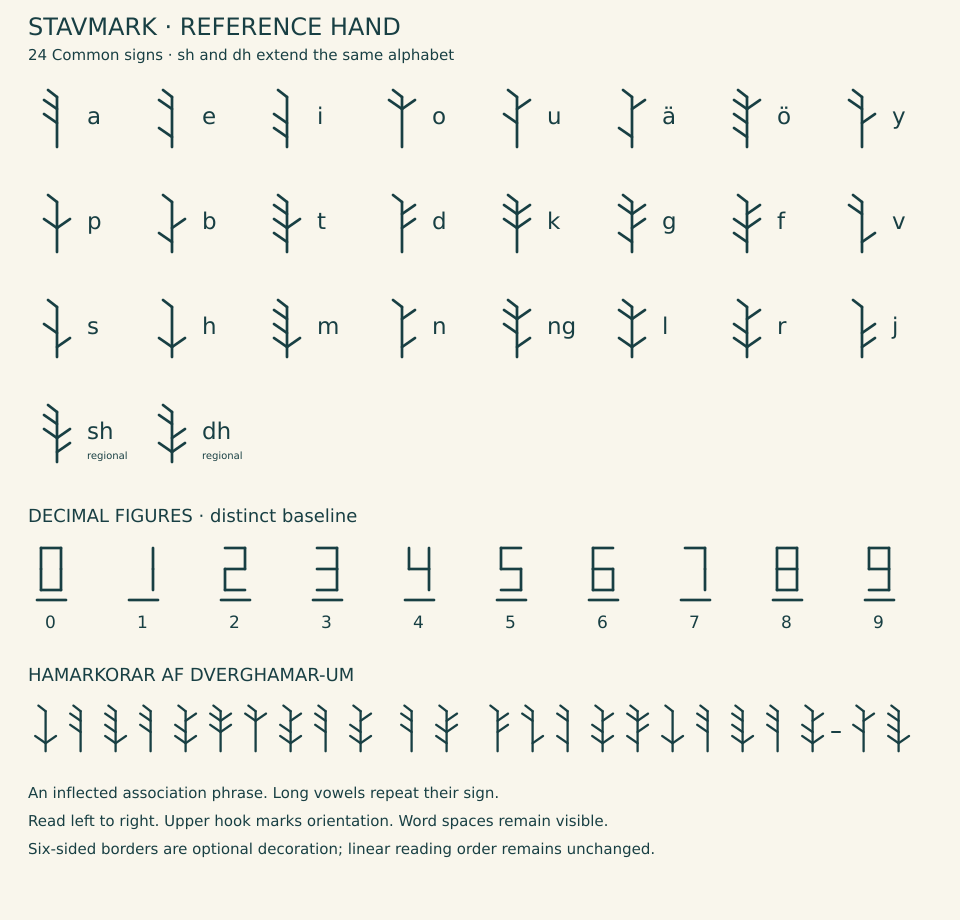

# Korvar: language and dictionary

The shared speech of the Hamarkorar, from a first sentence to the full grammar. Pronunciation, regional languages, writing and all 562 dictionary records are gathered here.

## Getting started

### The shared language

Hamarkorvar is the language family spoken by the dwarven peoples. Its regional languages share much of their grammar but differ in vocabulary and pronunciation. Korvar, literally people’s or public speech, is the standard taught for communication between regions. Hamarvar is the language of the ridge networks.

### Basic roots

| Root | Common reference meaning |
| --- | --- |
| hamar | Crag or great rock mass; related inherited hammer sense |
| rak | Natural rock material or an unworked rock piece |
| kam | Continuous bedrock in place |
| men | Stone selected as shaping material |
| kor | Person |
| var | Speech or language |

The last noun in a compound tells you what kind of thing it names. Earlier roots can describe its material, purpose, contents or mechanism; the dictionary records which meaning a compound has.

### A first example

The following chapters cover pronunciation, grammar, the Stavmark script and five regional languages. The dictionary contains 562 lexical records, and the example collection has 97 translated sentences. You can begin with these two:

**Ek sere Hamarkor.**

I am a dwarf.

**Vir sere Hamarkorar.**

We are dwarves.

Plural **-ar** attaches to the complete noun. The general people-name therefore makes **Hamarkorar**. The old **hamrar** in Dvergahamrar belongs to the inherited planetary name; it does not replace the regular modern plural of every related word.

## Names, sounds and word formation

### Names and belonging

**Hamarkor** /ˈha.mar.kor/ is the singular general people-name; **Hamarkorar** /ˈha.mar.ko.rar/ is the plural. Together they express “people of the great rock masses.” **Kelir**, interior-dweller, and **menir**, stoneworker, describe residence or occupation rather than ancestry. **Kelkor** identifies a member of a chamber-household.

**Rakkor/Rakkorar** is retained for a regional people; **Menkor/Menkorar** for a narrower local, cultural or species identity. Their communities have not yet been specified. **Hamkor/Hamkorar** remains a proposed everyday contraction. **Menkorvar** is a possible community-language name, not an established sixth regional language.

**Hamarkorvar** names the language family, **Korvar** the shared standard and **Hamarvar** the ridge-network language. **Dverghamar** is the ordinary planetary name, with **Dvergahamrar** its archaic or highly formal form. The inherited dverg- element survives in names rather than serving as the modern general people-name.

Names can preserve older sounds and meanings even as everyday speech changes. The grammar below describes the shared standard; local traditions have their own histories.

### Language in daily life

Mountain settlement, water-powered industry, cultivation and nursery care give speakers reasons to distinguish materials and processes carefully. Korvar also covers ordinary affection, play, memory, travel and household needs. Language affiliation crosses species boundaries, and community membership need not depend on ancestry.

Schools and apprenticeships teach the standard across regional networks. Its regular forms make records easier to share, while local languages continue to change and remain in use at home.

### Phonemes and reader spelling

| Spelling | Sound | Rule |
| --- | --- | --- |
| a e i o u | /a e i o u/ | Stable vowels; no English-style silent final e |
| ä ö y | /ɛ ø y/ | ä differs from e; ö and y are rounded front vowels |
| aa ee ii oo uu ää öö yy | long counterparts | Length is contrastive; double the vowel |
| p b t d k g | /p b t d k g/ | k and g remain hard |
| f v s h | /f v s h/ | s is /s/, including between vowels |
| m n l r j | /m n l r j/ | r may be tapped or trilled; j is the sound in English yes |
| ng | /ŋ/ | One consonant within a root; write n-g across a boundary when /n.g/ must be explicit |

There are eight vowel qualities and sixteen consonant phonemes. No obligatory guttural or very low voice is assumed. Short roots favor (C)(C)V(C)(C), with occasional two-syllable roots. Initial dv survives in the proper name. Other registered roots license their listed clusters; new roots should generally follow clusters already represented in the dictionary. Affix and compound boundaries may create longer clusters; syllable division normally resolves these. Thus karn-te is pronounced with the consonants retained. Speakers may use a noncontrastive transitional schwa inside a difficult boundary cluster; it does not change spelling, morphology or word identity.

Primary stress falls on the first root syllable; later compound roots can have secondary stress. Grammatical endings are unstressed. The infinitive -en is normally /ən/. Identical vowel letters meeting across an affix boundary coalesce into a long vowel: se + e gives see /seː/, se + en gives seen /seːn/, and du + um gives duum /duːm/. This coalescence overrides ordinary reduction of the infinitive vowel. Different adjacent vowel qualities remain consecutive syllables in careful speech. Written vowels are retained. Runs of two or more identical consonants are realized as one long consonant; morpheme spelling remains visible, so genitive risss may be written riss-s for clarity. Set-te retains its long t and remains distinct from sete. Loan names may preserve unusual spelling but are listed as exceptions.

In Dverghamar, gh is the boundary g-h, not /ɣ/; the reader spelling is approximately /ˈdvɛrɡˌha.mar/, with fossil e realized as /ɛ/ in this name. Dvergahamrar is approximately /ˈdvɛr.ɡaˌham.rar/. These lexical pronunciations do not establish a productive e-to-ä rule. The formal name preserves a linker -a- and old hamrar plural. The ordinary modern plural of hamar is **hamarar**. The modern planetary name reflects a stored singular reanalysis and a reduced first-element boundary, not merely deletion of a final r.

### Word boundaries and literal compounds

Compounds are head-final: **dravkel** is a chamber associated with water flow, not a kind of water. The final noun receives number and case: dravkel-ar-um. The first element is normally its dictionary stem, without plural or genitive. Its exact relationship may be material (menkel), purpose (nerkel), contents (dravkel), or mechanism (dravhamar). Established meanings are listed; a novel ambiguous relationship is stated with a phrase before shortening it.

Reader spelling permits hyphens to reveal a new or long compound: drav-karn-kel. Hyphens do not alter meaning or stress. More than three lexical roots normally become a phrase, particularly in instructions. Write n-g when separate n and g would otherwise look like ng. Proper place names retain their established spelling.

| Pattern | Function | Example |
| --- | --- | --- |
| Verb root + en | verb infinitive | menen, dress/work stone |
| Verb stem + ir | practitioner/habitual participant | menir, stoneworker |
| Verb stem + ek | bounded result | menek, dressed stone piece |
| Verb stem + et | dedicated activity place | menet, stoneworking workshop |
| Verb stem + ad | activity/practice | menad, stoneworking |
| Noun + ig | characterized by/containing the noun | porig, containing pores |

Speakers use these affixes to form new words, whose conventional meanings still need to be learned. The dictionary records each verb’s meanings and complements. Kelir is a lexicalized habitat-participant extension: it does not require an invented verb meaning 'to kel'. New dictionary entries record a word’s literal reading, intended meaning and an example. Material names usually favor direct descriptions, though speakers also use humor and figurative language, and meanings change over time.

### Habitats and usage

Settlements occupy separate illuminated refuges along the twilight region. Their rivers draw on catchment runoff, glacier outlets or groundwater; mild terrain can still be dry. Natural carbonate caves, lava tubes and fractures provided shelter before people excavated homes in solid massif rock. Thals grow compatible Erde-derived crops and need local advice before eating native foods. This vocabulary describes those conditions without assigning a language or people to one habitat.

## The common grammar

This grammar describes Korvar, the shared standard. The regional profiles identify where each language differs. Teaching has helped regularize the standard; older and regional speech can preserve exceptions.

### Noun phrases and reference

There is no grammatical gender. All ordinary nouns use stem + plural **-ar**, followed by genitive **-s** or oblique **-um**. The direct form serves both subject and direct object. Inflection applies after derivation and compounding.

| Case | Singular | Plural | Use |
| --- | --- | --- | --- |
| Direct | kel | kelar | subject or direct object |
| Genitive | kels | kelars | preposed possessor/association |
| Oblique | kelum | kelarum | complement of a preposition |

Vowel-final nouns keep their vowel before an ending; no automatic contraction. Stem-final s plus genitive s is written ss, retaining the boundary. Proper names are normally uninflected in direct use; add ordinary case endings when necessary, with a hyphen in reader spelling: Dverghamar-um. The fossil plural inside Dvergahamrar never turns the planet into a grammatically plural referent.

Noun-phrase order is determiner + numeral/quantity + adjective(s) + noun + postmodifiers. **Da** is the invariant definite article; bare nouns are indefinite, generic or mass according to context. **Di** is proximal 'this/these'; **dan** is distal 'that/those'. Determiners are alternatives, not stacked: di kel, not da di kel. Adjectives are uninflected. Numerals greater than one select plural count nouns: tor kelar, two chambers. Mass nouns such as water or stone material are not automatically countable; plurals denote kinds or separately identified portions. Use a measure/container phrase for quantities.

Genitive possessors precede the head and replace its determiner: **eks kel**, my chamber; **da menirs kel**, the chamber of the definite stoneworker. The article inside the possessor belongs to that possessor. A possessive phrase normally identifies the head; for an indefinite possessed object use a postposed phrase: **kel af da menirum**, a chamber of the stoneworker. Da kel af da menirum explicitly identifies the chamber. All prepositions require the oblique; there is no unmarked double-object construction.

Pronouns distinguish person and number, not gender. Their genitives are possessive forms; do not append another -s. Sar already means plural they; *sarar is not the ordinary plural.

| Person | Direct | Genitive | Oblique |
| --- | --- | --- | --- |
| I | ek | eks | ekum |
| you singular | du | dus | duum |
| third singular | sa | sas | saum |
| we | vir | virs | virum |
| you plural | jir | jirs | jirum |
| they plural | sar | sars | sarum |

Standalone demonstratives use di / dis / dium and dan / dans / danum. Their number follows the antecedent; use di kelar when it needs stating. **Si** is the reflexive direct object, **sis** the reflexive possessive, **sium** the oblique, referring to the subject of its own clause. **Sa** in an object or possessive position normally points to someone else when si/sis is available. Repeat a name or noun if several possible antecedents compete. **Mut** after a plural subject's object pronoun marks reciprocal action; for clarity use vir helpe vir mut, we help one another.

Coordination uses **ak**, and; **el**, or; **dar**, but. Each conjunct receives its own case under a preposition: me ekum ak duum. Da kel ak da nerkel names two distinct referents. Da kel ak nerkel can be contextually ambiguous and is avoided in technical writing.

### Verbs, time, aspect and voice

Dictionary verbs end in **-en**. Remove -en to obtain the stem. Present = stem + **-e**, past = stem + **-te**, imperative = bare stem, result participle = stem + **-et**. No person agreement occurs. Spell suffixes transparently, including sette from seten. The participle is not a case-inflected noun unless separately lexicalized.

| Form | karnen, build | Meaning |
| --- | --- | --- |
| Infinitive | karnen | to build |
| Present | karne | builds/is building in context |
| Past | karnte | built/was building in context |
| Imperative | karn | build! |
| Participle | karnet | built |

Only one verb is finite in a simple clause. Auxiliaries take the same present/past endings. **Seren** is be, **haven** is have; both are regular. There is no zero copula in a full assertion. Da kel sere keld: the chamber is cold. Adjectives remain unchanged after the copula. Existence uses **dar sere** + indefinite noun phrase, literally 'there is'; dar is a separately registered deictic sense as well as the conjunction 'but'. Context and syntactic position distinguish them.

| Construction | Example | Reading |
| --- | --- | --- |
| Simple | Ek karne da kel. | I build/am building the chamber. |
| Past | Ek karnte da kel. | I built/was building it. |
| Prospective future | Ek fere karnen da kel. | I will build it. |
| Ability | Ek mage karnen da kel. | I can/am able to build it. |
| Obligation | Ek mole karnen da kel. | I must/am required to build it. |
| Desire | Ek vele karnen da kel. | I want to build it. |
| Perfect | Ek have karnet da kel. | I have built it. |
| Pluperfect | Ek havte karnet da kel. | I had built it. |
| Explicit ongoing | Ek sere nu na karnadum. | I am now engaged in building. |
| Passive event | Da kel vere karnet af da menirum. | The chamber is being built by the stoneworker. |
| Result state | Da kel sere karnet. | The chamber stands built. |

Future feren is an auxiliary sense of the registered forward-motion root fer. **Veren** is become; with a participle it marks event passive, while seren + participle emphasizes the state. The agent phrase uses af + oblique. Verbs with no direct object do not automatically form an event passive. Have + participle retains the lexical verb's complements.

Auxiliary order is outer time/modal > perfect haven or passive veren > lexical participle/infinitive. After a modal, the next verb is infinitive: **Ek fere haven karnet da kel**, I will have built the chamber. For epistemic possibility use **ven**, perhaps: **Ven have sa karnet da kel**, perhaps they have built it. Mage denotes capability, not automatically uncertainty or permission. Permission uses **loven**, permit: **Ek love ke da ner ete**, I permit the child to eat. The full complement preserves its own subject. Do not chain more than two auxiliaries in ordinary instructions; paraphrase when scope becomes hard to follow.

Present with a stated later time can express a scheduled future. The perfect connects a completed event to a reference time; it does not entail that its result still exists. **Jev**, already; **nal**, still; and **rev**, again, are optional aspectual adverbs. Habitual frequency uses **oft**, often, or a frequency phrase. Narrative past is not automatically perfective; use tel, finish, to make completion explicit.

### Clause order, questions and negation

Declarative main clauses are **verb-second (V2)**: one whole constituent precedes the finite verb. A subject, time expression or prepositional phrase can fill this first position. If the subject is not first, it follows the finite verb. The nonfinite verb group follows the subject and sentence negation, then direct object, recipient phrase and other complements. Short adverbs may follow the nonfinite group or occupy the first field. The [translated examples](korvar.md#examples) use these conservative placements.

- Ek karne da kel. Subject–finite–object.
- Nu karne ek da kel. Time–finite–subject–object.
- Na da kelum vare da menir. Place phrase–finite–subject.
- Ek have ne karnet da kel. Subject–finite–negation–participle–object.
- Nu have ek ne karnet da kel. Time–finite–subject–negation–participle–object.

**Ne** negates the clause and sits after the subject–finite group. Inside a subordinate clause it precedes the finite verb. Default modal scope is negation over the modal: **Ek mole ne varen** means I am not obliged to speak. Distinguish **Ek mole stilen**, I must remain silent. For prohibition, **Ek banne varen** means I prohibit speaking. Bannen takes a bare infinitive activity or a ke clause; it does not by itself impose an obligation on the speaker. The verb chosen makes the scope of the negation clear.

Yes/no questions start with the finite verb: **Karne du da kel?** A question word occupies the first field: **Van karne du da kel?**, when do you build it? Subject questions use the interrogative itself as subject: **Hve karne da kel?**, who builds it? Non-subject questions retain the following subject: **Hvat karne du?**, what do you build? Who is hve; what is hvat; where is hor; when van; why virke; how ham. Case-mark hve/hvat after a preposition: **Me hveum vare du?**, with whom do you speak? These question stems, unlike most function words, accept noun case endings.

**Ja** and **no** answer yes and no; **ne** is clause negation, not the answer 'no'. Negative questions are avoided when an answer could invert the intended meaning. Repeat the proposition: Ek karne or Ek karne ne. Alternative questions use el and invite a named alternative. Commands use the bare stem, usually without a subject: **Karn da kel.** Negative commands place ne before the imperative: **Ne op da dor.**, do not open the door. Jir can be added as a vocative or explicit addressee when needed; the imperative has no separate plural ending. Polite requests use **Bitte, op da dor**, please open the door, or a question with magen. Courtesy does not require a formal second-person pronoun.

Ordinary direct objects cannot be freely fronted because direct subject and object forms are identical. Explicit topic **tem** introduces an outside-clause topic followed by a resumptive pronoun: **Tem da kel, ek karne di.**, as for the chamber, I build it. The topic frame is outside the V2 clause. Do not delete the resumptive pronoun. This provides topicalization without relying on ambiguous noun case.

### Dependent clauses and connective meanings

Dependent order is conjunction + subject + negation + finite + nonfinite group + complements. **Ke** introduces a statement complement; **se** introduces a yes/no content question; interrogatives introduce content questions with their ordinary subordinate order. Thus **Ek vite se du karne da kel**, I know whether you build it; **Ek vite hor du karne da kel**, I know where you build it. There is no inversion after se or an embedded question word.

**Vel** = if (condition); **den** = because; **tan** = when (time conjunction); **bis** = until; **sav** = although. When a dependent clause comes first, it occupies the first field of the main clause: **Vel da drav stane, stane da rad.**, if the water flow stops, the wheel stops. The dependent clause's finite verb does not count as the main clause's V2 verb.

Real conditions use ordinary present/past. Counterfactuals use invariant **vu**. In a dependent clause it follows negation, if present, and precedes the finite verb. In a main clause it follows the subject–finite group and negation, before any nonfinite verb: **Vel ek vu havte da men, fere ek vu karnen da kel**, if I had the stone, I would build the chamber. With a simple main verb: **Ek karnte vu da kel**, I would have built the chamber. This is a designated counterfactual operator, not a past tense ending. Context specifies whether the unreal condition concerns now or an earlier time; explicit past-time expressions distinguish past counterfactuals.

Relative **ri** introduces an adjective clause immediately after its head. In a subject relative the relativized subject is omitted: **da kor ri karne da kel**, the person who builds the chamber. In an object relative the subject remains and the object gap is omitted: **da kel ri ek karne**, the chamber that I build. Negation keeps subordinate placement: da kor ri ne karne da kel. Oblique relatives use a resumptive third-person pronoun: **da kor ri ek vare me saum**, the person with whom I speak. Avoid a relative with both an unstated subject and an unstated object. Ri clauses do not use main-clause inversion.

Purpose uses **te** + infinitive where the subject is shared: Ek kome te helpen, I come to help. A different subject needs **te ke** + full subordinate clause. Perception and reported speech prefer explicit ke clauses; quotation can instead follow a colon. Complement verbs may take a shared-subject infinitive only when their dictionary frame licenses it (modals, desire, begin, finish, permit/prohibit an activity). No English-style object-plus-infinitive frame is assumed by default.

Relative time is stated lexically when needed: before/after, a numbered work interval, a local calendar date. People on Dverghamar measure time and rest regularly despite the fixed sun. Basic tense and the word for a work cycle do not depend on sunrise or sunset.

### Space, comparison, quantities and measurement

Every preposition takes oblique. Na = inside/within (static); in = into; ut = out of; su = on; un = beneath; til = toward/to; fra = from; me = with/by means of; af = of/by an agent; an = beside; dor = through. Dor is also the noun door/opening, a noun/preposition homonym. Direction is not inferred from case alone. **Solvard** means sunward, **nattvard** nightward, **kamvard** into the rock, **utvard** outward toward exposure, **upvard** upward and **nedvard** downward. These adverbs need no case ending. Absolute bearing, local route, altitude and cover are separate concepts.

Adjectives do not agree with nouns. Comparative = **mer** + adjective + **dan** + comparison phrase; superlative = **mest** + adjective. In comparative use, dan is a conjunction and takes a direct comparison noun/pronoun, not the distal determiner's oblique. **Di men sere mer darn dan dan men**, this stone is harder than that stone; repeat the noun for clarity. Equatives use **sam** + adjective + **as** + comparison: equally hard as. Adverbs of manner use the adjective after the verb group; when ambiguous, me + activity noun makes the relation explicit. There is no obligatory adverb suffix.

Counts use the decimal system in [writing, numbers and everyday use](korvar.md#writing). **Ald** = all, **sum** = some, **neng** = none/no quantity, **tel** as an adjective = complete/whole. Tel's verb sense is finish; the dictionary records both. Neng is a negative determiner: Ek have neng men entails absence of stone; do not add ne unless intentionally changing scope. Use **neng kor**, nobody, and **neng ting**, nothing. Logical scope in contracts is expressed with separate clauses rather than an assumed universal reading of 'not all'.

Measure phrases use numeral + plural unit + **af** + material in oblique: **tor kapar af vasum**, two vessel-units of water. Length, mass, capacity, pressure, electrical quantities and temperature have distinct names. A unit's physical calibration is a separately recorded technical agreement, not deduced from dwarven hand size. Fractions, ratios and tolerances are specified in [writing, numbers and everyday use](korvar.md#writing).

### Register and evidence

Speakers use ordinary, technical, familiar and formal registers. Accent alone tells nothing about intelligence or moral character. Technical statements can append **vis**, observed, **tal**, reported, or **ren**, inferred. These optional words identify the claimed basis of a statement; they do not guarantee truth. Vis/tal/ren in this use are tagged as evidence particles, independent of any noun senses. A report still needs a speaker, time and sample identifier when provenance matters.

Short alarms can omit grammar in conventional phrases: **Ut!**, out; **Stal!**, support/brace; **Ne op!**, do not open. Because bare tool nouns and imperative roots can overlap, safety-critical actions are repeated in a full clause when time permits. Instructions never assume that a material name alone guarantees load capacity, potable water, breathable air or nursery suitability.

## Stone and material vocabulary

### Describing a material

The dictionary makes fine distinctions where dwarves repeatedly need them. A mason, grower and mineralogist may name the same specimen differently without contradicting one another. The shared vocabulary distinguishes the material itself, its observed properties, identified composition, inferred origin and tested uses.

| Layer | What the word identifies | Example | What it does not prove |
| --- | --- | --- | --- |
| Physical setting | material in place, loose rock, workable stone, crag | kam / rak / men / hamar | mineral composition |
| Observable texture | fine/coarse grain, layers, plates, pores, crystals | durfinrak, bandrak, flakrak, porrak | a unique geological origin |
| Identified composition | quartz-rich, carbonate-rich, salt-rich | kvirrak, kalmrak, salrak | uniform engineering or biological behavior |
| Inferred origin | melt-derived, deposited, transformed | smeltrak, lagad-rak, verrak in specialist speech | an inference being certain merely because it has a name |
| Intended application | support stone, filter stone | stalmen, silmen | a successful test or universal suitability |
| Recorded grade | sample + measured properties + use + conditions | gred af stalmenum, grade for support stone | suitability for another site or application |

The origin labels are broad technical classifications rather than perfect translations of every Earth petrological category. **Smeltrak** denotes rock interpreted as crystallized/cooled from melt; **lagadrak** denotes rock interpreted as lithified deposited material; **verrak** denotes rock interpreted as transformed in the solid state. A metamorphic rock may also be bandrak, and a layered volcanic deposit may also be lagrak. Describe replacement/alteration processes more fully when these broad classes are inadequate. Earth geological terms provide comparisons for readers rather than native loanwords.

USGS distinguishes sedimentary grain-size classes, igneous cooling textures and metamorphic transformation. Korvar distinguishes the observable properties, composition and history of a material. [USGS: sedimentary rocks](https://www.usgs.gov/faqs/what-are-sedimentary-rocks), [igneous rocks](https://www.usgs.gov/faqs/what-are-igneous-rocks), [metamorphic rocks](https://www.usgs.gov/faqs/what-are-metamorphic-rocks).

### A field encounter

A worker first calls a dark, fine-grained block **durfinrak**. A specialist may later identify it as a basalt-like melt-derived rock. A mason selects part of that block as **men**, perhaps **stalmen** for a support. The tested lot receives a grade with its dimensions, fracture orientation, load conditions and environment. The remainder can stay rak or become brak, rubble. The specimen stays the same; each name describes what the speaker needs to say about it.

The same observed texture can occur in different geological materials. A dark fine-grained rock can be something other than basalt; a banded rock is not automatically gneiss; a pale coarse rock is not necessarily granite. Surface color can reflect weathering. Scratch resistance, impact toughness, compressive strength, discontinuities and permeability are different properties. Connected fractures can transmit water through rock that appears dense in hand sample. Speakers can describe what they observe while reserving judgment about composition or performance.

### Loose earth and soil

**Dul** is loose mineral ground material. **Sarn**, **silm**, **lem**, and **grust** distinguish sand, silt, clay-rich earth and gravel in the shared field system. **Jörm** is biologically active growing soil. A material can be lemdul while being unsuitable as jörm; the terms answer different questions.

Mixtures remain expressible: sarnlem, sand-bearing clay-rich earth; saldul, salt-bearing loose earth; eskdul, ash-rich loose earth. **Svellem** is clay-rich earth observed to swell under specified conditions, not all clay. **Tettlem** names densely packed clay-rich material without promising that a seal will survive drying or loading. BGS studies relate shrink-swell behavior to the minerals in a clay and their interaction with water. Svellem records the observed behavior and its conditions. [BGS/NERC: clay mineralogy and shrink–swell research](https://nora.nerc.ac.uk/id/eprint/19698/1/IR10079.pdf).

Field grain classes can precede exact calibrated thresholds. The industrial standard adds numbers and the measuring method where trades need reproducible sorting. The precise sieve thresholds of the shared standard have not yet been specified. Terms for organic residue, rooting structure, salts, wetness and cultivation purpose can be combined with texture words while leaving the native organisms to their own biological descriptions.

### Geological distribution

| Geological setting | Vocabulary likely to be especially useful | Limits |
| --- | --- | --- |
| Volcanic ranges and calderas | durfinrak, glasrak, porrak, esklag, eskrak, smeltrak | No assumption every volcano has the same magma or ash chemistry |
| Granite-like intrusive massifs | belgrölrak, krisrak, risskam, veirkam, stalmen | Large intact spans still depend on joints, stress and groundwater |
| Gneiss-rich deformed massif cores | bandrak, flakrak, verrak, revnkam | Banding and anisotropy can matter more than a broad rock name |
| Lakes, rivers and tectonic basins | sarn, silm, slik, lagrak, sarnrak, grustrak | Deposits differ with transport and chemistry |
| Rain-shadow and evaporative basins | salbas, saldul, salrak, gisprak, svellem | Presence of gypsum or a particular salt at a specific site has not yet been mapped |
| Cold margins and glacial routes | isbrak, kantgrustrak, rundrak, vaatdul | Clast shape alone cannot uniquely identify transport history |
| Carbonate-bearing aquifers where present | kalmrak, holrak, revnkam, lös | Carbonate stratigraphy is a plausible local option, not established beneath every settlement |

Geology creates opportunities for lexical specialization; it does not force a species or language to inhabit only one rock type. Commercial samples and migration carry words between provinces. Shared composition terms can be taught without erasing a village's older descriptive names.

### Productive rock, stone, crag and hammer words

- **Kamkel**: chamber excavated in bedrock. **Kamhamar**: bedrock-cutting percussion mechanism.
- **Menkel**: chamber made or lined with worked stone. **Menhamar**: stone-dressing hammer. **Menek**: a dressed stone piece.
- **Hamarkel**: chamber inside a crag. **Hamarveg**: route along or through a crag, with the route relationship specified on first use.
- **Rakhamar**: rock-breaking hammer. **Rakstal**: retained-rock support structure.
- **Handhamar**: hand hammer. **Dravhamar**: water-powered hammer. **Gnisthamar**: electrically powered hammer, where such equipment exists.

Where a compound could mean either construction material or purpose, the established dictionary sense governs; otherwise use a phrase. A hammer made of stone is **handhamar af menum**, while menhamar is the conventional tool for dressing stone.

### Industry and measurement

**Dravrad** is a water wheel, **tarnrad** a gear wheel, **aks** a rotating shaft, **relm** a belt and **kavrel** a cable. **Vasporm** and **luftporm** are distinct pumps. Hydraulic power, pressure, fluid flow and shaft work must be described separately from their source. **Eldmotor** names a combustion engine; **gnistmotor** names an electric motor. Neither motor word specifies an automatic controller.

The technical vocabulary distinguishes **ener**, energy, **kravt**, power, **last**, applied force/load, **trykk**, pressure, **vörk**, mass as a measured quantity, and **rom**, volume. Electrical work has **spenn**, potential difference, **straum**, current, and **mot**, resistance. These terms serve a society with mechanical industry and limited electricity. The common technical register requires quantity, unit, datum and conditions when those change the result.

**Höl** means high in elevation; **dypp** means deep beneath a stated surface. **Hölram** supplies the elevation datum; **kammeel** states rock-cover thickness. Neither is a synonym for distance from a valley floor. A high mountain chamber can have little overhead cover; a lowland mine can have great cover. The language makes that ordinary distinction explicit because confusing it would misdescribe temperature, transport and structural loads.

### Household and care vocabulary

Nerkel names a nursery chamber; neret a care site.

Rinn denotes reproductive parentage; rukkor a protective caregiver; selkor a food-providing caregiver; kelkor household residence. A person can hold several roles. These distinctions allow extended households, fostering, shared care and other arrangements without prescribing one family form.

### Breadth beyond industry

The lexical database includes eating, drinking, buying, selling, affection, grief, games, music, questions, memories, bodies, travel, clothing, household space and ordinary disagreement. 'Know a fact' and 'know a person' have separate verbs; fear, love, permission and prohibition have explicit constructions.

Several roots recur across everyday vocabulary: men in the reserved regional name Menkor, menek and menhamar; kam in kamkel and kammeel; kor in household and caregiver terms; klak in fitted-stone vocabulary. Everyday stems such as **vegn** (wall), **gulm** (floor), **somb** (fungal food organism), **röl** (pipe), **mern** (memory) and **sivar** (signal) have meanings of their own. Some short stems and industrial terms resemble Earth words, but the family has no single Earth-language source.

The [dictionary](korvar.md#dictionary-section) gives definitions, word components and usage notes. Its entries include both roots and separately recorded compounds.

## Five regional languages

### A shared history

The family’s approximate history begins with diverse older languages spoken across surface-supported cave and mountain networks. A related corridor continuum spreads through household movement, neighboring settlements and trade. **Förvar**, “earlier speech,” names the late common source in this reconstruction, placed roughly three to six millennia before the present. The date is provisional; dwarven speech is much older.

Divided drainage systems, mountain barriers and discontinuous routes reduce contact, allowing five daughter traditions to develop. Later exchange reconnects some routes. Shared material labels, counting and written records encourage **Korvar**, a taught interregional standard based especially on conservative massif forms.

Record keepers, craft schools and exchange settlements teach the standard across political boundaries. Mechanical transport, rail, signal links and apprenticeship broaden its use. Local languages remain important in homes and communities.

The reference uses Common citation forms to describe the earlier shared vocabulary where no difference is specified. This is a limited reconstruction; the much older naming layer preserved in Dvergahamrar has its own history.

### Five regional traditions

| Language | Literal designation | Contact environment | Distinctive features |
| --- | --- | --- | --- |
| **Kamvar** | bedrock speech | massif chambers and connecting inland routes | conservative base for much of Common; colloquial copula contraction |
| **Hamarvar** | crag speech | ridge and pass networks | altered front rounded vowels, a palatalized consonant, retained case distinctions |
| **Dravvar** | water-flow speech | lake and river exchange corridors | intervocalic stop lenition, reduced case system, distinct local vocabulary |
| **Nattvar** | dark-side speech | cold-edge communities linked to photic food sources | several vowel mergers, final devoicing, loss of main-clause V2 |
| **Solvar** | starward speech | hot-margin and some volcanic trade networks | initial h loss, intervocalic d lenition, reduced inflections, analytic possession |

These labels describe language networks. A high-mountain dwarf can grow up speaking Dravvar in a lake settlement; two volcanic-range communities can speak Solvar and Hamarvar respectively. Kamvar speakers may include central, deep-massif and other dwarves, as well as proficient Thal residents. Mixed households can use two local languages or a local language and Korvar.

### What the languages share

Each regional language inherits the Common phoneme inventory, lexical meanings, productive derivations, verb argument frames, article and adjective behavior, construction rules, tense/aspect distinctions, question words, numerals and writing conventions **except for the overrides below**. Apply its regular sound changes to all locally pronounced inherited forms, including inflections. Proper names can retain conventional Common forms in interregional use; new local place names can follow local rules. Native spellings may add sh /ʃ/ or dh /ð/ in the languages that require them.

Local basic-word replacements in the dictionary are lexical alternatives, not sound-law exceptions. Their sources within the older dialect continuum have not yet been described. Listed replacements are inserted before the sound rules. A compound recorded as a shared industrial term is borrowed whole from the common lexicon and then adapted phonologically; it need not replace each component with the local everyday synonym. A newly created household compound normally uses local words. This explains, for example, why a local word for drinking water can differ while a common water-pump label remains recognizable. Nattvar uses **pran/pranen** for test/to test: otherwise its ö-to-o merger would collapse the noun tröv, test, with trov, sample. The local synonym preserves a useful industrial distinction; ordinary homophones elsewhere remain possible.

The [aligned regional dictionary](https://andeleidun.github.io/test-fantasy-world/data/regional-dictionary.tsv) gives the local citation form of every registered Common entry. For a verb, that is its infinitive; for a noun, its direct singular. Use the inflection tables and parallel texts below for grammar and word order. Two other practical contrasts use inherited local synonyms: Hamarvar and Solvar distinguish dissolving (los-/losen) from reading (les-/lesen before local endings), and asking (frägen) from blocking (speren). Nattvar uses tiren for teaching, distinct from leren for learning, and upig for high in elevation, distinct from hol, hollow. These synonyms preserve distinctions lost in the regional sound changes. Other homophones remain in ordinary use.

### Ordered sound rules

Rules operate in the order shown. V denotes a vowel. Hyphens preserve a visible morpheme boundary in careful reader spelling; write an established lexicalized compound closed to apply its ordinary within-word changes. Long vowels retain their length even where quality merges.

| Language | Productive sound developments | Illustration |
| --- | --- | --- |
| Kamvar | no additional sound rule in this reference | men → men; kel → kel |
| Hamarvar | sk → sh before e, i, ä, y; then y → i and ö → e | skel → shel; myrk → mirk; röl → rel |
| Dravvar | single p, t, k → b, d, g between vowels | kopen → koben; viten → viden; taken → tagen |
| Nattvar | word-initial v → f; ö → o, y → u, ä → e; word-final b, d, g devoice | var → far; röl → rol; berg → berk, but plural berga retains g |
| Solvar | word-initial h disappears; ö → e, y → i; single d → dh /ð/ between vowels | hand → and; röl → rel; fadur → fadhur |

Only single consonants lenite in Dravvar and Solvar. A doubled consonant protects the cluster: sette does not become sedde merely because t is near vowels. The regular past suffix changes separately in Dravvar by analogy. The sound changes follow plausible linguistic patterns. Their particular combination is fictional and does not follow from the speakers’ climate or anatomy.

### Complete grammatical overrides

| Feature | Kamvar | Hamarvar | Dravvar | Nattvar | Solvar |
| --- | --- | --- | --- | --- | --- |
| Plural | -ar | -ar | -er | -a | -a |
| Genitive | -s | -s | -s | -s | af + oblique phrase; no productive -s |
| Oblique | -um | -om | merges with direct | -u | -u |
| Present | -e; sere contracts to se in ordinary speech | -e | -e | -e | -a |
| Infinitive | -en | -en | -en | -en | -an |
| Past | -te | -te | -de | -te | -ta |
| Participle | -et | -et | -et | -et | -at |
| Main assertion | V2 | V2 | V2 | subject–negation–finite; topic adverbs outside this sequence | V2 |
| Yes/no question | finite–subject | finite–subject | finite–subject | se + subject–negation–finite | finite–subject |
| Relative linker | ri | ki | ri | ri | ri |
| Other dependent order | Common | Common | Common | Common subject–negation–finite | Common |

These suffix differences are inflectional developments: Hamarvar lowers the unstressed oblique vowel; Dravvar fronts the plural suffix vowel and loses a weak oblique ending, then generalizes -de past forms; Nattvar loses final r/m in the specified unstressed noun endings; Solvar reduces the specified suffixes and replaces genitives with an existing prepositional relation. These are **morphologically restricted** changes in the historical reconstruction, not rules that delete every final r or m in the vocabulary.

Nattvar no longer puts a finite verb ahead of the subject after a time/place topic. Its topic can come first, followed by a comma: **Nu, ek ne karne da kel**. Subject questions remain hve + finite; non-subject questions use wh + subject + negation + finite. Its content-question linker se is inherited, while its yes/no question use is a grammatical extension. Imperatives, relative clauses, nonfinite groups and dependent clauses retain Common behavior. Counterfactual Common vu, locally **fu**, sits after ne and before the finite verb in all Nattvar finite clauses. This word order applies throughout Nattvar.

Solvar possession puts the head before **af + oblique possessor**: da kel af da meniru, the stoneworker's chamber; da kel af eku, my chamber. Its demonstratives, pronouns and interrogative stems follow the same local case reduction as nouns. Dravvar keeps prepositions after case loss; explicit prepositions and fixed order carry the lost distinction.

The local numeral system retains the Common decimal structure with regular pronunciation changes. Serial numbers, measurement labels and emergency readbacks can always use careful Korvar forms. The shared written technical register spells canonical Common forms; a local-language book uses its local spelling. Both conventions are valid when the document identifies its language.

### Parallel passages

Compare the same passage in each language:

| Language | Text | Literal English |
| --- | --- | --- |
| Korvar | Nu karne ek da nerkel. Ek have ne da vas. | Now I build the nursery. I do not have the water. |
| Kamvar | Nu karne ek da nerkel. Ek have ne da vas. | Same structure; this passage does not happen to contain a differing feature. |
| Hamarvar | Nu karne ek da nerkel. Ek have ne da brin. | Local water word brin. |
| Dravvar | Nu karne ek da nerkel. Ek have ne da löm. | Local water word löm. |
| Nattvar | Nu, ek karne da nerkel. Ek ne have da ilm. | Topic outside SVO; preverbal negation; local water word. |
| Solvar | Nu karna ek da nerkel. Ek ava ne da es. | Present -a; h disappears in hava; local water word es. |

| Contrast | Korvar | Regional form |
| --- | --- | --- |
| The chamber is cold. | Da kel sere keld. | Kamvar: Da kel se keld. |
| Inside the chambers. | Na da kelarum. | Hamarvar: Na da kelarom. |
| Inside the chambers. | Na da kelarum. | Dravvar: Na da keler. |
| Inside the chambers. | Na da kelarum. | Nattvar: Na da kelau. |
| My chamber. | Eks kel. | Solvar: Da kel af eku. |
| I built the chamber. | Ek karnte da kel. | Dravvar: Ek karnde da kel. |
| Do you build the chamber? | Karne du da kel? | Nattvar: Se du karne da kel? |
| The person who builds. | Da kor ri karne. | Hamarvar: Da kor ki karne. |

### Learning the shared standard

Korvar is a learned shared language. Everyday literacy and fluency can vary by age, route access, household and education. Related languages can permit partial understanding, with fluency still requiring practice. Kamvar speakers usually face the smallest adjustment; local vocabulary and reduced inflections still require attention elsewhere. A person may read the Common technical standard well while speaking a local language most comfortably.

Standard access is maintained through apprenticeship, school instruction where available, exchanged records, route work and mixed households. Teachers use printed texts and reusable charts. Isolated speakers may have little chance to learn the standard. Interpreters and bilingual records remain useful.

Critical instructions use a restricted Common vocabulary, one action per clause, explicit quantities and a readback by the recipient. Technical glossaries map local terms to observed properties and sample classes rather than insisting that one traditional rock word have exactly the same boundaries everywhere.

### Productive naming

Settlement names can combine an observable feature and a place head: **Salbaskel**, salt-basin chamber settlement; **Bandhamar**, banded crag; **Dravmenet**, stone workshop served by water flow. These illustrate naming patterns; they do not identify mapped settlements. Person names can develop from short root forms, household associations or inherited names; occupations are only one possible source.

A practical record can identify a person as **Menel af da Hamarkelum**, Menel of the crag-chamber household. Menel is a sample proper name, not a common noun or a fixed surname. Reproductive parentage, household membership and personal preference may supply different name elements. Use an explicit association phrase when a compound would confuse a place, a person and an occupation. A settled proper name can fossilize earlier spelling just as Dverghamar has; people may keep their names after changing occupation or residence.

## Writing and everyday use

### Stavmark, the writing system

**Stavmark**, 'letter-mark', is the native writing system described in this guide. Its 24 base signs cover eight vowel qualities and sixteen consonants, including one sign for ng /ŋ/. Phonemic vowel length repeats the vowel sign. The chart accompanying this handbook supplies every base sign and the two regional extensions sh and dh.

The ordinary hand is linear, written left to right in horizontal lines from top to bottom. Each sign has an upright stem and an orientation hook at its upper left; short angled branches distinguish the signs. Carving, ink, printing and raised tactile marking can preserve the same identities. An orientation hook keeps a rotated loose label from silently becoming ordinary text. The teaching forms use pairs of branches. A missing branch leaves a visibly malformed letter, which helps readers notice damage. Heavy wear can still make a sign unreadable.

Spaces separate words; a short midline separator marks a compound boundary when needed; a low dot ends a sentence. A pair of low dots marks a clause break or colon according to layout. Questions have a terminal raised hooked mark, shown in reader transcription as ?. Reader Latin punctuation can be used in bilingual industrial records. There are no separate uppercase native letters; the reader transcription capitalizes names. A name cartouche is optional on labels and inscriptions and has no grammatical force.

The sign chart includes **Hamarkorar af Dverghamar-um**, 'Hamarkorar (crag people) of Dverghamar'. The proper name takes its regular oblique ending after af, with a visible boundary separator. This is an association phrase suitable for a heading or label; it follows ordinary case rules.

Hexagonal and honeycomb arrangements suit seals, panel borders, household labels and modular inventories when convenient. Text itself remains linearly ordered. A six-sided panel can hold six labeled compartments. This practical use has no prescribed religious or linguistic meaning, and counting remains decimal. Long documents, route notices and fast handwritten messages use ordinary lines. A writer can use the script with two working hands.

The regional sh /ʃ/ and dh /ð/ signs extend the same visual system. Common technical documents can instead retain their Common ancestral spelling when a reader is expected to pronounce it in the shared register. A local-language text uses its local spelling consistently. A bilingual sign states which version is which; spelling differences are not treated as careless Common errors.

The Stavmark writing reference. The surrounding text explains the signs, regional additions and numeral forms.

### Spoken numerals and quantities

Korvar uses decimal counting. This convention is independent of the number of limbs or fingers. The written decimal figures in reader transcription use the familiar 0–9 reader convention; their native straight-stroke counterparts are supplied on the chart. They have a baseline marker that separates figures from letters.

| Value | Common form | Value | Common form |
| --- | --- | --- | --- |
| 0 | nul | 5 | fim |
| 1 | en | 6 | sek |
| 2 | tor | 7 | siv |
| 3 | trel | 8 | okt |
| 4 | fadur | 9 | niv |
| 10 | dek | 100 | hund |
| 1,000 | tus | 1,000,000 | mil |

Multipliers precede the scale word and remainders follow it, largest scale first. Omit en before a scale when it means exactly one of that scale. Thus 14 = **dek fadur**, 26 = **tor dek sek**, 103 = **hund trel**, 1,205 = **tus tor hund fim**, and 500,000 = **fim hund tus**. No German-style units-before-tens inversion applies. Number words are separate words, not enormous single compounds. All numerals are uninflected.

Ordinal **-st** attaches to the final element: enst, first; torst, second; dek fadurst, fourteenth. Counted nouns use their ordinary case and plural. **Di torst kel** means this second chamber. A compound number such as 21 still takes a plural count noun because the whole value is greater than one.

Fractions use numerator + **av** + denominator: en av fadur, one quarter; trel av okt, three eighths. A ratio uses the same form with **del**, part/share, or an explicit 'ratio' label when it could be confused with a fraction of a whole. Decimals use **punkt** followed by individual digits: tor punkt nul fim = 2.05. For critical measurements, read the point and every following digit even when a spoken short form would be understandable. Leading minus expresses a negative value; plus and minus also name arithmetic operations. Multiplication can be read as **tor gang trel**, two times three, with gang's registered counting-passage sense; division is stated as a fraction. Equality uses **sere sam**, is equal.

Parentheses in technical writing group arithmetic expressions; spoken calculations say **op del** and **luk del**, open/close part, around a grouped expression. In mathematical contexts, these expressions conventionally mark grouping. Very large magnitudes can use powers of ten expressed as repeated multiplication or written indexed powers; everyday readers are not assumed to use scientific notation fluently. Larger numbers follow the same grouping conventions.

### Time, units and industrial records

**Tik** is a clock-counted short time unit, **takt** a scheduled activity/rest cycle, **orvtid** an orbital period, and **tid** duration generally. These do not import terrestrial solar days. A date record specifies the local or shared epoch and counted units. The epochs and history of calendar reforms remain undecided. A clock can be mechanical. People can say earlier, later, frequently and after a rest without observing a sunrise.

**Mer**, **vek**, and **kap** are conventional length, mass and capacity units. Their calibrations must accompany quantitative conversion into Earth SI. The physical calibrations of these units have not yet been specified. **Trykk**, **spenn**, **straum**, **mot** and **lut** identify measured pressure, potential difference, current, resistance and useful thermal conditions; careful records state the actual temperature scale or operational parameter rather than treating 'warmth' as a numerical temperature definition.

A technical record contains sample/asset identifier, location, time, property, measurement method, value and unit, conditions, responsible observer, and optional vis/tal/ren evidence marker. Ordinary conversation can omit these details. A practical label might read:

> Trov 14. Durfinrak. Tör. Gred af stalmenum: ne vitet.

> Sample 14. Dark fine-grained rock. Dry. Grade for support stone: not known.

These are labeled fragments. A full assertion is **Da gred af stalmenum sere ne vitet**, the support-stone grade is not known. Durfinrak describes the rock’s appearance. An engineering specification must also record the measurements needed to decide whether it is suitable.

### Names, courtesy and acquisition

Personal names can be short forms such as **Menel**, **Röva**, and **Keldin** which are sample names. Household associations can be expressed with af + oblique, and changed or retained according to local custom. Occupational labels remain distinct from ancestry labels. Dverghamar and Dvergahamrar preserve their established roles regardless of local name fashions.

Ordinary greetings are **Hei**, hello; **Takk**, thanks; **Bitte**, please; and **Farvel**, farewell. Affection and familiarity can be conveyed with voice, personal names and vocabulary; no obligatory honorific hierarchy is encoded. A respectful request can remain short and grammatical. Children learn household speech first and may acquire Korvar through other caregivers, community teaching or later apprenticeship; household arrangements and underground residence do not determine a fixed acquisition timetable.

Accessible communication can use large-print or raised Stavmark, written readback and agreed visual/tactile instructions. Work gestures and fingerspelling can complement speech, but do not constitute a full signed language. Dwarven signed languages, including their independent grammars and histories, have not yet been described.

### Reading passages

**A home high in a mountain**

> Eks helm sere na da bergum. Da kel sere höl, dar da kammeel sere kurt. Da drav dreve da rad. Vir have sombsel ak rötar. Na da nerkelum sove da ner. Nu vare ek me da rukkorum.

My home is inside the mountain. The chamber is high, but the rock cover is shallow. The water flow powers the wheel. We have fungal food and tubers. The child sleeps in the nursery. Now I speak with the caregiver.

**A material awaiting a decision**

> Ek have durfinrak. Da rak sere darn ak spröd. Da gred af stalmenum sere ne vitet. Ek fere tröven da trov. Eft fere ek skriven da döm. Nu mole vir ventren.

I have a piece of dark fine-grained rock. It is scratch-resistant and brittle. Its support-stone grade is not known. I will test the sample. Afterward I will write the decision. Now we must wait.

The [translated examples](korvar.md#examples) explain each sentence’s construction.

### Practice exercises

1. **Identify and request.** Learn kor, kel, vas, men, ner and the personal pronouns. Say Ek sere Hamarkor; Ek vele vas; Bitte, giv da men til ekum. Practice explicit recipient phrases.
2. **Locate and describe.** Contrast na/in, höl/dypp, and visible properties. Translate 'Inside the chamber is a child': **Na da kelum sere ner.** Translate 'The stone is harder than that stone': **Da men sere mer darn dan dan men.**
3. **Act and remember.** Build present, past and perfect forms. 'We built the nursery' = **Vir karnte da nerkel.** 'We have built the nursery' = **Vir have karnet da nerkel.** The perfect relates the event to the present.
4. **Ask and qualify.** Translate 'Do you know whether the water flows?' = **Vite du se da vas drave?** Translate 'I think the sample is dry' = **Ek tönke ke da trov sere tör.** Learn the difference between a measured property and an inference.
5. **Read across the family.** Recognize Hamarvar kelarom, Dravvar keler, Nattvar kelau and Solvar kelu as case/number forms according to their tables. Translate **Se du karne da kel?** from Nattvar into Korvar: **Karne du da kel?**
6. **Produce a connected text.** Describe a home, an ordinary need, one material observation and a request. Check each content word in the dictionary, each preposition's case, the finite verb position and the source of any uncertainty claim. The examples provide models for practice.

For more practice, use the [translated examples](korvar.md#examples) alongside the [dictionary](korvar.md#dictionary-section).

## Korvar in use: 97 examples

### Reading the examples

Each entry gives a Korvar sentence, its English meaning and a brief explanation of the construction. The examples progress from identity and household language to questions, care, work and connected passages. Consult the [common grammar](korvar.md#grammar) for the full rules.

#### C01: I am a dwarf.

**Ek sere Hamarkor.**

Hamarkor identifies a dwarf; it does not specify an occupation.

#### C02: We are dwarves.

**Vir sere Hamarkorar.**

Plural predicate noun; verb does not agree.

#### C03: The stoneworker builds the chamber.

**Da menir karne da kel.**

Subject + finite + object.

#### C04: Now I build the chamber.

**Nu karne ek da kel.**

Time constituent + finite + subject.

#### C05: The stoneworker speaks inside the chamber.

**Na da kelum vare da menir.**

Whole location phrase occupies first field.

#### C06: Do you build the chamber?

**Karne du da kel?**

Finite precedes subject.

#### C07: Who builds the chamber?

**Hve karne da kel?**

Interrogative is the subject.

#### C08: What do you build?

**Hvat karne du?**

Object question retains explicit subject.

#### C09: Where is the child?

**Hor sere da ner?**

Copula is finite second constituent.

#### C10: With whom do you speak?

**Me hveum vare du?**

Interrogative takes oblique after me.

#### C11: I do not build the chamber.

**Ek karne ne da kel.**

Ne follows subject and finite.

#### C12: Now I have not built the chamber.

**Nu have ek ne karnet da kel.**

Inversion; negation before nonfinite participle.

#### C13: I say that they do not build the chamber.

**Ek vare ke sa ne karne da kel.**

Singular sa; dependent negation before finite.

#### C14: I know whether you build the chamber.

**Ek vite se du karne da kel.**

No inversion in dependent question.

#### C15: I know where you build the chamber.

**Ek vite hor du karne da kel.**

Question word + subject + finite.

#### C16: The person who builds the chamber is here.

**Da kor ri karne da kel sere her.**

Relative subject gap; entire noun phrase precedes main copula.

#### C17: The chamber that I build is large.

**Da kel ri ek karne sere storr.**

Relative object gap; predicate adjective remains uninflected.

#### C18: The person with whom I speak is here.

**Da kor ri ek vare me saum sere her.**

Resumptive pronoun saum after me.

#### C19: The person who does not build the chamber is here.

**Da kor ri ne karne da kel sere her.**

Subject gap followed by ne + finite.

#### C20: My chamber is here.

**Eks kel sere her.**

Possessor replaces head determiner.

#### C21: The stoneworker's chamber is here.

**Da menirs kel sere her.**

Da belongs inside the possessor.

#### C22: I have a chamber belonging to the stoneworker.

**Ek have kel af da menirum.**

Bare head plus postposed association phrase.

#### C23: I give the stone to you.

**Ek give da men til duum.**

No bare double-object pattern.

#### C24: They wash themself.

**Sa vaske si.**

Singular reflexive refers to clause subject.

#### C25: They wash another person referred to as they.

**Sa vaske sa.**

Distinct third-person referent; repeat names if unclear.

#### C26: They have their own hand hammer.

**Sa have sis handhamar.**

Sis is subject-bound.

#### C27: They have another person's hand hammer.

**Sa have sas handhamar.**

Sas is not subject-bound here.

#### C28: We help one another.

**Vir helpe vir mut.**

Plural object plus reciprocal marker.

#### C29: I speak with myself and you.

**Ek vare me sium ak duum.**

Reflexive sium is clause-subject-bound; both conjuncts carry oblique.

#### C30: The stone is scratch-resistant and brittle.

**Da men sere darn ak spröd.**

Hardness does not entail toughness.

#### C31: This stone is harder than that stone.

**Di men sere mer darn dan dan men.**

First dan is comparison linker; second is determiner.

#### C32: This chamber is as large as that chamber.

**Di kel sere sam storr as dan kel.**

Sam + adjective + as introduces an equal comparison.

#### C33: The stoneworker built the nursery.

**Da menir karnte da nerkel.**

Transparent past suffix -te.

#### C34: I have built the chamber.

**Ek have karnet da kel.**

Have + participle.

#### C35: I had built the chamber.

**Ek havte karnet da kel.**

Past auxiliary + participle.

#### C36: I will build the chamber.

**Ek fere karnen da kel.**

Finite prospective auxiliary + infinitive.

#### C37: I will have built the chamber.

**Ek fere haven karnet da kel.**

Future + infinitive perfect auxiliary + participle.

#### C38: I can carry the stone.

**Ek mage bären da men.**

Magen expresses ability.

#### C39: I must remain silent.

**Ek mole stilen.**

Positive obligation with lexical silent verb.

#### C40: I am not obliged to speak.

**Ek mole ne varen.**

Negation takes scope over obligation.

#### C41: I prohibit speaking.

**Ek banne varen.**

Activity infinitive; not I must not speak.

#### C42: I permit the child to eat.

**Ek love ke da ner ete.**

Explicit subordinate subject.

#### C43: The chamber is being built by the stoneworker.

**Da kel vere karnet af da menirum.**

Event passive plus agent phrase.

#### C44: The chamber stands built.

**Da kel sere karnet.**

Copula plus result participle.

#### C45: I am now engaged in building.

**Ek sere nu na karnadum.**

Activity noun after na.

#### C46: If the water flow stops, the wheel stops.

**Vel da drav stane, stane da rad.**

Dependent clause fills first main-clause field.

#### C47: If I had the stone, I would build the chamber.

**Vel ek vu havte da men, fere ek vu karnen da kel.**

Vu follows the dependent subject and the main subject–finite group.

#### C48: I come to help.

**Ek kome te helpen.**

Infinitive shares main subject.

#### C49: I build the chamber so that the child can sleep.

**Ek karne da kel te ke da ner mage soven.**

Te ke introduces explicit new subject.

#### C50: As for the chamber, I build it.

**Tem da kel, ek karne di.**

Outside-clause topic plus resumptive demonstrative.

#### C51: Do not open the door.

**Ne op da dor.**

Ne precedes bare imperative.

#### C52: Please give the stone to me.

**Bitte, giv da men til ekum.**

Imperative plus recipient in oblique.

#### C53: Pump the water into the cistern.

**Pom da vas in da dravkelum.**

Imperative and directional preposition.

#### C54: The water flow powers the wheel.

**Da drav dreve da rad.**

Direct mechanical power relationship.

#### C55: I test the sample.

**Ek tröve da trov.**

Tröv and trov remain different words.

#### C56: I label the sample with a mark.

**Ek merke da trov me markum.**

Me governs oblique.

#### C57: The support-stone grade is not known.

**Da gred af stalmenum sere ne vitet.**

The grade is unknown; the sample has not been judged unsuitable.

#### C58: The sample is dry, by observation.

**Da trov sere tör, vis.**

Particle states the claimed basis.

#### C59: I think the sample is dry.

**Ek tönke ke da trov sere tör.**

Thought complement rather than asserted measurement.

#### C61: The child is in the nursery.

**Da ner sere na da nerkelum.**

Na takes the oblique nerkelum to locate the child inside the nursery.

#### C62: I care for and protect the child.

**Ek ruke da ner.**

Protective caregiver role.

#### C63: I feed the child with nourishment.

**Ek sele da ner me selum.**

Recipient is direct object; food is me phrase.

#### C64: The child holds the hand hammer.

**Da ner halte da handhamar.**

Halte takes the thing held as its direct object.

#### C65: I want water.

**Ek vele vas.**

Bare mass noun.

#### C66: I eat the tuber.

**Ek ete da röt.**

Eten takes a food object. Röt names a tuber crop, whose species remains unspecified.

#### C67: I like the fungal food.

**Ek like da sombsel.**

Liken expresses enjoyment and takes the thing liked as its object.

#### C68: I love you.

**Ek elske du.**

Direct object pronoun.

#### C69: I grieve.

**Ek sorge.**

Intransitive feeling verb.

#### C70: The child plays.

**Da ner spele.**

No object required.

#### C71: We sing the song.

**Vir sange da sang.**

Related verb and noun stems.

#### C72: I have no stone.

**Ek have neng men.**

Neng already makes a negative quantity.

#### C73: Two chambers are here.

**Tor kelar sere her.**

Numeral selects plural count noun.

#### C74: I take two vessel-units of water.

**Ek take tor kapar af vasum.**

Capacity unit and mass-noun complement.

#### C75: The chamber is high and deeply covered.

**Da kel sere höl ak dypp.**

Two independent spatial properties with contextual datums.

#### C76: I travel sunward.

**Ek gare solvard.**

Adverb, not preposition requiring a case.

#### C77: I travel through the tunnel.

**Ek gare dor da gangum.**

Through-preposition distinct from door noun.

#### C78: Do you know whether the water flows?

**Vite du se da vas drave?**

Main inversion; dependent subject-first order.

#### C79: I want to learn Common Dwarven.

**Ek vele leren Korvar.**

Shared-subject infinitive.

#### C80: I teach Common Dwarven to the child.

**Ek läre Korvar til da nerum.**

Content object; learner as explicit recipient.

#### C81: Hello. Can you help me?

**Hei. Mage du helpen ek?**

Modal + infinitive + direct object.

#### C82: Yes. What do you want?

**Ja. Hvat vele du?**

Yes response distinct from clause negation.

#### C83: I want two dressed stone pieces.

**Ek vele tor menekar.**

Bounded result noun, counted plural.

#### C84: I give these to you.

**Ek give di til duum.**

Di resumes the previously requested plural stones.

#### C85: Thanks. I will pay.

**Takk. Ek fere betalen.**

Payment amount is contextually recoverable.

#### C86: Farewell.

**Farvel.**

Conventional social formula.

#### C87: My home is inside the mountain.

**Eks helm sere na da bergum.**

Opening of the high-home passage.

#### C88: The chamber is high, but the rock cover is shallow.

**Da kel sere höl, dar da kammeel sere kurt.**

Literal cover thickness is short; elevation is a separate quantity.

#### C89: The water flow powers the wheel.

**Da drav dreve da rad.**

Dreve describes the water flow driving the wheel.

#### C90: We have fungal food and tubers.

**Vir have sombsel ak rötar.**

Sombsel is a mass noun; rötar is a plural count noun.

#### C91: The child sleeps in the nursery.

**Na da nerkelum sove da ner.**

Location-first main clause.

#### C92: Now I speak with the caregiver.

**Nu vare ek me da rukkorum.**

Care role with explicit oblique phrase.

#### C93: I have a piece of dark fine-grained rock.

**Ek have durfinrak.**

Count reading of the natural rock category.

#### C94: The rock is scratch-resistant and brittle.

**Da rak sere darn ak spröd.**

Distinct physical properties.

#### C95: Its support-stone grade is not known.

**Da gred af stalmenum sere ne vitet.**

Contextual referent, explicit unknown grade.

#### C96: I will test the sample.

**Ek fere tröven da trov.**

Fere plus an infinitive places the test in the future.

#### C97: Afterward I will write the decision.

**Eft fere ek skriven da döm.**

Time constituent before finite auxiliary.

#### C98: Now we must wait.

**Nu mole vir ventren.**

Positive obligation in a connected technical exchange.

## Dictionary

| Word | Part of speech | Meaning | Formation | Notes |
| --- | --- | --- | --- | --- |
| kam | N | continuous bedrock; rock in place |  | Does not identify mineral composition. |
| rak | N | natural rock material or an unworked rock piece |  | Count use denotes a piece; mass use denotes material. |
| men | N | stone selected as material for shaping |  | Workability is an intended use, not a guarantee of strength. |
| hamar | N | crag; large exposed rock mass; inherited hammer sense |  | Use handhamar for an unambiguous hand tool. |
| kor | N | person |  | Applies to persons beyond native dwarf ancestry. |
| kel | N | sheltered interior; chamber |  | Does not entail great depth. |
| stal | N | supporting frame or load-bearing arrangement |  |  |
| klak | N | fitted stone piece; the close joint it forms |  | Piece and joint senses are conventionally related. |
| var | N | speech; an utterance |  |  |
| drav | N | water flow considered as current or supply |  |  |
| ner | N | dependent young individual |  | Does not fix exact age or developmental anatomy. |
| lut | N | usable warmth |  |  |
| sel | N | nourishment; food provision |  |  |
| grem | N | sustained physical effort against resistance |  |  |
| menkor | N | member of a reserved narrower native people; exact regional, cultural or species assignment open | men+kor | A local, cultural or species-specific people-name. The specific community has not yet been described. |
| kelir | N | interior-dweller | kel+-ir | Lexicalized habitat participant. |
| menir | N | stoneworker | men+-ir | Occupation, not an ethnonym. |
| kelkor | N | member or resident of a chamber-household | kel+kor |  |
| korvar | N | public/common speech; Common Dwarven | kor+var | Capitalized when naming the standard. |
| menkorvar | N | reserved name for a possible Menkor community language | menkor+var | A proposed name for a Menkor community’s language, which remains undescribed. |
| karnir | N | builder | karn+-ir |  |
| menek | N | dressed stone piece | men+-ek |  |
| menet | N | stoneworking workshop | men+-et |  |
| menad | N | stoneworking as an activity or craft | men+-ad |  |
| karnad | N | building activity | karn+-ad |  |
| nerkel | N | nursery chamber | ner+kel |  |
| menkel | N | chamber made or lined with worked stone | men+kel | Does not imply a naturally self-supporting cavern. |
| dravkel | N | water chamber; cistern | drav+kel |  |
| lutkel | N | warming chamber | lut+kel |  |
| handhamar | N | hand hammer | hand+hamar | Default precise tool word. |
| dravhamar | N | water-powered hammer | drav+hamar | Names power source; mechanism may vary. |
| rakhamar | N | hammer for breaking rock | rak+hamar | Purpose compound. |
| menhamar | N | stone-dressing hammer | men+hamar | Purpose compound. |
| kamhamar | N | bedrock-cutting percussion mechanism | kam+hamar | May be powered; not automatically handheld. |
| hamarkel | N | chamber within a crag | hamar+kel |  |
| kamkel | N | chamber excavated in bedrock | kam+kel |  |
| rakstal | N | retained-rock support structure | rak+stal | Actual stability requires site assessment. |
| klakmen | N | stone selected for closely fitted masonry | klak+men |  |
| dur | ADJ | dark in visible color |  |  |
| bel | ADJ | pale or light in visible color |  |  |
| rod | ADJ | red or rusty-red in color |  |  |
| gral | ADJ | gray in color |  |  |
| blav | ADJ | blue in color |  |  |
| grön | ADJ | green in color |  |  |
| fin | ADJ | fine-grained; individual grains not readily resolved by eye |  | A field descriptor, not a universal size threshold. |
| gröl | ADJ | coarse-grained; grains readily individually visible |  |  |
| darn | ADJ | resistant to scratching by the stated comparator |  | Hardness differs from toughness and bulk strength. |
| möl | ADJ | readily scratched or indented by the stated comparator |  |  |
| treg | ADJ | resisting crack propagation under the stated impact |  | Field toughness descriptor; test conditions matter. |
| spröd | ADJ | readily fractured into pieces under impact |  |  |
| glad | ADJ | smooth-surfaced |  |  |
| skarf | ADJ | sharp-edged |  |  |
| rög | ADJ | rough-surfaced |  |  |
| vaat | ADJ | wet |  |  |
| tör | ADJ | dry at observation |  |  |
| tett | ADJ | closely packed; apparently dense |  | Does not prove impermeability. |
| hol | ADJ | hollow |  |  |
| por | N | pore; small void |  |  |
| gren | N | grain within a material |  |  |
| kris | N | crystal; visibly ordered crystal body |  |  |
| lag | N | layer or bed |  |  |
| band | N | band distinguished by texture or composition |  |  |
| flak | N | thin plate or flake |  |  |
| splet | N | fracture or split |  |  |
| riss | N | narrow crack |  |  |
| rund | ADJ | rounded |  |  |
| kant | ADJ | angular in outline |  |  |
| glim | ADJ | reflective; sparkling on the observed face |  | Shine alone does not identify a metal. |
| glas | N | glass; noncrystalline glassy material |  |  |
| sal | N | soluble mineral salt; salt deposit |  | Not all salts are edible. |
| gisp | N | soft sulfate stone of the identified gypsum family |  | Specialist identification, not any white soft rock. |
| kalm | N | identified carbonate-rich mineral material |  | May include different carbonate minerals. |
| kvir | N | identified quartz-family silica crystal material |  | Specialist mineral category. |
| jern | N | iron as a metal |  | Not any red mineral or magnetic grain. |
| kubr | N | copper as a metal |  |  |
| tin | N | tin as a metal |  |  |
| bly | N | lead as a metal |  | A material term, not a biological safety judgment. |
| sulv | N | identified sulfur-bearing mineral matter |  | Does not alone distinguish sulfide from sulfate. |
| mal | N | mineral-bearing material worth processing under stated conditions |  | Economic ore category; not a fixed mineral species. |
| kol | N | carbon-rich combustible material |  | The local geology of this fuel remains unspecified. |
| dul | N | loose mineral earth; unconsolidated ground material |  |  |
| sarn | N | sand-sized loose grains |  | Shared technical register may attach explicit size limits. |
| silm | N | silt-sized loose mineral grains |  |  |
| lem | N | clay-rich fine earth with stated plastic behavior |  | Field category; not every clay swells. |
| grust | N | gravel; loose small stones |  |  |
| skel | N | shell; enclosing shell-like layer |  | Qualify the term when the kind of enclosing layer matters. |
| esk | N | ash-sized particulate deposit |  | Context distinguishes volcanic and combustion ash. |
| jörm | N | biologically active soil used by rooted producers |  | Native soil organisms remain undescribed. |
| slik | N | wet deposited sediment; mud slurry |  |  |
| brak | N | broken rock debris; rubble |  |  |
| veir | N | mineral-filled fracture or vein |  |  |
| eld | N | flame; combustion fire |  |  |
| smelt | N | melted material |  |  |
| trykk | N | pressure or imposed compressive loading |  | Must state quantity, unit and context. |
| last | N | mechanical load |  |  |
| vörk | N | mass measurement in the standard register |  | Distinct from gravitational force, which is a kind of last. |
| rom | N | volume; occupied three-dimensional space |  |  |
| mer | ADV | more; comparative marker |  | Homonym with length-unit noun is explicitly registered. |
| mest | ADV | most; superlative marker |  |  |
| mer | N | conventional unit of length |  | Specify the calibration when converting to Earth units. |
| kap | N | standardized vessel unit of capacity |  | Calibration must be supplied. |
| vek | N | conventional unit of mass |  |  |
| tik | N | short counted time unit |  | Defined by an agreed clock; its duration in Earth seconds remains unspecified. |
| takt | N | scheduled work/rest time cycle |  | Not a sunrise-to-sunrise cycle. |
| tid | N | time; duration |  |  |
| sek | N | ordered sequence; numbered series |  |  |
| tal | PART | reported; evidence marker |  | Does not certify truth. |
| vis | PART | observed; evidence marker |  | Claimed observation only. |
| ren | PART | inferred; evidence marker |  | Inference can be wrong. |
| vas | N | water |  | Potability is a separate determination. |
| is | N | ice |  |  |
| sjö | N | lake |  |  |
| bek | N | small river or stream channel |  |  |
| dal | N | valley |  |  |
| rygg | N | ridge |  |  |
| berg | N | mountain or mountain body |  |  |
| bas | N | closed or open topographic basin |  |  |
| sol | N | star as the visible source of daylight |  | In local ordinary reference, Dverghamar's star. |
| natt | N | permanent dark-side environment |  | Not a recurring solar night. |
| skum | N | twilight or low-angle illuminated belt environment |  |  |
| vindr | N | wind; moving air outdoors |  |  |
| luft | N | air; gaseous atmosphere in a space |  |  |
| damp | N | vapor or steam in the stated context |  | Visible white plumes often contain droplets; not all gas is visible. |
| rök | N | smoke |  |  |
| gas | N | gas as a material state or gaseous substance |  |  |
| stöv | N | suspended or settled fine dust |  |  |
| reg | N | rule; agreed instruction |  |  |
| veg | N | route; passage used for travel |  |  |
| bröv | N | bridge |  |  |
| trepp | N | stair or stepped passage |  |  |
| dor | N | door; closable entrance |  | Also a through-preposition; syntax distinguishes it. |
| vegn | N | wall |  |  |
| gulm | N | floor |  |  |
| tekk | N | roof or overhead covering |  |  |
| söl | N | pillar |  |  |
| gang | N | tunnel or corridor |  |  |
| brunn | N | well or vertical water access |  |  |
| sjakt | N | excavated shaft |  |  |
| rad | N | wheel |  |  |
| tarn | N | tooth; gear tooth in compounds |  |  |
| aks | N | rotating axle or shaft |  |  |
| relm | N | transmission belt or strap |  |  |
| kavrel | N | cable or heavy flexible line |  |  |
| porm | N | pump |  |  |
| vent | N | valve or controllable flow opening |  |  |
| röl | N | pipe; enclosed conduit |  |  |
| sil | N | sieve or filter |  |  |
| falm | N | air-moving fan |  |  |
| motor | N | engine or motor converting a supplied energy source to motion |  | An industrial loan-shaped term; source must be qualified. |
| kravt | N | usable power in technical rate-of-work sense |  | Distinguish energy and force in calculations. |
| ener | N | energy; capacity accounted for through work and heat transfer |  | Technical term; not an additional food source. |
| gnist | N | electric discharge spark; electricity in early ordinary usage |  | Technical compounds disambiguate circuit quantities. |
| traad | N | wire or thread |  |  |
| spenn | N | electrical potential difference in technical usage |  |  |
| straum | N | electric current in technical usage |  | Water current is drav. |
| mot | N | electrical resistance in technical usage |  |  |
| skelm | N | rail guiding a vehicle |  |  |
| vögn | N | wagon or rail carriage |  |  |
| sivar | N | deliberately transmitted sign or signal |  | Does not imply digital encoding. |
| mark | N | written mark; identifying label |  |  |
| bök | N | bound record or book |  |  |
| blet | N | sheet; leaflike flat piece |  | Context distinguishes writing sheet and producer leaf analog. |
| pren | N | writing implement |  |  |
| keldar | N | map |  |  |
| narv | N | name |  |  |
| orn | N | word or lexical item |  |  |
| lym | N | sound |  |  |
| stav | N | script letter; straight rod in a separate physical sense |  |  |
| glos | N | defined meaning in a glossary |  |  |
| gred | N | tested grade or specified class |  | The relevant test must be identified. |
| tröv | N | test or trial |  |  |
| trov | N | sample or specimen |  | Distinct vowel from tröv, test. |
| meel | N | measured magnitude; target dimension |  |  |
| fevn | N | error; mismatch with a stated requirement |  |  |
| del | N | part; share |  |  |
| hand | N | hand |  | The number of digits remains unspecified. |
| arn | N | arm |  | Dwarves have four; upper/lower are independent adjectives. |
| fot | N | foot |  |  |
| delm | N | leg |  |  |
| ög | N | eye |  |  |
| hör | N | ear |  |  |
| mur | N | mouth |  |  |
| hul | N | outer skin or body covering |  | Exact native covering remains unspecified. |
| bern | N | internal skeletal support element |  | The mineral chemistry remains unspecified. |
| brol | N | circulating nutritive/respiratory fluid |  | Does not fix pigment. |
| hjar | N | pumping circulatory organ |  | Detailed respiratory/circulatory anatomy remains open. |
| lun | N | gas-exchange organ in a broad functional translation |  | The internal structure remains undescribed. |
| egg | N | egg |  | A general reproductive term; the process varies and remains undescribed. |
| neret | N | dedicated care site; nursery | ner+-et | Lexicalized place derivation. |
| rinn | N | reproductive parent |  | Sex or reproductive role can be specified without assuming household structure. |
| rukkor | N | caregiver responsible for protection and maintenance | ruk+kor | Care role; distinct from the verb veren, become. |
| selkor | N | person providing nourishment | sel+kor |  |
| fost | N | fostered young or fostering relationship |  | Role is specified by context; not necessarily adoption law. |
| fröm | N | friend |  |  |
| felag | N | cooperating group or association |  |  |
| helm | N | home; one's place of residence |  |  |
| seld | N | sleeping platform or bed |  |  |
| duk | N | cloth; flexible woven covering |  |  |
| kläd | N | clothing |  |  |
| mard | N | prepared meal |  |  |
| röt | N | storage root or tuber as food |  | A native tuber crop; the species remains unspecified. |
| somb | N | fungus-like decomposer or its cultivated food body |  | Ecological translation; detailed taxonomy remains open. |
| grölm | N | cultivated crop |  |  |
| frö | N | dispersal/reproductive propagule of a cultivated producer |  | Applies where seed-like structures occur; other producers may reproduce differently. |
| grö | N | edible green producer tissue |  |  |
| fesk | N | aquatic swimming animal used as food |  | Does not place the organism among Earth vertebrates. |
| dyl | N | animal |  |  |
| mik | N | microscopic living organism |  |  |
| lir | N | life; living state |  |  |
| rest | N | remainder; residue |  |  |
| skarn | N | discarded waste requiring handling |  | An everyday Korvar word, unrelated to the Earth rock name skarn. |
| prid | N | agreed price |  |  |
| byt | N | exchange; traded lot |  |  |
| myrk | N | token used as currency |  | Coinage and standards vary by community. |
| felagkor | N | member of a cooperating work group | felag+kor | Literal association term. |
| döm | N | judgment or decision |  |  |
| rett | ADJ | correct or conforming to the stated rule |  |  |
| fri | ADJ | free; unconfined or uncommitted in the stated respect |  |  |
| när | ADJ | near |  |  |
| fjär | ADJ | far |  |  |
| storr | ADJ | large |  |  |
| lenn | ADJ | small |  |  |
| larn | ADJ | long |  |  |
| kurt | ADJ | short in length or duration |  |  |
| höl | ADJ | high in elevation |  |  |
| dypp | ADJ | deep beneath a specified surface |  |  |
| keld | ADJ | cold |  |  |
| helt | ADJ | hot |  |  |
| nyr | ADJ | new |  |  |
| galm | ADJ | old |  |  |
| göd | ADJ | good for the stated purpose |  |  |
| ond | ADJ | bad or harmful in the stated respect |  |  |
| gläd | ADJ | glad; pleased |  |  |
| sorg | N | sadness; grief |  |  |
| räld | ADJ | afraid |  |  |
| arg | ADJ | angry |  |  |
| trölt | ADJ | tired |  |  |
| suld | N | hunger |  |  |
| törs | N | thirst |  |  |
| röm | N | rest; quiet interval |  |  |
| spel | N | game; play |  |  |
| sang | N | song |  |  |
| dans | N | dance |  |  |
| geev | N | gift |  |  |
| mern | N | memory; remembered item |  |  |
| tönk | N | thought; considered idea |  |  |
| viss | ADJ | certain according to the speaker |  | Not a truth guarantee. |
| ting | N | thing; unspecified object |  |  |
| seren | V | be; exist as or have a stated property |  | Copula with noun/adjective/participle; regular sere, serte. |
| haven | V | have; possess; perfect auxiliary |  | Noun object, or participle plus complements. |
| veren | V | become; event-passive auxiliary |  | Predicate complement or participle; do not derive caregiver from this sense. |
| karnen | V | build by joining parts into a stable whole |  | Direct object: what is built. |
| menen | V | dress or work stone |  | Direct object: stone or stone object. |
| varen | V | speak; say |  | Intransitive; ke content clause; recipient til + oblique. |
| selen | V | feed; provide nourishment to |  | Direct object: recipient; food me + oblique. |
| eten | V | eat |  | Food object optional. |
| driken | V | drink |  | Liquid object optional. |
| gremen | V | exert sustained physical effort |  | Intransitive; task te + infinitive. |
| helpen | V | help |  | Person object; task te + infinitive. |
| kopen | V | buy |  | Goods object; seller fra + oblique. |
| salen | V | sell |  | Goods object; buyer til + oblique. |
| byten | V | exchange |  | Goods object; counter-goods me + oblique. |
| given | V | give |  | Thing object; recipient til + oblique. |
| taken | V | take |  | Thing object; source fra + oblique. Distinct from tekk, roof. |
| bären | V | carry |  | Thing/person object. |
| seten | V | set or place |  | Thing object plus location/direction phrase. |
| open | V | open |  | stem op. |
| luken | V | close |  | Thing object. |
| stanen | V | stop; cease moving or operating |  | Intransitive; use stopen for deliberately stopping an object. |
| stopen | V | stop an object or process |  | Direct object. |
| dreven | V | drive or power a mechanism |  | Mechanism object; source me + oblique. |
| pomen | V | pump |  | Fluid object; destination in/til + oblique. |
| silen | V | filter |  | Material object; filter me + oblique. |
| venten | V | ventilate or regulate an air flow |  | Space object; distinct from waiting. |
| branen | V | burn; consume by combustion |  | Fuel object optional; no underground exhaust assumption. |
| smelten | V | melt a material |  | Material object; intransitive state expressed with veren + smelt. |
| kölen | V | cool |  | object optional in ordinary use. |
| luten | V | warm something to a useful temperature |  | Object; temperature specification as needed. |
| rissen | V | crack or split an object |  | Object; intransitive cracking uses veren rissig. |
| tröven | V | test under stated conditions |  | Sample/object; method me + oblique. |
| meelen | V | measure |  |  |
| merken | V | mark; label |  | Object plus mark me + oblique. |
| skriven | V | write |  | Text object; surface su + oblique. |
| lesen | V | read |  | Text object. |
| hören | V | hear |  | Sound object or ke clause. |
| seen | V | see |  | Stem se, present see; vowel sequence retained. |
| viten | V | know a fact or answer |  | ke/se/interrogative complement; object for known fact. |
| kennen | V | know or be familiar with a person/place |  | Direct object; differs from propositional viten. |
| tönken | V | think; consider |  | Object or ke clause. |
| mernen | V | remember |  | Object or ke clause. |
| leren | V | learn |  | Content object; source fra + oblique. |
| lären | V | teach |  | Content object; learner til + oblique. |
| spören | V | ask |  | Question se/wh clause; addressee til + oblique. |
| svaren | V | answer |  | Content object or ke clause; addressee til + oblique. |
| feren | V | move forward; prospective future auxiliary |  | Intransitive direction phrase; auxiliary takes infinitive. |
| komen | V | come |  | Destination til/in + oblique. |
| garen | V | go; travel |  | Route dor + oblique; destination til + oblique. |
| klimen | V | climb |  | Surface su + oblique; destination til + oblique. |
| löpen | V | run |  |  |
| svimen | V | swim |  | Intransitive. |
| soven | V | sleep |  | Intransitive. |
| vaken | V | wake; become awake |  | Intransitive; causing wakefulness requires explicit paraphrase. |
| vilen | V | rest |  |  |
| leven | V | live; be alive |  | Intransitive. |
| döen | V | die |  | stem dö. |
| voksen | V | grow; increase in body size |  | Intransitive. |
| ruken | V | protect and maintain care of |  | Person or nursery object; source of rukor caregiver. |
| halten | V | hold; keep physically in place |  | Direct object. |
| vasken | V | wash |  | Direct object. |
| sorgen | V | grieve; feel sadness |  | Intransitive; cause af + oblique. |
| lahen | V | laugh |  | no ch phoneme in Common. |
| liken | V | like; enjoy |  | Direct object or infinitive activity. |
| elsken | V | love |  | Direct object. |
| frykten | V | fear |  | Direct object or ke clause. |
| haapen | V | hope |  | ke clause or te + infinitive. |
| spelen | V | play |  | Game object optional. |
| sangen | V | sing |  | Song/text object optional. |
| dansen | V | dance |  | Intransitive. |
| velen | V | want |  | Thing object or shared-subject infinitive. |
| magen | V | be able to |  | Infinitive; ability rather than epistemic possibility. |
| molen | V | be required or obliged to |  | Infinitive. |
| loven | V | permit |  | Activity infinitive or ke clause with explicit subject. |
| bannen | V | prohibit |  | Activity infinitive or ke clause with explicit subject. |
| stilen | V | remain silent |  | Intransitive. |
| begnen | V | begin an activity |  | Infinitive. |
| telen | V | finish an activity or object |  | Infinitive or direct object. |
| ventren | V | wait |  | Intransitive; expected event te ke clause. |
| betalen | V | pay |  | amount object, recipient til + oblique. |
| ek | PRON | I |  |  |
| du | PRON | you singular |  |  |
| sa | PRON | third-person singular |  |  |
| vir | PRON | we |  |  |
| jir | PRON | you plural |  |  |
| sar | PRON | they plural |  |  |
| si | PRON | clause-local reflexive |  | Genitive sis; oblique sium. |
| di | DET | this or these; proximal demonstrative |  | Also standalone pronoun: dis, dium. |
| dan | DET | that or those; distal demonstrative |  | Also comparative conjunction than. |
| da | DET | the |  | Invariant definite article. |
| ald | DET | all |  |  |
| sum | DET | some |  |  |
| neng | DET | no; none as a quantity |  |  |
| tel | ADJ | complete; whole |  | Related to telen finish. |
| sam | ADJ | same; equal |  | Also equative marker. |
| as | CONJ | as; equal-comparison linker |  |  |
| ak | CONJ | and |  |  |
| el | CONJ | or |  |  |
| dar | CONJ | but |  | Also deictic/existential adverb there. |
| ke | CONJ | that introducing a statement clause |  |  |
| se | CONJ | whether introducing a content question |  | Homonymous with the stem of seen. |
| vel | CONJ | if |  | Distinct from verb velen; grammatical position resolves it. |
| den | CONJ | because |  |  |
| tan | CONJ | when introducing a time clause |  |  |
| bis | CONJ | until |  |  |
| sav | CONJ | although |  |  |
| ri | REL | relative clause linker |  |  |
| te | PART | purpose or infinitive linker |  |  |
| tem | PART | as for; explicit outside-clause topic |  |  |
| ne | PART | clause negation; not |  |  |
| vu | PART | counterfactual operator |  |  |
| mut | PART | reciprocal marker after a plural object pronoun |  |  |
| vis | N | an observation as a recorded item |  | Homonym of evidence particle, same semantic family. |
| ja | RESP | yes |  |  |
| no | RESP | no as an answer |  |  |
| bitte | PART | please |  | A courtesy form resembling a familiar Earth word. |
| takk | N | thanks; gratitude |  |  |
| hei | RESP | hello; greeting |  |  |
| farvel | RESP | farewell |  | A conventional farewell; its meaning cannot be applied to other fer/vel compounds. |
| nu | ADV | now |  |  |
| jev | ADV | already |  |  |
| nal | ADV | still |  |  |
| rev | ADV | again |  |  |
| oft | ADV | often |  |  |
| ven | ADV | perhaps |  |  |
| för | ADV | before; earlier |  | prepositional use takes oblique. |
| eft | ADV | after; later |  | Prepositional use takes oblique. |
| her | ADV | here |  |  |
| hor | Q | where |  |  |
| van | Q | when |  |  |
| hve | Q | who |  | Can take genitive -s or oblique -um. |
| hvat | Q | what |  | Can take genitive -s or oblique -um. |
| virke | Q | why |  |  |
| ham | Q | how |  |  |
| na | PREP | inside; within at rest |  |  |
| in | PREP | into |  |  |
| ut | PREP | out of |  | Standalone ut is an outvard command/adverb. |
| su | PREP | on |  |  |
| un | PREP | beneath |  |  |
| til | PREP | to; toward; recipient |  |  |
| fra | PREP | from; source |  |  |
| me | PREP | with; by means of |  |  |
| af | PREP | of; association; passive agent |  |  |
| an | PREP | beside |  |  |
| dor | PREP | through |  | Homonym of entrance noun. |
| up | ADV | up |  |  |
| ned | ADV | down |  |  |
| vard | BOUND | toward a named direction or reference |  | Productive directional suffix. |
| solvard | ADV | sunward | sol+vard |  |
| nattvard | ADV | nightward | natt+vard |  |
| kamvard | ADV | farther into rock | kam+vard |  |
| utvard | ADV | toward exterior exposure | ut+vard |  |
| upvard | ADV | upward | up+vard |  |
| nedvard | ADV | downward | ned+vard |  |
| nul | NUM | zero |  |  |
| en | NUM | one |  | Only numeral; not an indefinite article in this standard. |
| tor | NUM | two |  |  |
| trel | NUM | three |  |  |
| fadur | NUM | four |  |  |
| fim | NUM | five |  |  |
| sek | NUM | six |  | Homonym of sequence noun; numeric context distinguishes it. |
| siv | NUM | seven |  |  |
| okt | NUM | eight |  |  |
| niv | NUM | nine |  |  |
| dek | NUM | ten |  |  |
| hund | NUM | hundred |  |  |
| tus | NUM | thousand |  |  |
| mil | NUM | million |  |  |
| punkt | N | decimal point; geometric point in a distinct sense |  |  |
| av | PART | over; ratio/fraction separator |  | Not the association preposition af. |
| plus | PART | plus |  |  |
| minus | PART | minus; negative sign |  |  |
| ram | N | fixed reference datum or frame |  |  |
| dekad | N | ten-unit group or decade of a stated count | dek+-ad | Lexicalized count grouping; not automatically ten Earth years. |
| svel | N | swelling in response to wetting or another specified cause |  |  |
| svelen | V | swell; increase bulk in response to specified conditions |  | Intransitive; identify cause and sample. |
| lös | N | dissolution in a specified liquid |  |  |
| lösen | V | dissolve a material in a stated liquid |  | Material object; liquid me + oblique. |
| väv | N | interconnected mesh or cellular framework |  |  |
| skumljus | N | usable twilight illumination | skum+ljus |  |
| ljus | N | light; illumination |  |  |
| skugg | N | shadow cast by terrain or an object |  |  |
| dröp | N | liquid droplet |  |  |
| revn | N | open fissure; wider rock discontinuity |  |  |
| glid | N | slip along a surface |  |  |
| gliden | V | slide along a surface |  | Intransitive; surface su + oblique. |
| klem | N | clamp or gripping fixture |  |  |
| klemmen | V | clamp or grip an object |  | Stem klemm; fixture noun klem is a related lexical form. |
| sper | N | barrier preventing passage or flow |  |  |
| speren | V | block a passage or flow |  | Direct object. |
| tröm | N | flow rate as a measured quantity |  |  |
| hölram | N | elevation reference datum | höl+ram |  |
| kammeel | N | thickness of rock cover above a point | kam+meel |  |
| luftmeel | N | measured air quantity or condition with parameter specified | luft+meel | not a single universal air-quality score. |
| durfinrak | N | dark fine-grained rock | dur+fin+rak | Common basalt-like material may fit; color and grain alone do not identify basalt. |
| belfinrak | N | pale fine-grained rock | bel+fin+rak | May include several volcanic, sedimentary or altered materials. |
| durgrölrak | N | dark coarse-grained rock | dur+gröl+rak | Some gabbro-like rocks fit; composition requires identification. |
| belgrölrak | N | pale coarse-grained rock | bel+gröl+rak | Some granite-like rocks fit; neither all granites nor only granites. |
| gralrak | N | gray rock | gral+rak | Color category only. |
| rodrak | N | red-stained or red-colored rock | rod+rak | Redness is not proof of an economically recoverable iron deposit. |
| grönrak | N | green-colored rock | grön+rak | Does not prove copper content or a metamorphic grade. |
| darnrak | N | rock with stated scratch resistance | darn+rak | May still be brittle, fractured or unsuitable under load. |
| mölrak | N | readily scratched or indented rock | möl+rak | Property measured against a stated comparator. |
| tregrak | N | rock resistant to crack propagation under the stated impact | treg+rak | A field toughness description, not a structural certification. |
| sprödrak | N | rock readily fractured by impact | spröd+rak | Distinct from scratch hardness. |
| flakrak | N | rock splitting or occurring in thin plates | flak+rak | May include shale-like or slate-like rocks; genesis is not implied. |
| lagrak | N | distinctly layered rock | lag+rak | Sedimentary beds and other layering require further distinction. |
| bandrak | N | visibly banded rock | band+rak | Gneiss-like banding is one possible instance. |
| grenrak | N | rock visibly made of separate grains | gren+rak | Texture term. |
| krisrak | N | rock with conspicuous interlocking crystals | kris+rak | Not all crystals are visible; not a complete genetic class. |
| glasrak | N | glassy rock | glas+rak | Obsidian-like material is a possible local instance. |
| porrak | N | rock containing conspicuous pores or vesicles | por+rak | Pore connectivity and permeability must be checked separately. |
| tettkam | N | apparently close-packed bedrock | tett+kam | May contain hidden fractures and transmissive joints. |
| risskam | N | bedrock with narrow fractures | riss+kam | Engineering description; scale and orientation matter. |
| revnkam | N | bedrock with open fissures | revn+kam | Does not by itself describe current water flow. |
| veirkam | N | veined bedrock | veir+kam | The vein mineral must be separately identified. |
| glimrak | N | rock with sparkling reflective surfaces | glim+rak | Mica-like minerals can sparkle without being metal ore. |
| rundrak | N | rounded stone | rund+rak | Shape alone does not prove river transport. |
| kantrak | N | angular rock piece | kant+rak | Shape category; source history needs evidence. |
| gladrak | N | smooth-surfaced stone | glad+rak |  |
| rögrak | N | rough-surfaced stone | rög+rak |  |
| holrak | N | rock enclosing a cavity | hol+rak | A descriptive material term; intended use is a separate question. |
| holkrisrak | N | cavity-bearing rock with internal crystals | hol+kris+rak | A descriptive material term; intended use is a separate question. |
| sarnrak | N | rock composed of cemented sand-sized grains | sarn+rak | Sandstone-like field class; cement and composition vary. |
| silmrak | N | rock dominated by silt-sized grains | silm+rak | Siltstone-like field class. |
| lemrak | N | clay-rich mudrock | lem+rak | Swelling behavior and layering require separate terms. |
| grustrak | N | rock with abundant gravel-sized clasts | grust+rak | Rounded versus angular clasts are separate descriptors. |
| rundgrustrak | N | rock with rounded gravel-sized clasts | rund+grust+rak | Conglomerate-like texture. |
| kantgrustrak | N | rock with angular gravel-sized clasts | kant+grust+rak | Breccia-like texture; no single origin implied. |
| eskrak | N | consolidated ash-rich rock | esk+rak | Volcanic ash provenance must be established before interpreting it as tuff-like. |
| kalmrak | N | identified carbonate-rich rock | kalm+rak | Limestone-like and dolostone-like materials are not automatically distinguished. |
| kriskalmrak | N | carbonate-rich rock with conspicuous recrystallized texture | kris+kalm+rak | Marble-like identification needs texture and geological context. |
| kvirrak | N | quartz-rich rock | kvir+rak | Could include several origins; does not alone mean quartzite. |
| gisprak | N | gypsum-family rock | gisp+rak | composition category. |
| salrak | N | salt-rich consolidated rock | sal+rak | Identified soluble mineral deposits, not a food label. |
| sulvrak | N | identified sulfur-bearing rock | sulv+rak | Sulfide/sulfate distinction and mineral species remain necessary. |
| jernmal | N | material currently workable as an iron ore | jern+mal | Grade, process and price affect ore status. |
| kubrmal | N | material currently workable as a copper ore | kubr+mal | Shine or green color alone is insufficient. |
| salbas | N | basin containing extensive salt deposits | sal+bas | A closed evaporative basin may have this condition. |
| esklag | N | ash layer | esk+lag | Volcanic versus combustion origin must be stated. |
| sallag | N | salt layer | sal+lag | The spelling is lexical; it follows no general l-to-r sound change. |
| isbrak | N | rock debris associated with ice movement | is+brak | Broad transported-debris term; not a claim of one precise till fabric. |
| sarnlem | N | clay-rich earth with a substantial sand fraction | sarn+lem | Texture mixture, not an automatic engineering grade. |
| silmdul | N | loose earth dominated by silt-sized material | silm+dul |  |
| sarndul | N | loose earth dominated by sand-sized material | sarn+dul |  |
| lemdul | N | clay-rich loose earth | lem+dul |  |
| grustdul | N | gravel-rich loose earth | grust+dul |  |
| saldul | N | salt-bearing loose earth | sal+dul | Crop tolerance depends on salts and concentrations. |
| eskdul | N | ash-rich loose earth | esk+dul | Fresh ash is not automatically fertile or safe. |
| vaatdul | N | wet loose earth | vaat+dul |  |
| tördul | N | dry loose earth | tör+dul |  |
| svellem | N | clay-rich earth shown to swell under the stated wetting conditions | svel+lem | Observed behavior; no inference that every clay swells. |
| tettlem | N | densely packed clay-rich earth | tett+lem | Does not guarantee a durable watertight seal. |
| jörmsarn | N | sand used as part of growing soil | jörm+sarn | Not a claim that sand alone supplies plant nutrition. |
| seljörm | N | cultivation soil managed for food production | sel+jörm | Water and nutrient budgets remain necessary. |
| skarnjörm | N | soil containing processed organic waste | skarn+jörm | Treatment suitability is separate from the name. |
| durmen | N | dark stone selected for shaping | dur+men |  |
| belmen | N | pale stone selected for shaping | bel+men |  |
| darnmen | N | scratch-resistant stone selected for shaping | darn+men |  |
| mölmen | N | soft stone selected for shaping | möl+men |  |
| flakmen | N | thin-splitting stone selected for slabs or plates | flak+men |  |
| tekkmen | N | stone selected for roofing | tekk+men | engineering grade must be specified. |
| stalmen | N | stone selected for a supporting structure | stal+men | A purpose designation, not certified load capacity. |
| silmen | N | stone selected as a filter medium | sil+men | Pore size, chemistry and service conditions require testing. |
| porig | ADJ | containing pores | por+-ig | Does not imply connected pores. |
| rissig | ADJ | containing cracks | riss+-ig |  |
| salig | ADJ | containing mineral salt | sal+-ig | Coined literal Dwarven sense, unrelated to similar Earth words. |
| dravrad | N | water wheel | drav+rad |  |
| tarnrad | N | toothed gear wheel | tarn+rad |  |
| luftporm | N | air pump | luft+porm |  |
| vasporm | N | water pump | vas+porm |  |
| luftvent | N | air-control valve | luft+vent |  |
| vasvent | N | water-control valve | vas+vent |  |
| luftsil | N | air filter | luft+sil |  |
| vassil | N | water filter | vas+sil | Filtration does not automatically remove every dissolved contaminant. |
| eldmotor | N | combustion engine | eld+motor | Fuel, oxidant supply and exhaust must be managed. |
| gnistmotor | N | electric motor | gnist+motor | Does not imply digital control. |
| lutbytek | N | heat-exchange device | lut+byt+-ek | Conventional bounded result of exchanging heat. |
| lutröl | N | heat-transfer pipe | lut+röl |  |
| skelmveg | N | rail route | skelm+veg |  |
| luftväv | N | porous framework distributing air | luft+väv | May use cellular geometry; does not imply every opening is hexagonal. |
| ljuskel | N | chamber admitting or supplied with light | ljus+kel | Specify source; not necessarily electrically lit. |
| rötkel | N | tuber-growing or tuber-storage chamber, qualified by context | röt+kel | Growing requires lit producer surfaces; storage does not. |
| sombkel | N | fungal-crop chamber | somb+kel | Requires organic substrate; fungi do not create free calories. |
| brankol | N | charred organic fuel; charcoal-like material | bran+kol | Does not depend on coal geology. |
| sombsel | N | food derived from cultivated fungus-like organisms | somb+sel |  |
| ljusgrölm | N | crop grown with admitted light | ljus+grölm | Light source and growing conditions must be specified. |
| smeltrak | N | rock interpreted as solidified from melt | smelt+rak | Broad specialist origin class; an interpretation, not a visible texture alone. |
| lagad | N | deposition and accumulation in layers | lag+-ad | Lexicalized process derivation. |
| lagadrak | N | rock interpreted as lithified deposited material | lagad+rak | Broad specialist origin class. |
| verrak | N | rock interpreted as transformed in the solid state | ver+rak | Controlled specialist term; ver is the become/change verb stem. |
| hamarveg | N | route along or through a crag | hamar+veg | Specify the route relationship when introducing a new place. |
| gnisthamar | N | electrically powered hammer | gnist+hamar | Limited industrial technology, not ubiquitous equipment. |
| kamvar | N | massif-network language; bedrock speech | kam+var | Capitalized language name. |
| hamarvar | N | ridge-network language; crag speech | hamar+var | Capitalized language name. |
| dravvar | N | basin-network language; water-flow speech | drav+var | Capitalized language name. |
| nattvar | N | cold-edge-network language; dark-side speech | natt+var | Spoken in cold-edge communities connected to illuminated food-growing districts. |
| solvar | N | warm-margin-network language; starward speech | sol+var | Capitalized language name. |
| förvar | N | earlier speech; reconstructed common source of the family | för+var | The history and vocabulary of this earlier speech are approximate. |
| stavmark | N | native letter-mark script | stav+mark | The native writing system. |
| orv | N | orbital circuit |  | Not a recurring solar day. |
| orvtid | N | orbital period | orv+tid |  |
| draven | V | flow as a water current |  | Intransitive; contrasts with dreven power or drive. |
| vinst | ADJ | left relative to the body's forward orientation |  | Specify observer or body reference for external objects. |
| höst | ADJ | right relative to the body's forward orientation |  | Independent of sunward/nightward coordinates. |
| uparn | N | upper arm of one of the two upper limbs | up+arn | Does not prescribe joint geometry. |
| nedarn | N | lower arm of one of the two lower limbs | ned+arn | Here lower refers to limb pair, not forearm segment. |
| uphand | N | hand belonging to an upper limb pair | up+hand |  |
| nedhand | N | hand belonging to a lower limb pair | ned+hand |  |
| vinsthand | N | a hand on the left side of the body | vinst+hand | Upper/lower pair can be stated separately. |
| hösthand | N | a hand on the right side of the body | höst+hand | Upper/lower pair can be stated separately. |
| hamarkor | N | member of the native dwarven peoples; dwarf | hamar+kor | General native people-name: crag or great-rock-mass person. Includes all native dwarven species and the deep-massif subspecies. |
| hamarkorvar | N | the Dwarven language family collectively | hamarkor+var | The language family. Korvar is its common standard; Hamarvar is the ridge language. |
| rakkor | N | member of a reserved regional native people | rak+kor | Regional people-name. The specific community has not yet been described. |

All original project IP remains the author’s. Public documentation grants no license or right to reuse this work.
