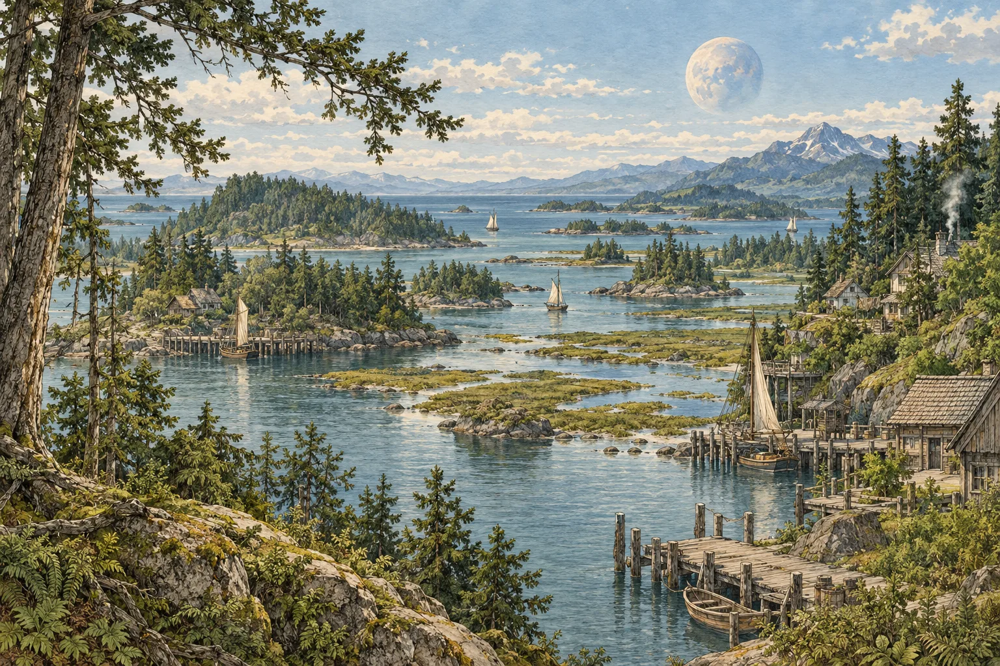
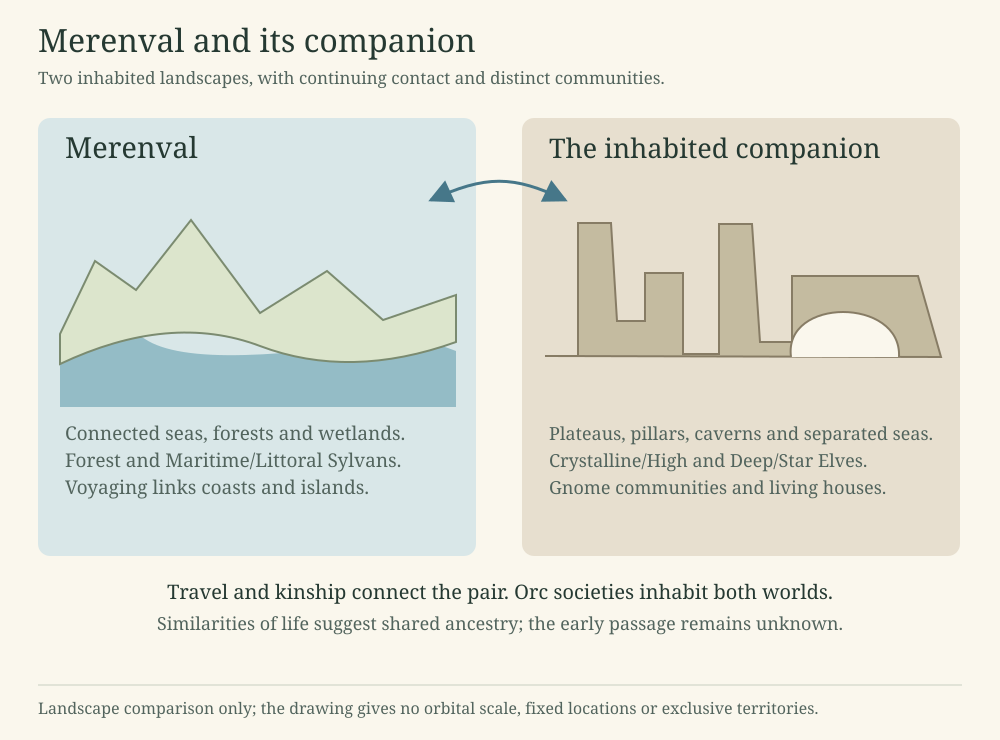
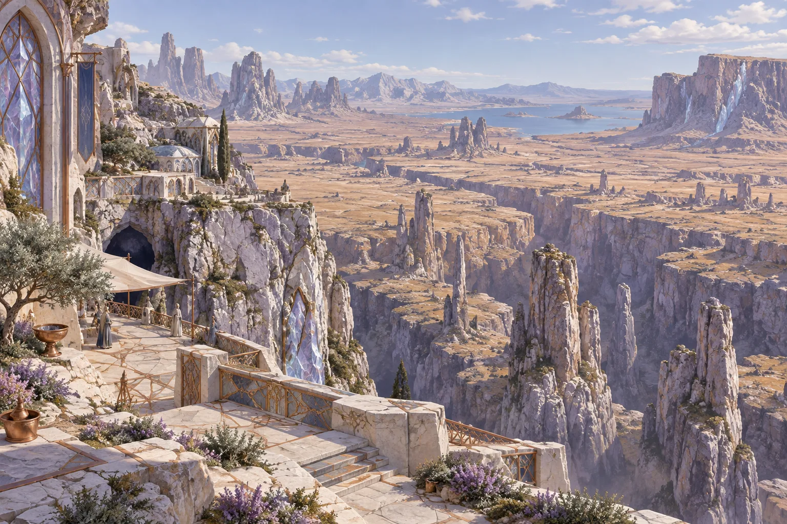
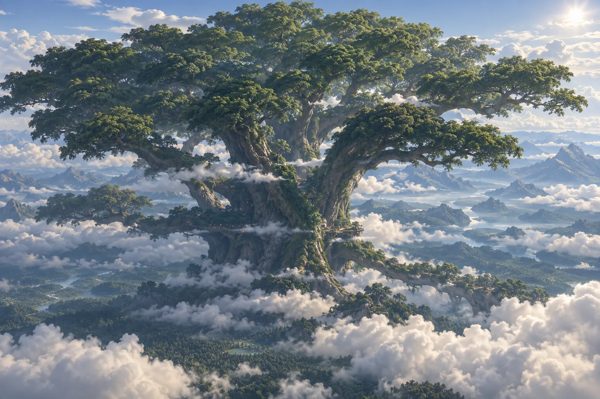
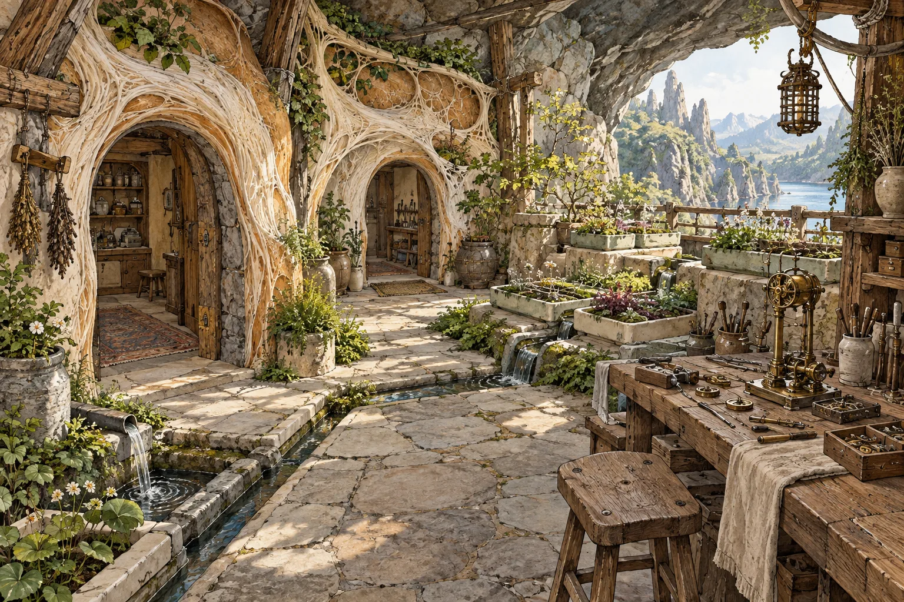

# Merenval and its living companion

Merenval’s seas and forests face a companion of plateaus, pillars and caverns. Elves, Gnomes and Orcs inhabit the pair, with long histories of travel and exchange.

Merenval: boats, living shorelines and inhabited roots along a forested coast. The scene interprets maritime Sylvan life without fixing a named settlement or tree species.

## The two worlds

### Two inhabited worlds

Merenval and its smaller inhabited companion share a prominent place in one another’s skies. Merenval’s landscapes are strongly maritime: connected seas, forests, wetlands, islands and rivers. The companion has more extensive land, broad plateaus, separated seas and striking cavern and pillar country.

Long days and slowly changing tides shape life around the pair. Visitors to the companion experience lighter weight.

The paired landscapes. The diagram compares the worlds and the communities described in their accounts. It does not place cities, draw exclusive territories or specify the orbit.

### Related life, different landscapes

Naturalists find similarities between life on the two worlds that suggest shared ancestry followed by long separation. They cannot yet trace how organisms passed between them. Travelers still need local advice about food and crops: a familiar-looking organism may be poisonous or difficult to grow.

### Peoples

Forest and Maritime/Littoral Sylvan traditions are associated with Merenval. Crystalline/High and Deep/Star traditions are associated with the companion. These Elven traditions share ancestry, but journeys between worlds remain rare. Regular travel within a coast, cavern district or Wayroot settlement does not make an onward crossing dependable.

Gnome communities cultivate living homes across the companion, from cavern districts to forests, wetlands, coasts and cities. Orc cities, farms, river communities, pastoral networks and other societies occur across the pair. Both worlds have societies of their own.

### Seas and coasts

Merenval’s seas connect coastal, island, estuary and river communities. Forests reach into wetlands and tidal country. Maritime/Littoral Sylvan networks grew through many communities and repeated exchange. Voyaging and kinship keep these communities in contact; no single colony founded the whole network.

Voyagers carry living cultures, seeds, medicine, craftwork and news as well as passengers. A family may keep a rooted home and spend much of its life aboard a vessel. Reliable seamanship depends on winds, currents, landing places and provisions even where magic helps a navigator.

### Plateaus, pillars and caverns

The companion has broad land interiors, rain-shadow districts, separated seas, great escarpments and cavern environments. Open plateaus and isolated pillars give some regions long views across broken ground. Crystal-rich rock gives some places and cities a distinctive appearance. Rock, masonry and worked crystalline materials occur together in architecture.

Life below those plateaus can look very different. Water, roots and surface openings support inhabited cavern districts. Reflected light and luminous fungi can make mineral ceilings resemble a night sky. Deeper settlements depend on their own local sources of food and on supplies from elsewhere. Neither bare rock nor glowing fungus alone feeds a city.

Merenval’s companion: a plateau settlement built with stone and crystalline materials. Broad land interiors and broken relief give this region a different character from Merenval’s wet coasts. This is one regional landscape, not a view of the whole world.

### Elven traditions and exchange

Forest and Maritime/Littoral Sylvans emphasize reciprocal relationships with living landscapes and waters. Crystalline/High traditions are known for structured magical craft and crystal arrays. Deep/Star traditions are associated with resonance and deep settlements.

Deep/Star Elves and Gnomes have long histories of exchange and some mixed settlements. Both peoples retain distinct cultures within shared settlements. Elven cultural identity and ancestry do not correspond exactly.

### Natural history and remembered journeys

The pair’s life has broad ancestral affinities, while its habitats differ substantially. Ancient Elven migrations established communities on the companion. Later contact was intermittent, and present journeys between worlds remain rare. A well-kept local Wayroot path or cavern route does not guarantee passage to the other world. The dates of early settlement, numbers of founders and details of ancestry remain uncertain.

### Dorrenath

Dorrenath is the eldest known Wayroot and the ancestor of the Wayroot lineage. She rises about **25 kilometres** above the ground beneath a vast, spreading crown. Ordinary forest is dwarfed at her feet. Her sweeping crown rises cleanly over substantial mountain shoulders near its edges, with higher peaks set farther back in the working regional design. Forested valleys, rivers and an open southern gulf connect the mountain country to her low root terrace. Her inhabited spaces extend through roots, trunk and branches, with paths that lead beyond what an outside view of the tree can explain.

Residents live with a responsive host. Dorrenath has her own interests, knowledge and habits of attention. Those who call her the **Great Mother** include more than Elves: the name embraces the many lives sheltered within her. It is a name of belonging and reverence, not a claim that she created all life.

Accounts describe long intervals of sleep in which her wider attention withdraws. Local parts of the tree remain responsive, so a sleeping Dorrenath is neither an empty house nor a defenseless one. She can resist interference and can restrain, injure or kill an aggressor. Knowing a resident does not mean knowing everything that resident thinks or does.

Her exact location, crown width and mountain contours remain unsettled. Some lower slopes could lie beneath outer limbs with open air between the trees and rock; the higher peaks chiefly form a backdrop. An apparent overlap in a picture need not mean that a branch physically touches a summit.

Dorrenath rises about 25 kilometres above her lowland roots. Nearby mountain shoulders give scale to her broad crown, while higher peaks remain distant and the gulf opens to the south. This is a regional concept illustration: exact ridge positions, crown width, and settlement geography remain open.

### Living within Dorrenath

Homes, kitchens, stores, workshops and civic spaces share the tree with living tissues and other organisms. Some inhabited spaces also serve her bodily needs. Repairing a passage or treating an injury can disrupt a neighborhood; protecting residents and caring for their host can become competing obligations.

People still grow food, carry water, remove waste, mend buildings and inspect routes. Familiar paths can be dependable, but a visitor needs local knowledge. Different conditions beyond a passage may call for a guide or preparation. Children learn within predictable neighborhoods and gradually take on more demanding journeys.

Care for Dorrenath does not by itself confer authority over her residents. Interpreters can disagree about a response, and illness or reflex can be mistaken for a deliberate request. The institutions that settle such disputes remain to be described.

Some residents and spiritual practitioners report continuing contact with the dead within Dorrenath. They distinguish a remembered impression from an apparent continuing person, though an encounter can be difficult to interpret. These experiences have a place in Great Mother traditions; they do not promise every resident the same fate.

### Other Wayroots

Wayroots descend from Dorrenath, but each grows in its own surroundings. Some become associated with usable Otherworld paths; others never do. Health, age, cultivation and local conditions matter. Planting a young Wayroot does not reproduce its parent's destinations or open a reliable road between planets.

The reported paths can be dangerous. Ordinary trees offer no dependable passage.

## Elven peoples and traditions

### One people across two worlds

Elves originated on Merenval and remain one fully interfertile people spread across Merenval and its companion. Their history produced four major traditions: Forest Sylvan, Maritime/Littoral Sylvan, Crystalline/High and Deep/Star. Each tradition has its own history and relationships with its surroundings. None is a separate species.

Ancient migrations established Elven communities on the companion. Later journeys connected the pair intermittently; travel between the worlds remains rare. Their early ancestry remains uncertain. Traditions associating Elves with fay remain attributed ancestral stories here, not a verified explanation of their origins.

### Four traditions, three approaches

Forest and Maritime/Littoral Sylvans share a broad magical approach based on **reciprocity**. Forest practitioners cultivate living passages, care for associated organisms and learn to recognize a host's distress or refusal. Maritime practitioners maintain refuges along coasts, tend littoral Wayroots and plan journeys through changing waters. Fog or a rising tide does not open a path by itself.

Crystalline/High practice emphasizes **structure and intricate craft**, often through carefully built crystal arrays. Practitioners make local charts, instruments and protected passages, then check them against conditions that can change. Deep/Star practice emphasizes **resonance**, with major schools rooted in the companion's deep-cave settlements. Their specialists listen for changed connections in rock, water and living networks; a response need not be intentional speech.

Schools borrow from one another, and individual practitioners often disagree. An inland Sylvan may study crystal craft, and a Deep Elf may be a cook or historian with little magical training. These traditions describe learned approaches rather than professions assigned by ancestry.

### Sylvans of Merenval

Forest Sylvans live among forests, wetlands, rivers and cultivated living landscapes. Maritime/Littoral Sylvans connect coasts, islands and estuaries through voyaging and exchange. Their network formed from many communities rather than one founding colony.

Some maritime populations have modest diving and marine-foraging adaptations. They do not have gills or breathe seawater, and cultural belonging does not depend on ancestry.

### Peoples of the companion

Crystalline/High communities are known for monumental structures, resonant arrays and exacting magical craft. Their taste for order and fractal design appears in societies with different governments and customs.

Deep/Star communities have long histories of contact with Gnomes in fungal, cavern and geothermal environments. The two peoples trade, teach one another and share some settlements while retaining their own cultures.

### Dorrenath and the Wayroots

Dorrenath is the eldest known Wayroot, a living host rising about **25 kilometres** beneath a vast crown. Elves and other inhabitants live within her and call her the Great Mother. Her broad crown passes above mountains beside her in a developing regional picture, while the exact crown breadth and mountain locations remain open. Her knowledge, responses and defenses make residence a relationship with another being. Ordinary labor, care for the tree and negotiation over inhabited space shape daily life.

Other Wayroots descend from her. Some grow useful Otherworld paths, but those paths do not all lead to the same places. A familiar local route gives no assurance of reaching the companion world. The reported paths can be dangerous; most trees offer no such passage.

### Bodies, childhood and experience

Elves keep remarkably stable bodily forms despite their close Otherworld associations. Neither residence near a strange passage nor magical study makes every Elf a shapeshifter. Experienced practitioners can manage conditions that would confuse an unprepared traveler, but they remain vulnerable to injury, illness and error.

Children begin within familiar, predictable networks of home and care. Their journeys grow more demanding as experience allows. Safety depends on the actual neighborhood and its routes, rather than simply on how strange a place looks from outside.

Long lives allow teachers, craftspeople and travelers to build deep experience. They do not give everyone the same skills or an infallible memory.

Elven lifespans, maturity, detailed physiology, present populations and many local histories remain open.

## Gnomes and their living houses

This account follows a learned Gnome tradition of natural history. Its scholars draw on dissection, cultivation, travel and testimony, with methods comparable to nineteenth-century human scholarship. They often disagree, especially where anatomy meets religious experience.

### On the breadth of the Gnome peoples

“Gnome” is a useful foreign umbrella, not the name of one nation or one uniform kind. The peoples so grouped speak related languages rather than a single tongue and differ greatly in color, texture, stature, fruiting habit, climate tolerance, diet, house species, religion, and government. Most adults stand near three feet, though no serious naturalist mistakes the common measure for a defining law.

Some populations are gray, brown, or nearly black; others show greens, violets, ochres, reds, pale creams, bands, speckles, or seasonal changes. Cavern life favors some forms and surface life others, but color alone does not reliably reveal homeland, occupation, disposition, or magical ability.

Comparative form strongly supports kinship among the Gnome peoples. How distant branches are related, where the first branch arose, and whether all should be placed within one genus remain disputed.

### The assembled body

The Gnome body is built from differentiated fungal or fungus-like tissues. Its organization differs from the body of a Human, Elf, or Orc. When examined after injury or death, it shows braided fibers, cords, layered membranes, fluid passages, toughened supports, soft exchange tissues, and several masses of especially dense and responsive material. The fibers branch and join repeatedly. Different tissues stain, tear, dry, burn, mineralize, and regrow differently, so an anatomist must distinguish them.

No agreement exists about which dense tissues perform thought, sensation, memory, or voluntary motion. Injury to some regions produces predictable losses, while in other cases function returns through a route that the anatomist did not expect. This has encouraged both the theory of several cooperating centers and the theory of one widely distributed sensitive web. Neither explains every case.

Gnomes exchange air, water, food, salts, and waste through specialized surfaces and inner passages. They need food as well as water and suitable surroundings. Body form, diet, breathing surface, and heat tolerance differ by lineage. Drying, fire, certain salts, poisons, parasites, and invasion by hostile growth are serious dangers even where an animal-bodied visitor sees only superficial injury.

Many tissues can seal, reroute, or regrow after damage. Infection can still kill them. Unchecked growth is itself a disease. Physicians distinguish dead fiber, sleeping fiber, confused growth, invading growth, poisoned exchange tissue, broken conduction, and loss of the patient’s proper pattern, though the causes are often obscure.

Some elders gradually deposit mineral throughout selected tissues. In certain peoples this produces patterned plates, dense inner supports, or a stone-like outer stillness. Complete stone does not live in any ordinary sense known to anatomy. Whether mineralization is chiefly age, adaptation, disease, preparation for death, or several different processes remains contested.

### Birth, childhood and bodily descent

No single account covers every Gnome people. In several well-described traditions, a juvenile develops within a protected nursery growth supplied by two or more bodily contributors and tended by a wider household. In others, the protected chamber belongs chiefly to one parent. Travelers also report eggs, enclosed knots, fruit-like cradles, and mobile brood structures, but some reports confuse Gnome reproduction with the reproduction of associated house organisms.

Whatever the form, a child becomes bodily separate. The child is not a room, branch, or obedient continuation of the parents. The exact moment of separation is treated differently in law and ritual. Some physicians describe a gradual closing of shared passages; others insist that individuality is already present before visible separation.

Gnomes distinguish bodily parentage from those who rear a child, from the house in which the child grows, and from the household dead who accept relationship with that child. These relations often overlap but need not.

### The living house

There is no universal Gnome house fungus. A cultivated home may be one organism, several compatible organisms, a fungus joined to roots or microbial gardens, living panels over a nonliving frame, or a managed colony whose members cannot be separated by ordinary inspection. Stone, wood, shell, crystal, fired clay, glass, and metal may carry loads while living tissue seals, insulates, senses, repairs, filters, feeds, or decorates.

Forest houses may enter roots and fallen trunks. Wetland houses may grow as floating or stilted mats. Coastal houses may tolerate salt, bind shell, and filter tidal water. Desert houses may spend long periods dormant around a protected core. Alpine houses may wear lichen-like skins. Migratory households may carry a small living nucleus and unfold the home at each seasonal site. Industrial cities may grow panels in nurseries and replace them according to inspection schedules.

Every living house must be fed. Most receive plant matter, cultivated substrate, wastes that have been made safe, dissolved minerals, water, and air. Some share nourishment with green symbionts or root systems. Deep houses may depend upon imported food, mineral-working microbes, warm springs, or other local sources. When these supplies fail, a house consumes its stored substance or succumbs to other organisms.

Ventilation, drainage, humidity, temperature, and the removal of waste are therefore matters of architecture. The pleasant odor of a healthy house is not proof of health; neither is an unfamiliar odor proof of disease. Cultures maintain different balances among dryness, living surface, dormant structure, flowing air, and sealed chambers.

House ailments include rot, drying, runaway fruiting, blocked passages, parasitic invasion, poisoned feed, mineral imbalance, graft rejection, loss of symbionts, and growth into unsafe foundations. The boundary between illness and an unwelcome preference becomes controversial in very old houses.

An interpretation of a Gnome living house at a cavern entrance. Living panels share a frame with stone and timber; assay gardens and a mechanical workshop occupy the courtyard. Gnome house traditions vary widely.

### Propagation and household founding

A childhood house is often cultivated beside the child. Adults founding a new household may bring viable cultures from their childhood homes and combine them in a new architecture. Compatibility must be tested. Some cultures fuse readily; others fight, wall one another off, or poison the attempted union. Skilled founders may keep separate living panels on a common frame rather than forcing union.

An extension that remains connected is usually treated by cultivators as part of the old house. A severed culture ordinarily grows as a daughter. Law, religion, and affection do not always accept the cultivator’s distinction. One people may say a daughter house is a new person in waiting; another may call it the childhood house continued elsewhere.

Households often begin with six to ten adults in varied bonds, though many smaller and larger forms exist. Bonding feasts may include edible cultivated parts of childhood houses, fruit, and customary first adult drinks. Structural tissue, diseased growth, treated panels, and load-bearing members are not eaten merely because another portion of the home is edible.

Kinship vocabulary commonly distinguishes bodily descent, upbringing, house descent, adoption, ancestral relationship, and ecological affiliation. Personal names may accumulate these relationships rather than replace an earlier name. Languages express these relationships differently.

### Houses, spirits and the dead

Most Gnome spiritual practitioners distinguish the living spirit of a house from the accumulated character of a household and from the dead who remain in relationship with it. The distinctions are clearer in doctrine than in grief.

Some households maintain a small ancestral country or interior place reached through rites, dreams, trance, or the work of trained practitioners. Neighboring households may share paths between such places. The paths become uncertain at greater distance, and no reputable guide promises that every dead person will answer.

Physical remains can be incorporated into a house without confining the dead. Some cultures preserve a mineralized elder whole; others distribute pieces through walls or root beds; others burn, dissolve, bury, or refuse incorporation. Many households mourn once at bodily death and again when an ancestor ceases responding. What the second absence means is a matter of religion.

These ancestral places must not be confused with the Otherworld rooms cultivated by living houses. A person may walk bodily into a tangent chamber and find no ancestor there. Several religions nevertheless teach that the two kinds of place touch or that one serves as a vestibule to the other. Natural history has not settled the matter.

### Houses that awaken

Old accounts describe houses that speak, refuse, choose, remember, bargain, migrate, adopt, grieve, or defend themselves with purpose. Some are fraudulent; some are sick colonies interpreted by frightened residents; some are collective habits misheard as one voice. Others withstand careful tests and behave as enduring persons.

Among the proposed signs are preferences that persist across seasons and changes of inhabitants, untrained responses to novel events, selective initiation or refusal of relationships, self-directed rebuilding, memories no resident supplied, coherent appearances in dreams or rites, and purposeful control of tangent growth. None is decisive alone.

A household may sacrifice itself to the demands of diseased tissue believed sacred, or cut apart a young mind believed to be ordinary property. Laws differ on when a house may own goods, refuse renovation, enter contracts, hold citizenship, leave its site, or demand care.

An awakened house can be dangerous to threaten. It may control chemical defenses, hardening tissues, constricting passages, stored water, pressure, symbionts, underground cords, detachable growths, mobile propagules, or routes that do not obey ordinary surface geography. The visible building may be only its oldest and least mobile part.

### Growing into the Otherworld

Many Gnome traditions begin with a probing root rather than an open gate. The root grows toward a relationship the cultivator cannot see directly. It may fail, retreat, find nourishment, encounter hostile life, accept a symbiont, or thicken into a cord. From successful roots come membranes, reservoirs, gardens, passages, and inhabitable chambers.

Different house organisms behave differently. One sends fine feeding fans; another builds armored cords; another survives only with a particular companion species; another grows seasonally and withdraws. Two roots may fuse, ignore one another, form an exchange, reject the graft, prey upon one another, or carry disease. Cultivators must know which organism they are tending.

Some regions make tangent cultivation an ordinary part of a new home. Elsewhere it is forbidden, forgotten, or possible only after generations. Age, local conditions, inherited cultures, magical skill, and patient tending all matter.

A living connection that passes water or sensation may not safely pass a person. Households may refuse access. A traveler may be incompatible with the tissue. Routes sicken, change, become occupied, or lead differently after great events. A useful local network may therefore offer no route to another Gnome city.

### Dethreading

Certain Gnomes can loosen the assembled body into connected fibers, enter a permeable substrate, and re-form elsewhere. The practice is commonly called “earth swimming,” though it takes training and can be dangerous.

Loose soil, roots, decayed wood, porous stone, cracks, house tissue, and prepared fungal beds are common routes. Unbroken solid rock blocks passage. Expert practitioners can use passages too fine for an assembled body and can sometimes alter the material around them, but their substance must still travel and remain alive.

Schools disagree about what must remain concentrated during passage. Some guard a traveling knot, some many redundant cords, and some a distributed sensitive lattice. Physicians agree only that excessive separation, drying, burning, poison, predation, or the cutting of essential routes can prevent safe return.

Rescue medicine keeps separated tissue alive, restores communication, supplies a temporary scaffold, and prevents a wounded patient from growing into the wrong form. Skilled passage usually succeeds; failed passages can be catastrophic.

### Perception, assay and medicine

Gnomes perceive more through contact with ground and living material than many animal-bodied visitors realize. Pressure, vibration, moisture, warmth, dissolved substances, volatile odors, deformation, and the condition of associated growth all contribute. These senses differ by lineage and training and are not infallible.

An assay garden is a cultivated collection whose colors, odors, light, growth, fruiting, wilting, or death reveal conditions in air, water, soil, mine, house, or workshop. Such gardens warn of poisonous seepage, bad air, useful minerals, contamination, structural change, or approaching ecological failure. Good assay practice uses several organisms because one sign may have many causes.

A physician treating a Gnome asks which routes still communicate, which tissues are viable, what is invading, what is rerouting, whether reassembly is safe, and whether the patient’s own structure or a supporting house should carry a function during healing.

### Mechanism and industry

Gnomes have long built complex clockwork. Their experience maintaining living bodies and houses helps them understand flows, feedback and coordinated parts. Their finest mechanisms use governors, escapements, interlocks, condition-responsive regulators, redundant paths, replaceable modules, and visible maintenance states.

Some traditions combine metal clockwork with living sensors, chemical changes, flowing water or air, cultured actuators, and assay growths. Others prefer entirely dry, fired, polished, and nonliving machinery because living systems are judged capricious or politically dangerous.

### Government beyond the household

Some Gnome states carefully separate family, house, workshop, court, and government. Public repositories preserve house cultures so no adult’s ability to leave depends upon family permission. Civic law may assign rights separately to residents, house organisms, awakened houses, ancestral trusts, and landholders.

Other societies make no such separation. A great house may be family, district, infrastructure, archive, temple, sovereign, and citizen simultaneously. Councils may represent branches or chambers. Offices may belong to house lineages rather than geographic districts. Secession may require physically propagating a new polity.

Neither arrangement belongs exclusively to an earlier or later age. In both, people dispute who may end a living relationship and what they owe those who remain.

### The incomparable city-house

Travelers describe one settlement that has grown across centuries into a city-scale house. Courtyards, towers, tunnels, bridges, workshops, waters, parks, transit cords, and neighborhoods belong to one ancient continuous house lineage. The house itself is recognized as a person.

Its roots, galleries, gardens, reservoirs, and inhabited chambers extend beyond ordinary space. No single three-dimensional plan can contain them. A nearby room may require a journey; a distant district may share a wall; a corridor may possess more directions than an animal-bodied surveyor expects.

Descriptions disagree because no outsider sees the whole and most residents do not pretend to. Visiting Gnomes are no less astonished than Elves, Orcs, or Humans. Even those raised within it continue to find portions of their own city awe-inspiring. Its proper name and a dependable history remain to be recorded here.

### Variation and disagreement

There is no universal Gnome attitude toward nature, magic, ancestors, living houses, or the Otherworld. Some societies cultivate ancestor-filled homes; some release the dead quickly. Some grow tangent districts; some outlaw them. Some make living towers; some choose fired ceramic and metal so that buildings cannot acquire claims upon their inhabitants. Some celebrate awakened houses; others consider deliberately encouraging such birth an unforgivable act.

These disputes concern daily life: what people inherit, what they must maintain, and which obligations they can leave.

### Limits of this account

The inner causes of thought, inheritance, soul, tangent direction, house awakening, extreme longevity, and dethreading remain imperfectly understood. Where observation ends, rival schools of medicine, natural history, theology, and magic continue the argument.

### Neighbors

Merenval’s living companion is a major Gnome world. Deep/Star Elves and Gnomes have long histories of contact in shared cavern regions without becoming one culture. Deep/Star traditions often approach crystal and cavern through resonance; Gnome traditions often approach the same places through metabolism, substrate, cultivation and succession.

## Orcs

Orcs originated on Merenval and later reached its living companion. Their populations now include cities, farming and river communities, mobile pastoral networks, canyon settlements, and many intermediate ways of life. The timing, routes, and founder history of companion settlement remain unresolved.

### Ancestry and body

Naturalists associate Orc ancestry with social life along riverbanks and floodplains, seasonal movement and sustained walking. The details of their descent remain uncertain.

Orcs are massive and robust, with a wedge-shaped head, neck and torso, powerful musculature and a formidable jaw. Exact proportions and life-history details remain open.

Orcs tend to sink. They commonly cross reachable water by walking, running or bounding along the bottom rather than conventional swimming. Deep water without a reachable bottom is dangerous. Knowledge of crossings, breath management and flotation matters culturally; no exact diving duration is stated.

### Strength and agreed terms

Many settled societies define strength through self-command, endurance, reliability, courage, restraint, care, craft, judgment, and keeping one’s terms. Challenges commonly establish permitted force, victory conditions, consent, witnesses, and a recognized end. Winning an agreed knockout contest does not authorize killing the defeated participant.

Wild bands reject settled obligations in varying ways. Some repeatedly use dens and routes; others vow never to return to the same place. People can join or leave these bands; membership is cultural. Outsiders who mainly hear of wandering bands can form a distorted picture of Orc society. Some reports describe bands using strange routes, though the nature of those passages remains uncertain.

Many societies support extended households, communal child-rearing, and fostering, including people leaving wild bands. Honor consumption and dominion consumption are distinct cultural categories with different meanings, consent, legality, and regional acceptance. Some wild chiefs practice an extreme form of dominion consumption, sharing defeated challengers with wargs. The custom belongs to those bands.

### Two worlds

Orc communities occur on Merenval and its companion. Visitors experience lighter weight on the companion, but local skill, acclimation and custom still matter. Orcs on both worlds share ancestry despite these differences in daily life.

All original project IP remains the author’s. Public documentation grants no license or right to reuse this work.
